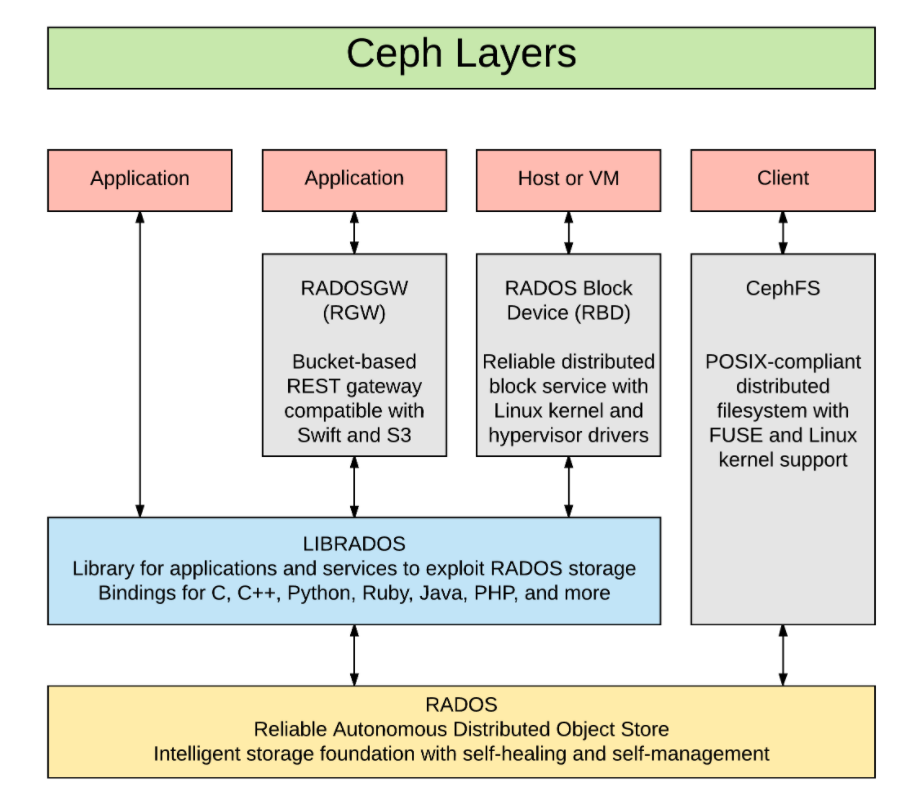

# CEPH STORAGE

## 1. Khái niệm

cept là giải pháp mã nguồn mở để xây dựng lưu trữ phân tán, ổn định, độ tin cậy cao, dễ dàng mở rộng. Nó cung cấp cấp được các loại storage bao gồm bject storage, Block storage, File Storage trên 1 hệ thống duy nhất. Ceph có thể đáp ứng  quy mô triển khai 1 vài máy chủ đến vài chục máy.

Ceph xây dựng giải pháp dựa trên Object. Các Object được tổ chức, nhân bản trên toàn cluster nâng cao tính bảo đảm dữ liệu. Quản lý dưới dạng key Object.

Việc Ceph phổ biến là do Ceph là một Một Cluster Ceph được tạo thành từ việc kết nối các node Ceph lại với nhau nó cần ít nhất 1 Ceph Monitor và 2 Ceph OSD Daemons.

Ceph OSDs: Ceph OSD daemon (Ceph OSD) lưu trữ data, xử lý việc đồng bộ dữ liệu, recovery, rebalancing và cung cấp thông tin liên quan đến monitoring đến cho Ceph monitoring bằng cách kiểm tra các Ceph OSD daemons khác thông qua heartbeat. Một ceph storage cluster cần ít nhất 2 ceph OSD daemons để hướng tới trạng thái active + clean, lúc này hệ thống sẽ có 02 bản copy của data (default của Ceph là 3 bản).

Monitors: ceph monitor sẽ theo dõi trạng thái của cluster, bao gồm việc theo dõi các monitor map, OSD map, placement group (PG) map, và CRUSH map. Ceph lưu thông tin lịch sử (trong ceph gọi là “epoch” của mỗi trạng thái thay đổi của Ceph Monitors, Ceph OSD Daemons, và PGs.

MDSs: một Ceph Metadata Server (MDS) lưu trữ thông tin về metadata của hệ thống Ceph FileSystem (ceph block device và object storage không sử dụng MDS).

Ceph lưu trữ dữ liệu của client dưới dạng các objects trong các pool lưu trữ. Ceph sử dụng thuật toán CRUSH, trong đó Ceph sẽ tính toán placement group nào sẽ lưu trữ object, và tính toán Ceph OSD Daemon nào sẽ lưu trữ placement group. CRUSH algorithm cho phép Ceph Storage cluster khả năng mở rộng, tự cân bằng (rebalance), và recovery tự động.

CPU Ceph MDS cần nhiều CPU hơn các thành phần khác trong hệ thống, khuyến cáo sử dụng quad core hoặc CPU tốt hơn. Ceph OSDs chạy RADOS service, tính toán data placement với thuật toán CRUSH, đồng bộ dữ liệu, và duy trì bản copy của cluster map. Vì vậy, OSDs cũng cần 1 lượng CPU nhất định, khuyến nghị sử dụng dual core processors. Monitor hoạt động không cần nhiều CPU. Cần lưu ý trong trường hợp máy chủ chạy dịch vụ tính toán trên các OSD, ví dụ mô hình hoạt động của OpenStack – kết hợp giữa compute node và storage node, cần thiết kế CPU để bảo đảm đủ năng lực dành riêng cho Ceph daemons. Khuyến cáo nên tách riêng các chức năng để bảo đảm hoạt động.

RAM Metadata servers và monitors hoạt động liên tục để phục vụ cho dữ liệu, vì vậy cần số lượng RAM kha khá, thông thường 1Gb RAM cho mỗi instance daemon. OSD không cần nhiều RAM cho các hoạt động của nó, thông thường vào khoảng 500Mb cho mỗi instance daemon. Tuy nhiên, trong quá trình recovery sẽ cần nhiều RAM, thường 1Gb cho mỗi 1Tb lưu trữ trên mỗi daemon. Nhìn chung, càng nhiều RAM càng tốt, nhất là khi RAM là tài nguyên rẻ nhất hiện nay đối với máy tính, máy chủ.

Data Storage Đây là yếu tố quan trọng nhất, cần cân nhắc thật kỹ giữa vấn đề chi phí và năng lực hệ thống.

OSDs có thể là SSD, HDD hoặc NVME sử dụng để lưu trữ data.

Các điểm quan trọng cần lưu ý khi triển khai đó là cần tách biệt các disk cho HĐH (OS) với các Ceph OSD Daemon, tránh việc chạy chung nhiều Ceph OSD daemon trên 1 disk, cũng như tránh chạy Ceph OSD trên MDS hay monitoring trên cùng 1 disk. Ngoài ra, OS, OSD Data, và OSD Journals nên được đặt trên các disk khác nhau, trong đó Journals sử dụng các đĩa cứng SSD để tăng tốc độ truy xuất dữ liệu cho các node lưu trữ OSD.

Việc thiết kế, sử dụng các đĩa cứng trong hệ thống CEPH thực tế như thế nào tùy thuộc vào nhu cầu của từng hệ thống.

## 2. RADOS (Reliable Autonomic Distributed Object Store)

Lớp RADOS giữ vai trò đặc biệt quan trọng trong kiến trúc Ceph, là trái tim của hệ thống lưu trữ CEPH,. RADOS cung cấp tất cả các tính năng của Ceph:

- Lưu trữ object phân tán

- Sẵn sàng cao

- Tin cậy

- Không có SPOF (Single point of failure)

- Tự sửa lỗi

- Tự quản lý

- ...

  Các phương thức truy xuất Ceph, như RBD, CephFS, RADOSGW và librados, đều hoạt động trên lớp RADOS.




Khi Ceph cluster nhận một yêu cầu ghi từ người dùng, thuật toán CRUSH tính toán vị trí và thiết bị mà dữ liệu sẽ được ghi vào. Các thông tin này được đưa lên lớp RADOS để xử lý. Dựa vào quy tắc của CRUSH, RADOS phân tán dữ liệu lên tất cả các node dưới dạng các object, phân chia lưu trữ dưới các PG. Cuối cùng ,các object này được lưu tại các OSD.

RADOS, khi cấu hình với số nhân bản nhiều hơn hai, sẽ chịu trách nhiệm về độ tin cậy của dữ liệu. Nó sao chép object, tạo các bản sao và lưu trữ tại các zone khác nhau, do đó các bản ghi giống nhau không nằm trên cùng 1 zone. RADOS đảm bảo có nhiều hơn một bản copy của object trong RADOS cluster.

RADOS cũng đảm bảo object luôn nhất quán. Trong trường hợp object không nhất quán, tiến trình khôi phục sẽ chạy. Tiến trình này chạy tự động và trong suốt với người dùng, do đó mang lại khả năng tự sửa lỗi và tự quẩn lý cho Ceph. RADOS có 2 phần: phần thấp không tương tác trực tiếp với giao diện người dùng, và phần cao hơn có tất cả giao diện người dùng.

RADOS lưu dữ liệu dưới trạng thái các object trong pool

Để liệt kê danh sách các pool:

```
rados lspools
```

Để liệt kê các object trong pool:

```
rados -p {pool-name} ls
```

Để kiểm tra tài nguyên sử dụng:

```
rados df
```

Lớp `LibRADOS` là thư viện C cho phép ứng dụng làm việc trực tiếp với RADOS, bypass qua các lớp khác để tương tác với Ceph Cluste.librados là thư viện cho RADOS, cung cấp các hàm API, giúp ứng dụng tương tác trực tiếp và truy xuất song song vào cluster.Ứng dụng có thể mở rộng các giao thức của nó để truy cập vào RADOS bằng cách sử dụng librados. Các thư viện tương tự cũng sẵn sàng cho C++, Java, Python, Ruby, PHP. librados là nền tảng cho các service giao diện khác chạy bên trên, gồm Ceph block device, Ceph filesystem, Ceph RADOS Gateway. librados cung cấp rất nhiều API, các phương thức lưu trữ key/value trong object. API hỗ trợ *atomic-single-object* bằng cách update dữ liệu, key và các thuộc tính.

Tương tác trực tiếp với RADOS Cluster qua thư viện librados giúp tăng hiệu năng của ứng dụng. librados mang lại sự thuận lợi khi cung cấp PaaS và SaaS.

RADOS có 2 thành phần lõi: Monitor  và OSD

## 3. MON (Ceph Monitor)

Ceph monitor chịu trách nhiệm giám sát tình trạng của toàn hệ thống. Nó hoạt động như các daemon duy trì sự kết nối trong cluster bằng cách chứa các thông tin cơ bản về cluster, tình trạng các node lưu trữ và thông tin cấu hình cluster. Ceph monitor thực hiện điều này bằng cách duy trì các cluster map. Các cluster map này bao gồm monitor, OSD, PG, CRUSH và MDS map.

### 3.1. Các map trong MON

- **Monitor map**: map này lưu giữ thông tin về các node monitor, gồm CEPH Cluster ID, monitor hostname, địa chỉ IP và số port. Nó cũng giữ epoch (phiên bản map tại một thời điểm) hiện tại để tạo map và thông tin về lần thay đổi map cuối cùng. Có thể kiểm tra bằng câu lệnh:

```
ceph mon dump
```

- **OSD map**: map này lưu giữ các trường như cluster ID, epoch cho việc tạo map OSD và lần thay đổi cuối., và thông tin liên quan đến pool như tên, ID, loại, mức nhân bản và PG. Nó cũng lưu các thông tin OSD như tình trạng, trọng số, thông tin host OSD. Có thể kiểm tra OSD map bằng câu lệnh:

```
ceph osd dump
```

- **PG map**: map này lưu giữ các phiên bản của PG (thành phần quản lý các object trong ceph), timestamp, bản OSD map cuối cùng, tỉ lệ đầy và gần đầy dung lượng. Nó cũng lưu các ID của PG, object count, tình trạng hoạt động và srub (hoạt động kiểm tra tính nhất quán của dữ liệu lưu trữ). Kiểm tra PG map bằng lệnh:

```
ceph pg dump
```

- **CRUSH map**: map này lưu các thông tin của các thiết bị lưu trữ trong Cluster, các rule cho tưng vùng lưu trữ. Kiểm tra CRUSH map bằng lệnh:

```
ceph osd crush dump
```

- **MDS map**: lưu thông tin về thời gian tạo và chỉnh sửa, dữ liệu và metadata pool ID, cluster MDS count, tình trạng hoạt động của MDS, epoch của MDS map hiện tại. Kiểm tra MDS map bằng lệnh:

```
ceph mds dump
```

### 3.2. Hướng triển khai MON

- eph monitor không lưu trữ dữ liệu, thay vào đó, nó gửi các bản update cluster map cho client và các node khác trong cluster. Client và các node khác định kỳ check các cluster map với monitor node.
- Monitor là lightweight daemon không yêu cầu nhiều tài nguyên tính toán. Một Server thuộc dòng entry-server, CPU, RAM vừa phải và card mạng 1 GbE là đủ. Monitor node cần có đủ không gian lưu trữ để chứa các cluster logs, gồm OSD, MDS và monitor log. Một cluster ổn định sinh ra lượng log từ vài MB đến vài GB. Tuy nhiên, dung lượng cho log có thể tăng lên khi mức độ debug bị thay đổi, có thể lên đến một vài GB.
- Cần đặt ra các policy cho log và các giải pháp monitor dung lượng lưu trữ, trên các node monitor tăng mức debug, lượng log có thể lên tới 1GB/1h.
- Mô hình Ceph nhiều node Mon đưa ra khái niệm quorum bằng cách sử dụng thuật toán PAXOS. Số monitor trong hệ thống nên là số lẻ, ít nhất là 1 node, và khuyến nghị là 3 node. VÌ hoạt động trong quorum, hơn một nửa số lượng monitor node cần đảm bảo sẵn sàng để tránh rơi vào trạng thái "split-brain". Một monitor node sẽ là leader, và các node còn lại sẽ đưa đưa lên làm leader nếu node ban đầu bị lỗi.
- Nếu hạn chế về tài chính, monitor daemon có thể chạy cùng trên OSD node. Tuy nhiên, cần trang bị nhiều CPU, RAM và ổ cứng hơn để lưu monitor logs.
- Đối với các hệ thống lớn, nên sử dụng node monitor chuyên dụng. Đặt các node montior trên các rack riêng biệt với switch và nguồn điện riêng biệt. Nếu có nhiều datacenter với đường mạng tốc độ cao, có thể đặt monitor node trên nhiều DC.
- Các node monitor thường khuyến cáo sử dụng ổ SSD để lưu trữ phân vùng `/var/lib/ceph/ceph-mon` nhằm tăng tốc độ xử lý cho cụm

### 3.3. Monitor Commands

- Kiểm tra trạng thái service, dùng câu lệnh:

```
service ceph status mon
```

- Các câu lệnh đẻ kiểm tra trạng thái các node monitor:

```
ceph mon stat
ceph mon_status
ceph mon dump
```

## 4. OSDs (Object Storage Diveci)

CEPH OSD lưu dữ liệu thực trên các ổ đĩa vật lý dưới dạng các object. Một Ceph cluster có rất nhiều OSD. Với bẩt cứ tác vụ đọc hoặc ghi nào, client gửi yêu cầu về cluster map tới node monitor, và sau đó tương tác trực tiếp với OSD cho các tác vụ đọc ghi, mà không cần sự can thiệp của node monitor. Điều này giúp việc chuyển tải dữ liệu nhanh chóng khi client có thể ghi trực tiếp vào các OSD mà không cần lớp xử lý dữ liệu trung gian. Cơ chế lưu trữ này là đôc nhất trên Ceph khi so với các phương thức lưu trữ khác.

Ceph nhân bản mỗi object nhiều lần trên tất cả các node, nâng cao tính sẵn sàng và khả năng chống chịu lỗi. Mỗi object trong OSD có một primary copy và nhiều secondary copy, được đặt tại các OSD khác. Bởi Ceph là hệ thống phân tán và object được phân tán trên nhiều OSD, mỗi OSD đóng vai trò là primary OSD cho một số object, và là secondary OSD cho các object khác. khi một ổ đĩa bị lỗi, Ceph OSD daemon tương tác với các OSD khác để thực hiện việc khôi phục. Trong quá trình này, secondary OSD giữ bản copy được đưa lên thành primary, và một secondary object được tạo, tất cả đều trong suốt với người dùng. Điều này làm Ceph Cluster tin cậy và nhất quán. Thông thường, một OSD daemon đặt trên mọt ổ đĩa vật lý , tuy nhiên có thể đặt OSD daemon trên một host, hoặc 1 RAID. Ceph Cluster thường được triển khai trong môi trường JBOD, mỗi OSD daemon trên 1 ổ đĩa.

## Ceph OSD File System