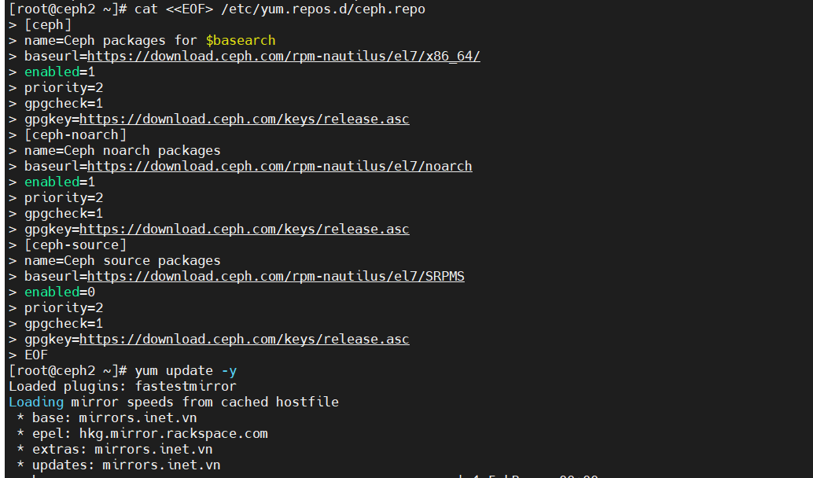

# Hướng dẫn cài đặt CEPH Nautilus trên CentOS7

## 1. Mô hình dựng LAB


# 2. Cac buoc cai dat

## 2.1. Thiết lập hostname, IP cho node CEPH1

Login với tài khoản root và thực hiện các lệnh dưới.

```
yum update -y
```

Cài đặt các gói phần mềm bổ trợ

```
yum install epel-release -y
yum update -y
yum install wget byobu curl git byobu python-setuptools python-virtualenv -y
```

Cấu hình chế độ firewall để tiện trong môi trường lab. Trong môi trường production cần bật firewall hoặc iptables hoặc có biện pháp xử lý khác tương ứng để đảm bảo các vấn đề về an toàn.

```
sudo systemctl disable firewalld
sudo systemctl stop firewalld
sudo systemctl disable NetworkManager
sudo systemctl stop NetworkManager
sudo systemctl enable network
sudo systemctl start network

sed -i 's/SELINUX=enforcing/SELINUX=disabled/g' /etc/sysconfig/selinux
sed -i 's/SELINUX=enforcing/SELINUX=disabled/g' /etc/selinux/config

echo "net.ipv6.conf.all.disable_ipv6 = 1" >> /etc/sysctl.conf
```

Khai báo file /etc/hosts. Việc này rất quan trọng vì CEPH sẽ sử dụng hostname trong các bước tới để cấu hình và kết nối khi thực hiện.

```
cat << EOF > /etc/hosts
127.0.0.1 `hostname` localhost
192.168.2.112 client1
192.168.2.142 ceph1
192.168.2.132 ceph2
192.168.2.122 ceph3

192.168.237.112 client1
192.168.237.142 ceph1
192.168.237.132 ceph2
192.168.237.122 ceph3
EOF
```

Cài đặt NTP, trong hướng dẫn này sử dụng chronyd thay cho ntpd. Việc đồng bộ thời gian cũng là quan trọng khi triển khai CEPH. Hãy đảm bảo timezone và thời gian được đồng bộ để đúng với hệ thống

```
yum install -y chrony

systemctl enable chronyd.service
systemctl start chronyd.service
systemctl restart chronyd.service
chronyc sources
```

Khởi động lại node CEPH1 và chuyển sang CEPH2 thực hiện tiếp.

```
init 6
```

Thiết lập hostname, IP cho node CEPH2 vaf CEPH 3 tuong tu

## 2.2. Tạo user cài đặt CEPH và khai báo repos

#### Tạo user để cài đặt CEPH trên cả 03 node CEPH1, CEPH2, CEPH3.

**Bước này được thực hiện trên cả 03 node CPEH.**

Tạo user là cephuser với mật khẩu là matkhau2019@

```
useradd cephuser; echo 'matkhau2019@' | passwd cephuser --stdin
```

Cấp quyền sudo cho user cephuser

```
echo "cephuser ALL = (root) NOPASSWD:ALL" | sudo tee /etc/sudoers.d/cephuser
chmod 0440 /etc/sudoers.d/cephuser
```


#### Khai báo repo cho ceph nautilus

Thực hiện hiện khai báo repo cho ceph nautilus trên tất cả các node CEPH.

```
cat <<EOF> /etc/yum.repos.d/ceph.repo
[ceph]
name=Ceph packages for $basearch
baseurl=https://download.ceph.com/rpm-nautilus/el7/x86_64/
enabled=1
priority=2
gpgcheck=1
gpgkey=https://download.ceph.com/keys/release.asc

[ceph-noarch]
name=Ceph noarch packages
baseurl=https://download.ceph.com/rpm-nautilus/el7/noarch
enabled=1
priority=2
gpgcheck=1
gpgkey=https://download.ceph.com/keys/release.asc

[ceph-source]
name=Ceph source packages
baseurl=https://download.ceph.com/rpm-nautilus/el7/SRPMS
enabled=0
priority=2
gpgcheck=1
gpgkey=https://download.ceph.com/keys/release.asc
EOF
```



## 2.3. Cai đặt ceph-deploy và cấu hình

#### Cài đặt ceph-deploy.

**Thực hiện việc cài đặt này trên node CEPH1**

sử dụng node ceph1 chính là node ceph admin. Thực hiện việc này bằng tài khoản root.

Lưu ý: trong hướng dẫn này chỉ cần đứng trên ceph1 thực hiện, một số thao tác trên node CEPH2, CEPH3 sẽ thực hiện từ xa ngay trên CEPH1.

```
sudo yum install -y epel-release
sudo yum install -y ceph-deploy
```

Chuyển sang tài khoản `cephuser`

```
su - cephuser
```

```
ssh-keygen
```

Nhấn Enter để mặc định các tham số, bước này sẽ sinh ra private key và public key cho user *cephuser*. Sau đó tiến hành các lệnh dưới để copy public key sang các node.

Nhập mật khẩu của user *cephuser* tạo ở các node trước đó trong bước trên.

```
ssh-copy-id cephuser@ceph1
```

```
ssh-copy-id cephuser@ceph2
```

```
ssh-copy-id cephuser@ceph3
```


Tạo thư mục chứa các file cấu hình khi cài đặt CEPH

```
cd ~
mkdir my-cluster
cd my-cluster
```

Khai báo các node ceph trong cluser.

```
ceph-deploy new ceph1 ceph2 ceph3
```


Lệnh trên sẽ sinh ra các file cấu hình trong thư mục hiện tại, kiểm tra bằng lệnh *ls – alh*


Khai báo thêm các tùy chọn cho việc triển khai, vận hành CEPH vào file ceph.conf này trước khi cài đặt các gói cần thiết cho ceph trên các node. Lưu ý các tham số về network.

```
echo "public network = 192.168.2.0/24" >> ceph.conf
echo "cluster network = 192.168.237.0/24" >> ceph.conf
echo "osd objectstore = bluestore"  >> ceph.conf
echo "mon_allow_pool_delete = true"  >> ceph.conf
echo "osd pool default size = 3"  >> ceph.conf
echo "osd pool default min size = 1"  >> ceph.conf
```


Bắt đầu cài đặt phiên bản CEPH Nautilus lên các node ceph1, ceph2, ceph3. Lệnh dưới sẽ cài đặt lần lượt lên các node.


Thiết lập thành phần MON cho CEPH. Trong hướng dẫn này khai báo 03 node đều có thành phần MON của CEPH.

```
ceph-deploy mon create-initial
```


Kết quả sinh ra các file trong thư mục hiện tại


- Để node `ceph01`, `ceph02`, `ceph03` có thể thao tác với cluster chúng ta cần gán cho node quyền admin bằng cách bổ sung key `admin.keying` cho node

```
ceph-deploy admin ceph01 ceph02 ceph03
```

> 