# Ceph Storage

## Cài đặt Ceph All In one luminous - Centos7

### Chuẩn bị

- Yêu cầu sử dụng 1 node, chạy trên Centos7 64 bit, tối thiểu

```
CPU         2 core
RAM         4 GB

Disk        sba: os
            sdb,sdc,sdd: 3 disk osd

Network     ens33: 1 replicate data (192.168.237.132)
            ens37: 1 access ceph (192.168.2.132)
```

- tắt tường lửa

```
systemctl stop firewalld
systemctl disable firewalld
```

### Cài đặt

#### Chuẩn bị trên  Node

Tạo Ceph User với user 'cephuser'

``` 
useradd -d /home/cephuser -m cephuser
passwd cephuser
```

Cấp quyền root cho user vừa tạo

```
echo "cephuser ALL = (root) NOPASSWD:ALL" | sudo tee /etc/sudoers.d/cephuser
chmod 0440 /etc/sudoers.d/cephuser
sed -i s'/Defaults requiretty/#Defaults requiretty'/g /etc/sudoers
```

- cấu hình NTP

```
yum install -y ntp ntpdate ntp-doc
ntpdate 0.us.pool.ntp.org
hwclock --systohc
systemctl enable ntpd.service
systemctl start ntpd.service
```

- Nếu Sử Dụng VMware, Cần Sử Dụng Công Cụ Hỗ Trợ

```
yum install -y open-vm-tools
```

- Hủy Bỏ SELinux

```
sed -i 's/SELINUX=enforcing/SELINUX=disabled/g' /etc/selinux/config
```

- cấu hình host file 

  vi /etc/hosts

  192.168.237.132  cephaio

- reboot

#### Cấu hình ssh-server

- tạo ssh-key

  echo -e "\n" | ssh-keygen -t rsa -N ""

- Cấu hình ssh file

  ```
  echo '
  Host cephaio
          Hostname cephaio
          User cephuser' > ~/.ssh/config
  ```

thay đổi quyền trên file

```
chmod 644 ~/.ssh/config
```

Thiết lập keypair

```
ssh-keyscan cephaio >> ~/.ssh/known_hosts
ssh-copy-id cephaio
```

> 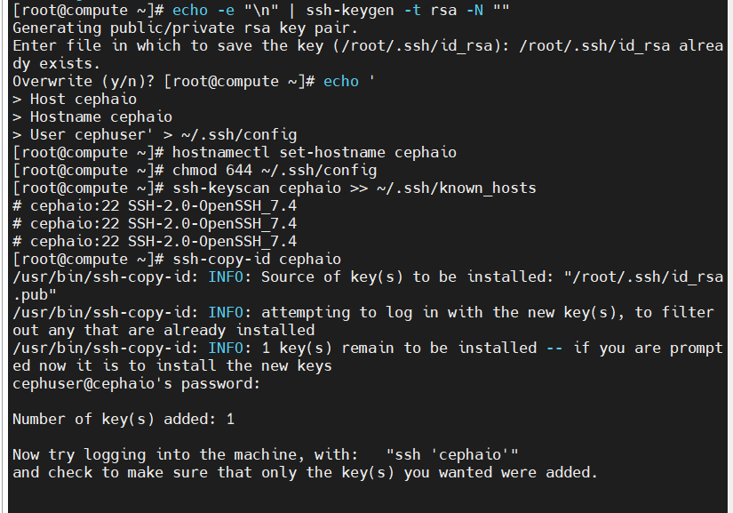
>
> ### Thiết lập Ceph Cluster
>
> - Cấu hình Ceph Repo
>
>   ```
>   echo '
>   [Ceph]
>   name=Ceph packages for $basearch
>   baseurl=http://download.ceph.com/rpm-luminous/el7/$basearch
>   enabled=1
>   gpgcheck=1
>   type=rpm-md
>   gpgkey=https://download.ceph.com/keys/release.asc
>   priority=1
>   
>   [Ceph-noarch]
>   name=Ceph noarch packages
>   baseurl=http://download.ceph.com/rpm-luminous/el7/noarch
>   enabled=1
>   gpgcheck=1
>   type=rpm-md
>   gpgkey=https://download.ceph.com/keys/release.asc
>   priority=1
>   
>   [ceph-source]
>   name=Ceph source packages
>   baseurl=http://download.ceph.com/rpm-luminous/el7/SRPMS
>   enabled=1
>   gpgcheck=1
>   type=rpm-md
>   gpgkey=https://download.ceph.com/keys/release.asc
>   priority=1' > /etc/yum.repos.d/ceph.repo
>   
>   yum update -y 
>   ```

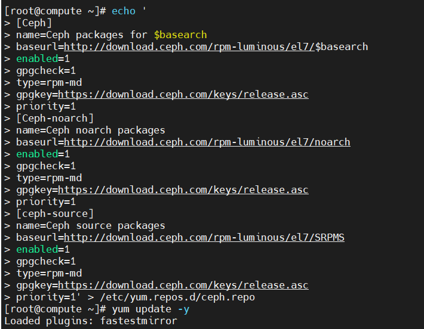

- Cài đặt Ceph-Deplay

  ```
  yum install ceph-deploy -y
  yum update ceph-deploy -y 
  ```

- tạo mới Ceph Cluster

  Tạo cluster drectory

  ```
  mkdir cluster
  cd cluster/
  ```

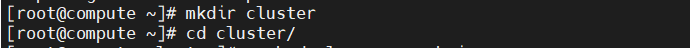

Tạo mới cấu hình ceph, thiết lập node mon

```
ceph-deploy new cephaio
```

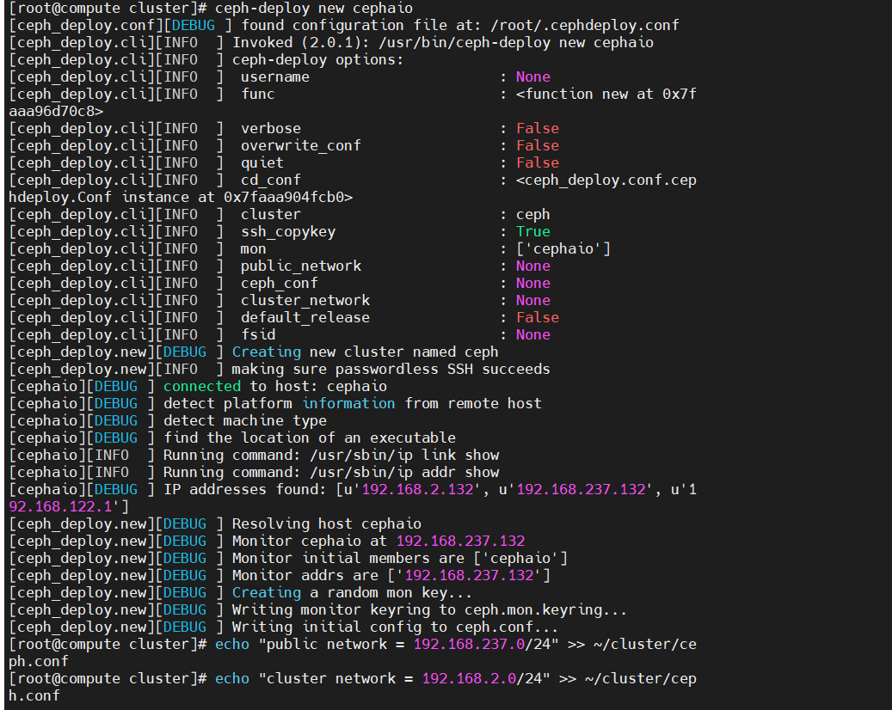

Cấu hình ceph.conf

```
echo "public network = 192.168.237.0/24" >> ~/cluster/ceph.conf
echo "cluster network = 192.168.2.0/24" >> ~/cluster/ceph.conf
```

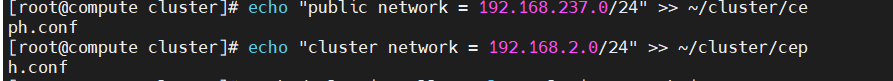

- Cài Đặt Ceph

  ```
  ceph-deploy install --release luminous cephaio
  ```

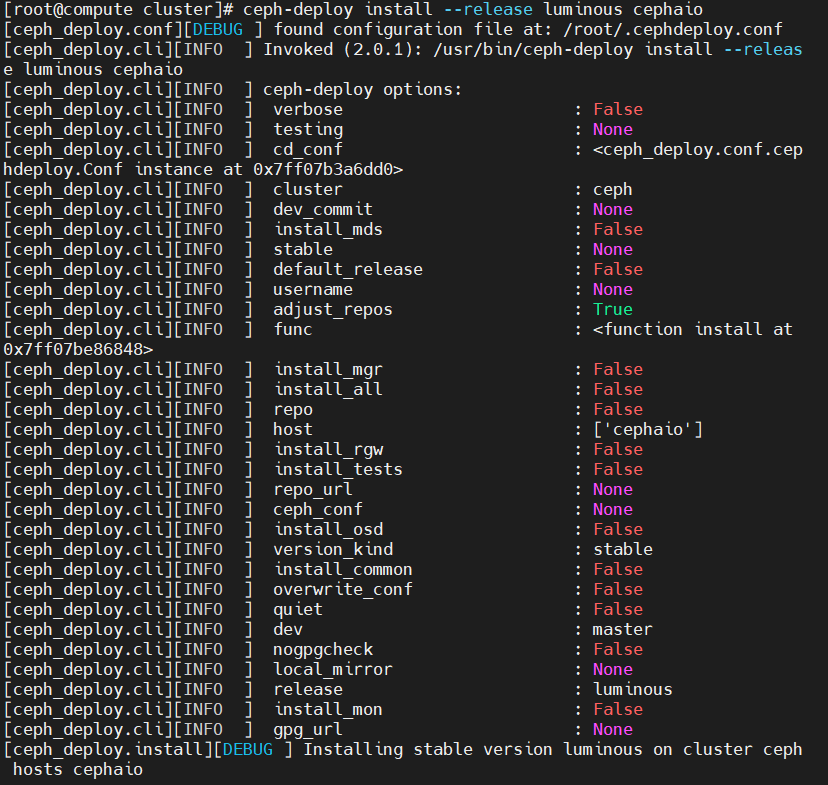


Khởi tạo tiến trình mon

```
ceph-deploy mon create-initial
```

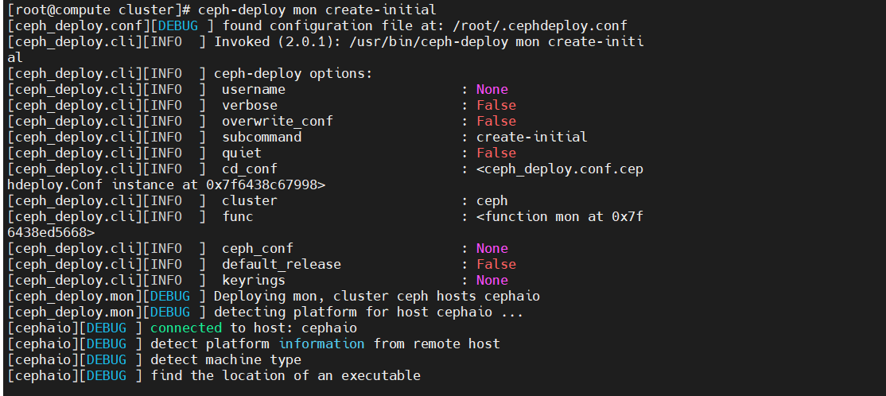

- Thiết lập OSD

  Liệt kê OSD

  ```
  ceph-deploy disk list cephaio
  ```

Xóa partition tables trên tất cả node với zap option

```
ceph-deploy disk zap cephaio /dev/sdb
ceph-deploy disk zap cephaio /dev/sdc
ceph-deploy disk zap cephaio /dev/sdd
```

Tạo mới OSD

```
ceph-deploy osd create cephaio --data /dev/sdb
ceph-deploy osd create cephaio --data /dev/sdc
ceph-deploy osd create cephaio --data /dev/sdd
```

Kiểm tra tại OSD node

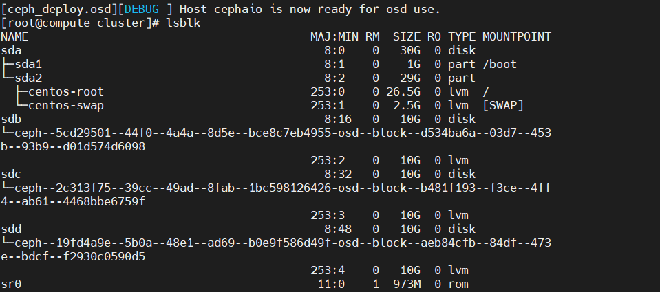

Khởi tạo quyền admin ceph cho node `cephaio` (Để node có quyền quản trị Ceph)

```
ceph-deploy admin cephaio
```


Thiết lập quyền truy cập file

```
sudo chmod 644 /etc/ceph/ceph.client.admin.keyring
```

Khởi tạo tiến trình ceph mgr (Không khởi tạo có thể gây lỗi ceph)

```
ceph-deploy mgr create cephaio:ceph-mgr-1
```

- kiểm tra trạng thái Ceph

  Kiểm Tra Cluster Health

```
[root@cephaio cluster]# sudo ceph health
HEALTH_OK

```

 Kiểm Tra Cluster Status

```
sudo ceph -s
```


- Chỉnh sửa Crush Map

  ```
  cd cluster/
  ceph osd getcrushmap -o map.bin
  crushtool -d map.bin -o map.txt
  ```


Chỉnh sửa crush map

```
sed -i 's/step chooseleaf firstn 0 type host/step chooseleaf firstn 0 type osd/g' ~/cluster/map.tx
```

```
crushtool -c map.txt -o map-new.bin
ceph osd setcrushmap -i map-new.bin
```

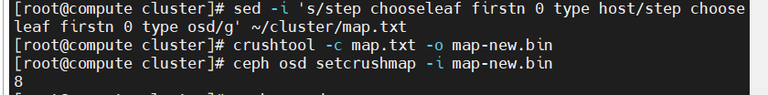

- Khởi tạo Ceph Dashboard

  sử dụng cho mục đích giám sát Ceph

  Liệt kê các Module hiện có

  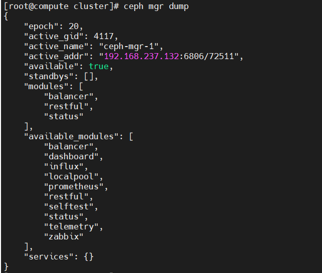

  Kích Hoạt Module Dashboard

```
ceph mgr module enable dashboard
```

 Kiểm Tra Lại

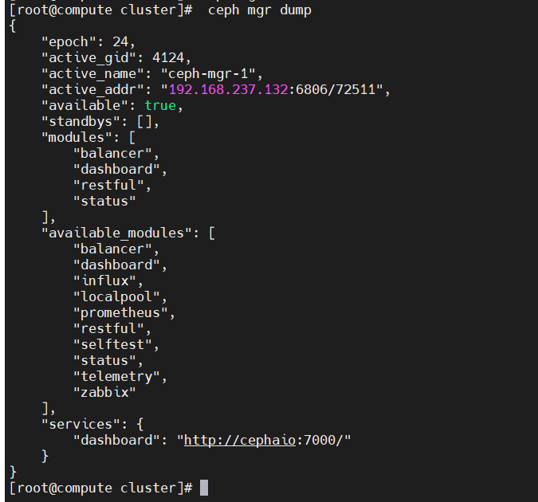

truy cập giao diện 

http://192.168.237.132:7000/

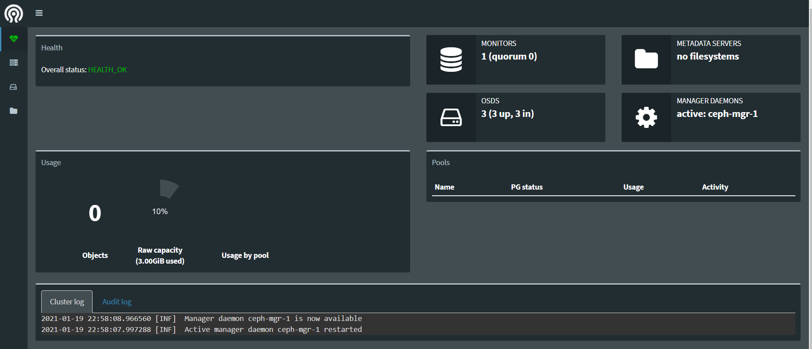