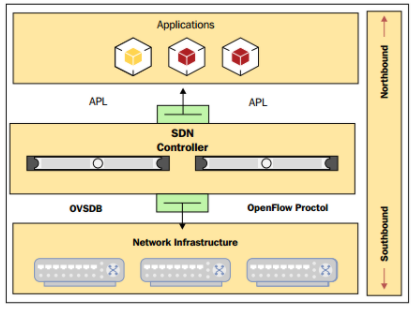

# Tìm hiểu về openvSwitch trong openstack

## 1. SDN và Open flow

## 1.1. SDN (Software Defined Networking)

SDN (Software Defined Networking) hay mạng điều khiển bằng phần mềm là một kiến trúc đem tới sự tự động, dễ dàng quản lí, tiết kiệm chi phí và có tính tương thích cao, đặc biệt phù hợp với những ứng dụng yêu cầu tốc độ băng thông cũng như sự tự động ngay

Kiến trúc này tách riêng hai chức năng là quản lí và truyền tải dữ liệu

SDN tách định tuyến và chuyển các luồng dữ liệu riêng rẽ và chuyển kiểm soát luồng sang thành phần mạng riêng có tên gọi là thiết bị kiểm soát luồng (Flow Controller).

- Tách biệt phần quản lí (control plane) với phần truyền tải dữ liệu (data plane).
- Các thành phần trong network có thể được quản lí bởi các phần mềm được lập trình chuyên biệt.
- Tập trung vào kiểm soát và quản lí network.

SDN có 3 phần chính đó là:

- Network infrastructure: Bao gồm các thiết bị mạng như router, switch, bao gồm cả thiết bị ảo và thật.
- Controller: Bao gồm phần mềm dựa trên bộ điều khiển tập trung, có thể đặt trên server để giao tiếp với tất cả các thiết bị mạng bằng cách sử dụng API như OpenFlow hoặc OVMDB.
- Applications: Bao gồm hàng loạt các ứng dụng có sự tồn tại của network. Các ứng dụng này có thể nói chuyện với controller sử dụng API để thực hiện những yêu cầu.

### 1.2. Open Flow

OpenFlow là tiêu chuẩn đầu tiên, cung cấp khả năng truyền thông giữa các giao diện của lớp điều khiển và lớp chuyển tiếp trong kiến trúc SDN

OpenFlow cho phép truy cập trực tiếp và điều khiển mặt phẳng chuyển tiếp của các thiết bị mạng như switch và router, cả thiết bị vật lý và thiết bị ảo, do đó giúp di chuyển phần điều khiển mạng ra khỏi các thiết bị chuyển mạch thực tế tới phần mềm điều khiển trung tâm. Các quyết định về các luồng traffic sẽ được quyết định tập trung tại OpenFlow Controller giúp đơn giản trong việc quản trị cấu hình trong toàn hệ thống. 

Một thiết bị OpenFlow bao gồm ít nhất 3 thành phần:

- Secure Channel: kênh kết nối thiết bị tới bộ điều khiển (controller), cho phép các lệnh và các gói tin được gửi giữa bộ điều khiển và thiết bị.

- OpenFlow Protocol: giao thức cung cấp phương thức tiêu chuẩn và mở cho một bộ điều khiển truyền thông với thiết bị.

- Flow Table: một liên kết hành động với mỗi luồng, giúp thiết bị xử lý các luồng.

  

  

## 2. OPenvSwitch

Open vSwitch là switch ảo mã nguồn mở theo giao thức OpenFlow.

Các chức năng của Open vSwitch:

- Hỗ trợ tính năng VLAN chuẩn 802.1Q với các cổng trunk và access port như một switch layer thông thường.
- Hỗ trợ giao diện NIC bonding có hoặc không có LACP trên cổng uplink switch.
- Hỗ trợ NetFlow, sFlow(R), và mirroring để tăng khả năng hiển thị.
- Hỗ trợ cấu hình QoS (Quality of Service) và các chính sách thêm vào khác.
- Hỗ trợ tạo tunnel GRE, VXLAN, STT và LISP.
- Hỗ trợ tính năng quản lý các kết nối 802.1aq
- Hỗ trợ giao thức OpenFlow.
- Cấu hình cơ sở dữ liệu với C và Python.
- Hoạt động forwarding với hiệu suất cao sử dụng module trong nhân Linux.

## 3. Những hạn chế khi sử dụng Linux Bridge - So sánh OpenvSwitch và Linux Bridge

**Hạn chế của Linux Bridge**

Linux Bridge (LB) là cơ chế ảo hóa mặc định được sử dụng trong KVM. Nó rất dễ dàng để cấu hình và quản lí tuy nhiên nó vốn không được dùng cho mục đích ảo hóa vì thế bị hạn chế một số các chức năng.

LB không hỗ trợ tunneling và OpenFlow protocols. Điều này khiến nó bị hạn chế trong việc mở rộng các chức năng. Đó cũng là lí do vì sao Open vSwitch xuất hiện.

Dưới đây là bảng so sánh giữa hai công nghệ này:

| Open vSwitch                             | Linux bridge                                           |
| ---------------------------------------- | ------------------------------------------------------ |
| Được thiết kế cho môi trường mạng ảo hóa | Mục đích ban đầu không phải dành cho môi trường ảo hóa |
| Có các chức năng của layer 2-4           | Chỉ có chức năng của layer 2                           |
| Có khả năng mở rộng                      | Bị hạn chế về quy mô                                   |
| ACLs, QoS, Bonding                       | Chỉ có chức năng forwarding                            |
| Có OpenFlow Controller                   | Không phù hợp với môi trường cloud                     |
| Hỗ trợ netflow và sflow                  | Không hỗ trợ tunneling                                 |

**OVS**

- Ưu điểm: các tính năng tích hợp nhiều và đa dạng, kế thừa từ linux bridge. OVS hỗ trợ ảo hóa lên tới layer4. Được sự hỗ trợ mạnh mẽ từ cộng đồng. Hỗ trợ xây dựng overlay network.
- Nhược điểm: Phức tạp, gây ra xung đột luồng dữ liệu

**LB**

- Ưu điểm:

các tính năng chính của switch layer được tích hợp sẵn trong nhân. Có được sự ổn định và tin cậy, dễ dàng trong việc troubleshoot Less moving parts: được hiểu như LB hoạt động 1 cách đơn giản, các gói tin được forward nhanh chóng

- Nhược điểm:

để sử dụng ở mức user space phải cài đặt thêm các gói. VD vlan, ifenslave. Không hỗ trợ openflow và các giao thức điều khiển khác. không có được sự linh hoạt

## 4. Các thành phần và kiến trúc của OpenvSwitch

Các thành phần chính:

- **ovs-vswitchd**: đóng vai trò daemon switch thực hiện các chức năng chuyển mạch kết hợp với module trong kernel Linux cho flow-based swtiching.

- **ovsdb-server**: database server mà ovs-vswitchd truy vấn tới để lấy cấu hình.

- **ovs-dpctl**: công cụ cấu hình module chuyển mạch trong kernel.

- **ovs-vsctl**: công cụ thực hiện truy vấn và cập nhật các cấu hình của ovs-vswitchd.

- **ovs-appctl**: công cụ gửi các lệnh tới Open Vswitch deamon. Open vSwitch cũng cung cấp một số công cụ sau:

- **ovs-ofctl**: công cụ truy vấn và điều khiển chuyển mạch Open Flow và controller.

- **ovs-pki**: Công cụ cho phép tạo và quản lý các public-key cho các Open Flow switch.

- **ovs-testcontroller**: một OpenFlow controller đơn giản có thể quản lý một số switch ảo thông qua giao thức Open Flow, khiến chúng hoạt động như các switch lớp 2 hoặc như hub. Phù hợp để kiểm tra các mạng Open Flow ban đầu.

  

#### Cơ chế hoạt động

Nhìn chung Open vSwitch được chia làm phần, Open vSwitch kernel module (Data Plane) và user space tools (Control Plane).

OVS kernel module sẽ dùng netlink socket để tương tác với vswitchd daemon để tạo và quản lí số lượng OVS switches trên hệ thống local. SDN Controller sẽ tương tác với vswitchd sử dụng giao thức OpenFlow. ovsdb-server chứa bảng dữ liệu. Các clients từ bên ngoài cũng có thể tương tác với ovsdb-server sử dụng json rpc với dữ liệu theo dạng file JSON.

Open vSwitch có 2 modes, normal và flow:

- Normal Mode: Ở mode này, Open vSwitch tự quản lí tất cả các công việc switching/forwarding. Nó hoạt động như một switch layer 2.
- Flow Mode: Ở mode này, Open vSwitch dùng flow table để quyết định xem port nào sẽ nhận packets. Flow table được quản lí bởi SDN controller nằm bên ngoài.