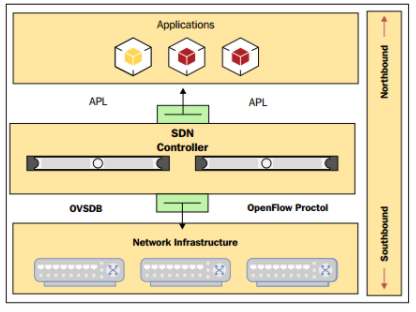

# Tìm hiểu về openvSwitch trong openstack

## 1. SDN và Open flow

## 1.1. SDN (Software Defined Networking)

SDN (Software Defined Networking) hay mạng điều khiển bằng phần mềm là một kiến trúc đem tới sự tự động, dễ dàng quản lí, tiết kiệm chi phí và có tính tương thích cao, đặc biệt phù hợp với những ứng dụng yêu cầu tốc độ băng thông cũng như sự tự động ngay

Kiến trúc này tách riêng hai chức năng là quản lí và truyền tải dữ liệu

SDN tách định tuyến và chuyển các luồng dữ liệu riêng rẽ và chuyển kiểm soát luồng sang thành phần mạng riêng có tên gọi là thiết bị kiểm soát luồng (Flow Controller).

- Tách biệt phần quản lí (control plane) với phần truyền tải dữ liệu (data plane).
- Các thành phần trong network có thể được quản lí bởi các phần mềm được lập trình chuyên biệt.
- Tập trung vào kiểm soát và quản lí network.

