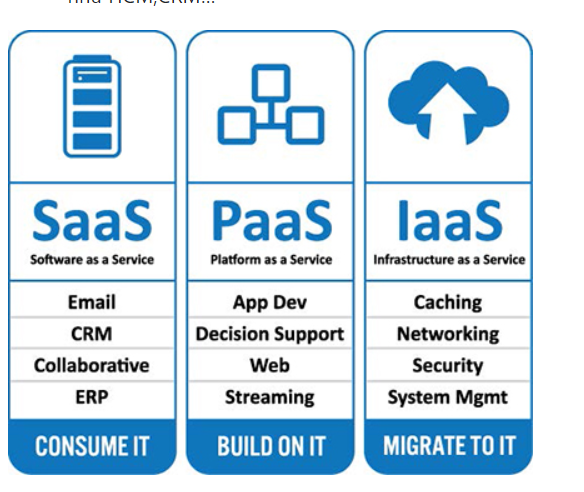

TÌM HIỂU VỀ OPENSTACK

[1. Khái niệm về openstack](#P1)

[2. Kiến trúc openstack](#2)

[3. Mô hình](#P3)

[4. Đặc điểm của OpenStack](#4)

# 1. Khái niệm về openstack 

Openstack là một platform mã nguồn mở dùng để triển khai điện toán đám mây, được phát triển theo mô hình Iaas, quản lý tài nguyên máy tính và cung cấp tài nguyên cho người dùng.
Nền tảng phần mềm bao gồm một nhóm các chức năng liên quan với nhau để điểu khiển xử lý các nhóm phần cứng, lưu trữ và hệ thống mạng trong data center. Người sử dụng quản lý thông qua dashboad dựa trên  nền tảng web, các công cụ, dòng lệnh hoặc thông qua các API Restful.

# 2. Kiến trúc openstack 

Kiến trúc tổng quan của OpenStack được chia thành 3 tầng:

Tầg ứng dụng (Your Application) : Các ứng dụng/phần mềm sử dụng OpenStack

Tầng Hypervisor (Standard Hardware) : Phần ứng máy chủ đã được ảo hóa để chia sẻ cho người dùng.

Dịch vụ OpenStack (Openstack Shared Services) : Các thành phần cơ bản như Dashboard, Compute, Networking, API, Storage.

# 3. Mô hình 

- Mô hình giải pháp

Điện toán đám mây OpenStack được các nhà cung cấp dịch vụ phát triển qua 3 giải pháp:

IaaS (Infrastructure as a service): cung cấp/cho thuê cơ sở hạ tầng như thuê máy chủ…

PaaS (Platform as a service): cung cấp nền tảng để phát triển ứng dụng

SaaS (Software as a service): cung cấp khả năng truy cập phần mềm linh hoạt như HCM,CRM…

- Mô hình triển khai

Các mô hình triển khai OpenStack trên thực tế:

Private Cloud: sử dụng trong một doanh nghiệp và không chia sẻ với bất kỳ ai nằm ngoài doanh nghiệp đóng

Public Cloud: các dịch vụ trên nền tảng điện toán đám mây được dành cho cá nhân, tổ chức cùng thuê và sử dụng chung tài nguyên

Hybrid Cloud: mô hình lai giữa public cloud và private cloud

Community Cloud: các dịch vụ được các công ty cùng hợp tác xây dựng và cung cấp cho cộng đồng sử dụng

# 4. Đặc điểm của OpenStack 

Với OpenStack, Cloud có khả năng phục vự và đáp ứng nhu cầu người dùng một cách toàn diện:

Thời gian boot máy ảo, cài đặt cực kỳ nhanh chóng

Giảm tối đa thời gian downtime

Trang dashboard quản trị dễ dàng, thân thiện với người dùng

Khả năng tự phục vụ - Khả năng truy cập hệ thống trên diện rộng

Tài nguyên được người dùng tự mua, lắp đặt và phân bổ theo nhu cầu

Khả năng co dãn, đàn hồi của tài nguyên (nâng lên - hạ xuống CPU,RAM)

Tự đo lường khả năng sử dụng dịch vụ bằng cách giám sát, dự phòng

Khả năng phục hồi và sao lưu dữ liệu hoàn toàn tự động

Tốc độ đọc dữ liệu vượt trội với ổ cứng SSD siêu tốc

