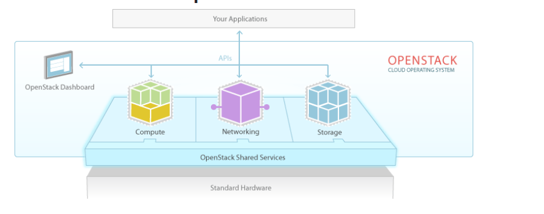

TÌM HIỂU VỀ OPENSTACK

[1. Khái niệm về openstack](#P1)

[2. Kiến trúc openstack](#2)

[3. Mô hình](#P3)

[4. Đặc điểm của OpenStack](#4)

[5. Các thành phần chính của OpenStack](#5)

[6. Lợi ích của sử dụng OpenStack] (#6)

# 1. Khái niệm về openstack 

Openstack là một platform mã nguồn mở dùng để triển khai điện toán đám mây, được phát triển theo mô hình Iaas, quản lý tài nguyên máy tính và cung cấp tài nguyên cho người dùng.
Nền tảng phần mềm bao gồm một nhóm các chức năng liên quan với nhau để điểu khiển xử lý các nhóm phần cứng, lưu trữ và hệ thống mạng trong data center. Người sử dụng quản lý thông qua dashboad dựa trên  nền tảng web, các công cụ, dòng lệnh hoặc thông qua các API Restful.

# 2. Kiến trúc openstack 

Kiến trúc tổng quan của OpenStack được chia thành 3 tầng:

Tầg ứng dụng (Your Application) : Các ứng dụng/phần mềm sử dụng OpenStack

Tầng Hypervisor (Standard Hardware) : Phần ứng máy chủ đã được ảo hóa để chia sẻ cho người dùng.

Dịch vụ OpenStack (Openstack Shared Services) : Các thành phần cơ bản như Dashboard, Compute, Networking, API, Storage.

# 3. Mô hình 

- Mô hình giải pháp

Điện toán đám mây OpenStack được các nhà cung cấp dịch vụ phát triển qua 3 giải pháp:

IaaS (Infrastructure as a service): cung cấp/cho thuê cơ sở hạ tầng như thuê máy chủ…

PaaS (Platform as a service): cung cấp nền tảng để phát triển ứng dụng

SaaS (Software as a service): cung cấp khả năng truy cập phần mềm linh hoạt như HCM,CRM…

- Mô hình triển khai

Các mô hình triển khai OpenStack trên thực tế:

Private Cloud: sử dụng trong một doanh nghiệp và không chia sẻ với bất kỳ ai nằm ngoài doanh nghiệp đóng

Public Cloud: các dịch vụ trên nền tảng điện toán đám mây được dành cho cá nhân, tổ chức cùng thuê và sử dụng chung tài nguyên

Hybrid Cloud: mô hình lai giữa public cloud và private cloud

Community Cloud: các dịch vụ được các công ty cùng hợp tác xây dựng và cung cấp cho cộng đồng sử dụng

# 4. Đặc điểm của OpenStack 

Với OpenStack, Cloud có khả năng phục vự và đáp ứng nhu cầu người dùng một cách toàn diện:

Thời gian boot máy ảo, cài đặt cực kỳ nhanh chóng

Giảm tối đa thời gian downtime

Trang dashboard quản trị dễ dàng, thân thiện với người dùng

Khả năng tự phục vụ - Khả năng truy cập hệ thống trên diện rộng

Tài nguyên được người dùng tự mua, lắp đặt và phân bổ theo nhu cầu

Khả năng co dãn, đàn hồi của tài nguyên (nâng lên - hạ xuống CPU,RAM)

Tự đo lường khả năng sử dụng dịch vụ bằng cách giám sát, dự phòng

Khả năng phục hồi và sao lưu dữ liệu hoàn toàn tự động

Tốc độ đọc dữ liệu vượt trội với ổ cứng SSD siêu tốc

# 5. Các thành phần chính của OpenStack 

+ Compute Infrastructure

Bên trong Compute là các nova nhỏ, mỗi nova có một chức năng riêng biệt. Tuy nhiên có một số loại phổ biến như: No-Volume đảm nhận trách nhiệm thêm, bớt Volume vào instance; No-compute thúc đẩy quá trình khởi động và vận hành hệ thống máy ảo;  No-schedule có khả năng sàng lọc thông tin nhanh chóng từ một lượng dữ liệu khổng lồ một cách nhanh chóng và bảo mật. cuối cùng là No-network có khả năng cấu hình mạng ảo. 

+ Storage Infrastructure (Swift)

Chức năng chính của bộ phận này là sao chép và ghi nhớ nguồn dữ liệu khổng lồ từ hệ thống máy ảo. Swift hoạt động dựa trên sự kết hợp hải hòa của Proxy node và Storage node. 

Cơ chế hoạt động khá đơn giản: sau khi các Proxy node tiếp nhận thông tin cần xử lý sẽ gửi về Storage node. Dữ liệu lúc này sẽ được sao lưu dưới dạng một account (không giới hạn số lượng. Trong mỗi account sẽ chứa ít nhất một container có tác dụng tiến hành update thông tin đã sao lưu.

+ Imaging service (Glance)

Tên gọi đã thể hiện chức năng chính của thành phần này là xử lý và lưu trữ những file ảnh từ máy chủ ảo. Đảm bảo hình ảnh lưu trữ trong hệ thống luôn có tính bảo mật cao. Bên cạnh đó Glance còn hỗ trợ các thao tác khác liên quan đến hình ảnh như chỉnh sửa hoặc xóa ảnh.

+ Openstack Network

Đây là thành phần giữ vai trò vô cùng quan trọng có tác dụng điều tiết, vận hành cũng như quản lý mạng cho máy chủ ảo. Là một hệ thống có tính chất pluggable,

+ Dashboard

Sự xuất hiện của dashboard giúp người dùng có thể truy cập các tính năng thiết kế đồ họa ấn tượng. Đồng thời cung cấp nguồn tài nguyên dồi dào để lưu trữ chúng.

# 6. Lợi ích khi sử dụng OpenStack 

+ Một công cụ tuyệt vời hỗ trợ quản lý mạng máy chủ ảo, cho phép người dùng điều khiển trực tiếp thông qua lệnh.

+ Quản lý một cách chặt chẽ và có hệ thống các thông tin, dữ liệu. Đảm bảo sao lưu nhanh chóng, chính xác, kịp thời và có tính bảo mật cao.

+ Cung cấp các chuỗi xác thực riêng biệt đối với user và projects.

+ Hỗ trợ các giao diện đồ họa, chỉnh sửa hình ảnh bắt mắt cho người dùng.

+ Đảo bảo hệ thống máy chủ ảo vận hành trơn tru, êm ái, không bị tấn công bởi nguồn dữ liệu nhiễm virus.

+ Cung cấp hệ thống mã nguồn tự do, miễn phí giúp bạn xây dựng hệ thống máy chủ ảo VPS vững mạnh

+ Sử dụng đa dạng đối với hai hệ thống là  Public và Private Cloud.
