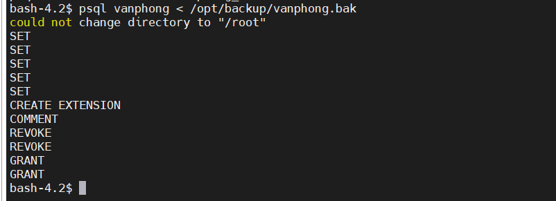
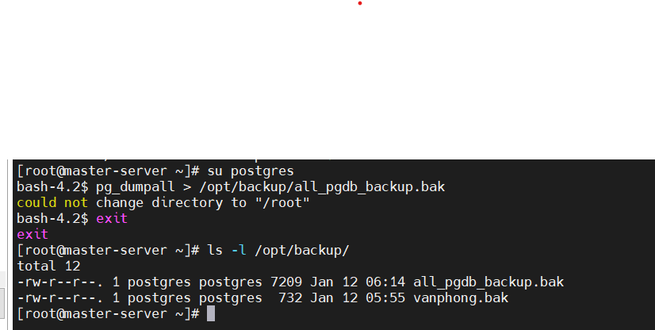
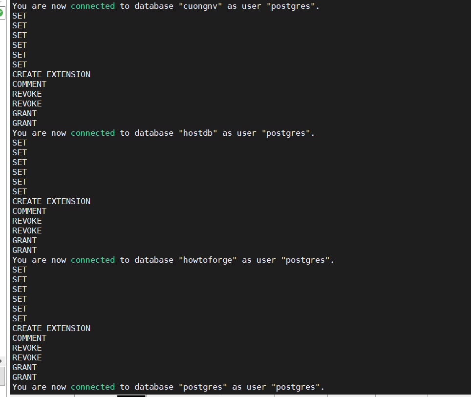

# PostgreSQL 

## Cài đặt psqlS

```

sudo yum install postgresql-server postgresql-contrib
```

```
sudo postgresql-setup initdb
```

```
sudo systemctl start postgresql
sudo systemctl enable postgresql

```

[1. các lệnh kiểm tra user, database,tables](#p1)

[2. Các kiểu dữ liệu trong PSQL](#P2)

##  1. Các lệnh kiểm tra user, database, tables

<a name="p1"></a>

\l hoặc \l+ : hiện thị các database đang có trong postgresql db

\c dbname : kết nối hoặc thay đổi db cần làm việc;

\set search_path to schemaname chỉ định schema làm việc

\dn liệt kê các schema đang có

\dt : liệt kê các đang có trong schema hiện tại

\q: thoát

\x on hoặc \x auto : để dữ liệu dễ nhìn hơn

## 2 . Các kiểu dữ liệu trong PSQL <a name="P2"></a>

### Kiểu chuỗi

| Kiểu dữ liệu                     | Miêu tả                                                      |
| -------------------------------- | ------------------------------------------------------------ |
| character varying(n), varchar(n) | Dộ dài (variable-length) thay đổi có giới hạn                |
| character(n), char(n)            | Độ dài (fixed-length) cố định, thiếu ký tự thì sẽ đệm bằng ký tự trống (blank) |
| text                             | Độ dài (variable-lenth) thay đổi không có giới hạn           |

### Kiểu số

| Kiểu dữ liệu     | Kích thước lưu trữ | Miễu tả                         | Khoảng giá trị                                               |
| ---------------- | ------------------ | ------------------------------- | ------------------------------------------------------------ |
| smallint         | 2 bytes            | small-range integer             | Giá trị từ: -32768 => +32767                                 |
| integer          | 4 bytes            | typical choice for integer      | Giá trị từ: -2147483648 => +2147483647                       |
| bigint           | 8 bytes            | large-range integer             | Giá trị từ: -9223372036854775808 tới +9223372036854775807    |
| decimal          | variable           | user-specified precision, exact | Độ dài tới 131072 chữ số trước dấu phẩy; và 16383 chữ số sau dấu phẩy |
| numeric          | variable           | user-specified precision, exact | Độ dài tới 131072 chữ số trước dấu phẩy; và 16383 Chữ số sau dấu phẩy |
| real             | 4 bytes            | variable-precision, inexact     | Kiểu dữ liệu số thực, độ chính xác tới 6 chữ số sau dấu thập phân |
| double precision | 8 bytes            | variable-precision, inexact     | Độ chính xác tới 15 số sau dấu thập phân                     |
| smallserial      | 2 bytes            | small autoincrementing integer  | Giá trị từ: 1 => 32767                                       |
| serial           | 4 bytes            | autoincrementing integer        | Giá trị từ: 1 => 2147483647                                  |
| bigserial        | 8 bytes            | large autoincrementing integer  | Giá trị từ: 1 => 9223372036854775807                         |

### kiểu Thời gian

| Kiểu dữ liệu                            | Kích thước lưu trữ | Miêu tả                                                 | Giá trị thấp nhất | Giá trị cao nhất | Resolution                |
| --------------------------------------- | ------------------ | ------------------------------------------------------- | ----------------- | ---------------- | ------------------------- |
| timestamp [ (p) ] [ without time zone ] | 8 bytes            | Gồm ngày/tháng/năm với thời gian (không theo time zone) | 4713 BC           | 294276 AD        | 1 microsecond / 14 digits |
| timestamp [ (p) ] with time zone        | 8 bytes            | Gồmngày/tháng/năm với thời gian (theotime zone)         | 4713 BC           | 294276 AD        | 1 microsecond / 14 digits |
| date                                    | 4 bytes            | Chỉ ngày/tháng/năm                                      | 4713 BC           | 5874897 AD       | 1 day                     |
| time [ (p) ] [ without time zone ]      | 8 bytes            | Chỉ thời gian (giờ/phút/giây) (không theo time zone)    | 00:00:00          | 24:00:00         | 1 microsecond / 14 digits |
| time [ (p) ] with time zone             | 12 bytes           | Chỉ thời gian (giờ/phút/giây) (theo time zone)          | 00:00:00+1459     | 24:00:00-1459    | 1 microsecond / 14 digits |
| interval [ fields ] [ (p) ]             | 16 bytes           | time interval                                           | -178000000 years  | 178000000 years  | 1 microsecond / 14 digit  |

### Kiểu tiền tệ

| Kiểu dữ liệu | Kích thước lưu trữ | Miêu tả      | Khoảng dữ liệu                                 |
| ------------ | ------------------ | ------------ | ---------------------------------------------- |
| money        | 8 bytes            | Kiểu tiền tệ | -92233720368547758.08 => +92233720368547758.07 |

### Kiểu boolean

| Kiểu dữ liệu | Kích thước lưu trữ | Miêu tả                         |
| ------------ | ------------------ | ------------------------------- |
| boolean      | 1 byte             | Có 2 giá trị là true hoặc false |

### Backup and restore PostgreSQL

##### Backup Database

- Backup thành file txt thuần SQL

Để backup PostgreSQL Database thì trước tiên hãy đăng nhập bằng tài khoản có quyền truy cập server, sau đó chuyển sang dùng tài khoản **Postgres** và chạy lệnh `pg_dump` như sau

$ pg_dump db > db.sql


- khôi phục postgresql database

  Để khôi phục một database từ file backup.bak ,có thể sử dụn conmand sau

  psql vanphong < /opt/backup/vanphong.bak

  

  #### Backup and sao lưu toàn bộ database

  Để backup toàn bộ database của postgresql ,sử dụng công cụ pg_dumpall của Postgresql

  pg_dumpall > /opt/backup/all_pgdb_backup.bak

  


Để khôi phục toàn bộ database 

psql -f /opt/backup/all_pgdb_backup.bak postgres



## Đồng bộ dữ liệu Postgresql bằng replication

- slep 1: setup hostname

  ```
  sudo hostnamectl set-hostname master-server
  ```

```
sudo hostnamectl set-hostname slave-server
```

```
sudo vim /etc/hosts
```

- step 2: Cài đặt Postgresql trên master và slave

  ```
  su - postgres
  psql
  \conninfo
  ```

- Cấu hình master-server

  ```
  su - postgres
  ```

```
psql
CREATE USER replica REPLICATION LOGIN ENCRYPTED PASSWORD 'replicauser@';
```

```
cd /etc/postgresql/9.4/main/
```

```
listen_addresses = 'localhost,192.168.1.249'
```

```
wal_level = hot_standby
```

```
archive_mode = on
archive_command = 'cp -i %p /var/lib/postgresql/9.4/main/archive/%f'
max_wal_senders = 3
wal_keep_segments = 8
```

```
mkdir -p /var/lib/9.4/main/archive/
```

```
vim pg_hba.conf
host    replication     replica      192.168.1.248/24            md5

```

- step 4. Cấu hình slave server

  ```
  su - postgres
  cd /etc/postgresql/9.4/main/
  ```

```
vim postgresql.conf
listen_addresses = 'localhost,192.168.1.248'
wal_level = hot_standby
checkpoint_segments = 8
max_wal_senders = 3
wal_keep_segments = 8
hot_standby = on

```

- step 5: 

  slave

  ```
  systemctl stop postgresql
  su - postgres
  mv 9.4/main 9.4/main_original
  pg_basebackup -h 192.168.1.249 -D /var/lib/postgresql/9.4/main -U replica -v -P
  ```

```
cd /var/lib/postgresql/9.4/main/
vim recovery.conf
standby_mode = 'on'
primary_conninfo = 'host=192.168.1.249 port=5432 user=replica password=replicauser@'
restore_command = 'cp //var/lib/postgresql/9.4/main/archive/%f %p'
trigger_file = '/tmp/postgresql.trigger.5432'
```

```
systemctl start postgresql
```

- step 6 : Testing

  master

  ```
  su - postgres
  psql -x -c "select * from pg_stat_replication;"
  su - postgres
  psql
  create database howtoforge;
  ```

slave

```
su - postgres
psql
\list
```

#### chuyển slave thành  master

chạy quảng cáo pg_ctl

```
bash``-4.2$ pg_ctl promote -D ``/var/lib/pgsql/10/data/``<font><``/font``>
waiting ``for` `server to promote.... ``done``<font><``/font``>
server promoted
```

Tạo một tệp trigger_file mà chúng ta phải thêm vào recovery.conf của thư mục dữ liệu của chúng ta.

```
bash``-4.2$ ``cat` `/var/lib/pgsql/10/data/recovery``.conf<font><``/font``>
standby_mode = ``'on'``<font><``/font``>
primary_conninfo = ``'application_name=pgsql_node_0 host=postgres1 port=5432 user=replication password=****'``<font><``/font``>
recovery_target_timeline = ``'latest'``<font><``/font``>
trigger_file = ``'/tmp/failover.trigger'``<font><``/font``>
<font><``/font``>
bash``-4.2$ ``touch` `/tmp/failover``.trigger
```