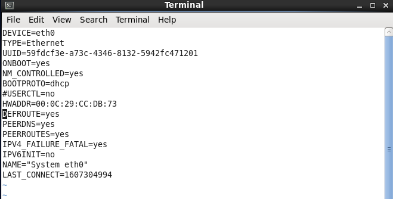

# REPORT 3

[MỤC LỤC](#mucluc)

[1. CONNECTING LINUX TO THE NETWORK](#P1)

* [1.1. Basic network configuration](#p11)

* [1.2. IPv4 addressing (dhcp/static)](#p12)

* [1.3. Network protocols](#p13)

* [1.4. Network services and port numbers](#p14)

* [Managing network devices](#p15)

* [Hostnames and DNS](#16)

* [Searching domains](p17)

* [Routing under Linux](p18)

* [1.9. Configuring network time & The time zone](p19)


[2.SYSTEM LOGGING](#P2)

* [Rsyslog/syslog configuration](#21)

*  [Testing using logger](#22)

* [Managing logs with logrotate](#23)

* [The systemd journal: journalctl](#24)

[3.TROUBLESHOOTING](#P3)

* [The troubleshooting process](#31)

* [Booting the rescue system/recove7y password]((#31)


<a name="P1"> </a>
# 1. CONNECTING LINUX TO THE NETWORK

<a name="p11"></a>
## 1.1. Basic network configuration

Các bước cơ bản để thêm một máy tính mới vào một mạng cục bộ là như sau:

- Gán địa chỉ IP và tên máy chủ duy nhất.

-  Đảm bảo giao diện mạng được cấu hình đúng tại thời điểm khởi động.

- Thiết lập một tuyến đường mặc định và có lẽ định tuyến fancier.

- Trỏ đến một máy chủ tên DNS để cho phép truy cập vào phần còn lại của Internet

### 1.1.1. Hostname and IP address assignment


## 1.2. IPv4 addreding(dhcp/static)

### 1.2.1. Liệt kê các cart mạng trên Centos 7

Đối với câu lệnh dùng :ip link show


– Hoặc cũng có thể sử dụng lệnh ‘nmcli‘ của chương trình dịch vụ NetworkManager. Nếu card cần cấu hình hiển thị trạng thái ‘connected‘ là card mạng đó đã được cấu hình để được quả lý bởi chương trình Network Manager.


### 1.2.2. Cấu hình IP Tĩnh cho Centos  7

- Đối với chỉnh sửa cấu hình IP tĩnh cho các card mạng tương ứng

 Giờ ta có card mạng thì ta cần tạo 1 file cấu hình có tên tiền tố là ‘ifcfg-<tên card mạng>‘ trong thư mục ‘/etc/sysconfig/network-scripts/‘. Ví dụ dưới đây thì ta sẽ tạo file ‘ifcfg-ens33‘ .
 
 
 
 Dưới đây là các option bạn nên lưu ý khi cấu hình, còn lại để mặc định cũng được.
 
- DEVICE : tên card mạng đã được liệt kê ở phần 1, nên điền chính xác tên card mạng thì hệ thống mới nhận biết được card nào để cấu hình card mạng cho nó.
- NAME : nội dung y như phần DEVICE.
- ONBOOT : phải để option ‘yes‘ thì khi reboot hệ thống, network mới tự động được bật lên với cấu hình card mạng tương ứng.
- BOOTPROTO : cấu hình IP tĩnh hay DHCP. Nếu là DHCP thì để giá trị ‘dhcp’.
- IPV6INIT : tắt chức năng hỗ trợ sử dụng IPv6 trên card mạng ens18.
- IPADDR : địa chỉ IP tĩnh.
- PREFIX : subnet mask của lớp mạng IP sử dụng.
- GATEWAY : địa chỉ IP cổng gateway. Nếu không có gateway thì máy này chỉ làm việc trong mạng local, nếu có gateway, nó được phép đi ra ngoài ví dụ như, ra Internet.
- DNS1 : thông tin DNS server.

Lưu ý: Các dòng không phân biệt hay thứ tự ưu tiên. Chỉ cần có các dòng cần thiết là được

### 1.2.3. Kiểm tra cấu hình

- Sau khi đã hoàn tất cấu hình IP tĩnh như trên thì ta sẽ khởi động lại dịch vụ network trên CentOS 7.

Câu lệnh : #systemctl restart network


- Kiểm tra thông tin IP tĩnh đã cấu hình cho card mạng ens33:

Câu lệnh: ip a s ens33


– Kiểm tra thông tin routing trên CentOS 7

câu lệnh ip r


Kêt quả thu được là địa chỉ ip route của ens 33 là 192.168.237.1 nằm trong dãy mạng 192.168.237.0/24
- Kiểm tra thông tin DNS

câu lệnh : #cat /etc/resolv.conf


- Kiểm tra ping gateway và ping DNS1

Câu lệnh :ping 192.168.237.1 và ping 8.8.8.8

 [trở về mục luc](#mucluc)
 
<a name="p13" > </a>
## 1.3. Network protocols

### 1.3.1. Mô hình OSI: Cách thức mạng hoạt động

Mô hình OSI chia quá trình giao tiếp giữa hai thiết bị mạng thành 7 lớp. Một nhiệm vụ hoặc một nhóm nhiệm vụ được giao cho mỗi lớp trong số 7 lớp này. Tất cả các lớp đều khép kín và các tác vụ được giao cho chúng có thể được thực thi độc lập.


Sau đây là mô tả chi tiết về hoạt động của các giao thức mạng trong mỗi lớp của mô hình OSI:

các lớp trong OSI | Nhiệm vụ |
-----| --------|
giao thức lớp Application | Cung cấp các dịch vụ tiêu chuẩn như thiết bị đầu cuối ảo, tệp, chuyển công việc và các hoạt động.|
giao thức lớp Presentation | Che dấu sự khác biệt về định dạng dữ liệu giữa các hệ thống khác nhau. 
Mã hóa và giải mã dữ liệu, mã hóa và giải mã dữ liệu cũng như nén và giải nén dữ liệu.|
giao thức  lớp Session |Quản lý các phiên và hội thoại của người dùng. Thiết lập và kết thúc phiên giữa những người dùng. |
giao thức lớp Transport | Quản lý việc gửi tin nhắn từ đầu đến cuối trong mạng. Kết xuất phân phối gói tuần tự và đáng tin cậy thông qua cơ chế khôi phục lỗi và kiểm soát luồng.|
giao thức lớp Network | Định tuyến các gói theo địa chỉ thiết bị mạng duy nhất. Kết xuất kiểm soát luồng và tắc nghẽn để ngăn chặn sự cạn kiệt tài nguyên mạng. |
giao thức lớp Datalink | Các gói tin khung. Phát hiện và sửa lỗi truyền gói. |
giao  thức lớp Physical | Giao diện giữa phương tiện mạng và thiết bị.  Xác định các đặc tính quang học, điện và cơ học|

### 1.3.2. Giao thức DHCP 

- Khái niệm

`DHCP viết tắt của từ Dynamic Host Configuration Protocol – Giao thức cấu hình Host động, giúp giảm khối lượng công việc cho quản trị hệ thống mạng. DHCP là một dịch vụ được chạy trên một máy chủ DHCP server. Nó có chức năng quản lý việc cấp phát địa chỉ IP động và các cấu hình TCP/IP. DHCP client là dịch vụ có sẵn trên các máy client. Nó dùng để yêu cầu cấp phát địa chỉ IP và các thông tin DNS cho chính máy client đó`

- Một DHCP server bao gồm bốn mục chính sau:

Options: các thông tin như địa chỉ IP, địa chỉ Subnet Mask, địa chỉ Gateway, địa chỉ DNS,… sẽ được DHCP Server cung cấp đầy đủ thông tin.

Scope: một dãy hay một đoạn địa chỉ IP đã được quy hoạch và chỉ định rõ ràng cho DHCP Server được phép cấp phát IP động thông qua DHCP cho máy tính client.\

Reservation: là những thông tin địa chỉ IP đã được “để dành”, tức cấu hình sẵn địa chỉ IP đó cho một số loại máy tính client.

Lease: Thời gian “cho thuê” hoặc tồn tại của địa chỉ IP động đối với mỗi máy client.

- Quá trình hoạt động DHCP


- chuẩn bị  
 + Server: Centos 7, ip : 192.168.2.2/24
 + Client: Centos6, Centos 
 
 - Đặt Ip tĩnh cho DHCP Server
 
 ` #vi /etc/sysconfig/network-scripts/ifcfg-ens33`
 
 
 
 - Cài đặt dhcp server 
  
  câu lệnh: yum install -y dhcp 
  
  kiểm tra cài đặt thành công hay chưa : rpm -qa | grep dhcp
  
  
  
 – Cấu trúc các file/thư mục của dịch vụ DHCP Server mà bạn cần biết:

`/etc/dhcp/dhcpd.conf : file cấu hình dịch vụ DHCP.

/var/lib/dhcpd/dhcpd.leases : file chứa thông tin các IP động đang cấp qua DHCP.

/var/log/message : log mặc định chứa quá trình DHCP 4 bước.
 `
 - Cài đặt DHCP Server
 
  Sau khi đã cài đặt gói dịch vụ thành công chúng ta chép file cấu hình mẫu tới thư mục /etc/dhcp
  
 `# cp /usr/share/doc/dhcp-4.2.5/dhcpd.conf.example /etc/dhcp/dhcpd.conf
`
Nội dung cấu hình DHCP Server

câu lệnh vào file cấu hình: #vi /etc/dhcp/dhcp.conf


khởi dộng lại dhcp

`#systemctl start dhcpd
`
- cấu hình dhcp ở client

câu lệnh: #vi /etc/sysconfig/network-script/ifcfg-eth0



kiểm tra ở client được cấp phát ip từ DHCP Server chưa : # ifconfg

.

Ta đã thấy ip client là 192.168.2.110 nằm trong dãy địa chỉ ip từ 192.168.2.110 đến 192.168.2.150 của dhcp server cấp phát

Như vậy đã  cấp  hình thành công DHCP 

- kiểm tra các client được cấp phát : # cat /var/lib/dhcpd/dhcp.leases


- Cấp phát 1 ip của thể cho một máy  

Trường hợp này là bạn đang muốn dành riêng 1 địa chỉ IP trong range IP DHCP cho một máy tính cụ thể trong hệ thống mạng

Phần khai báo cấu hình này nằm trong nội dung cấu hình “subnet” của DHCP Server nhé. 


kiểm tra ở client centos7 đã đặt ip của  máy thông qua dhcp chưa


• Network services and port numbers

• Managing network devices

• Hostnames and DNS

• Searching domains

• Routing under Linux

<a name="p19"> </a>
## 1.9. Configuring network time &  The time zone

Trong tất cả hệ điều hành, thời gian hệ thống là một phần không thể thiếu bởi nó ảnh hưởng đến rất nhiều công việc như: Ghi Log, lập lịch công việc, Backup…. 

Các thành phần bắt buộc

- Giao thức Network Time Protocol (NTP)

- Tập tin Timezone data.

### 1.9.1. Giao thức Network Time Protocol(NTP)

NTP là một giao thức đồng bộ thời gian qua mạng, là một giao thức đồng bội đồng hồ của các hệ thống thông tin máy tính thông qua mạng dữ  liệu chuyển mạch gói với độ trễ biến đổi

- Cơ chế hoạt động của NTP:
  * NTP client gửi một gói tin, trong đó chứa một thẻ thời gian tới cho NTP server
  
  * NTP server nhận được gói tin, gửi trả lại NTP client một gói tin khác, có thẻ thời gian là thời điểm nó gửi gói  tin đó đi
  
  * NTP client nhận được gói tin đó, tính toán độ trễ, dựa vào thẻ thời gian mà nó nhận được cùng với độ trễ đường truyền, NTP client sẽ set lại thời gian của nó.
  
  - Cài đặt NTP
  
  ```
  #yum install ntp -y
  # /etc/init.d/ntpd start
  # chkconfig ntpd on
  ```
 Như vậy là đã hoàn thành cài đặt Network Time Protocol, tiếp theo chúng ta thực hiện lựa chọn Timezone cho hệ thống.
 
 ### 1.9.2. Cấu hình Timezone
 
 Trong centos, các tập tịn Timezone nằm ở thư mục /use/share/zoneinfo/, ca
[2.SYSTEM LOGGING](#P2)

• Rsyslog/syslog configuration

• Testing using logger

• Managing logs with logrotate

• The systemd journal: journalctl

[3.TROUBLESHOOTING](#P3)

• The troubleshooting process

• Booting the rescue system/recovery password
