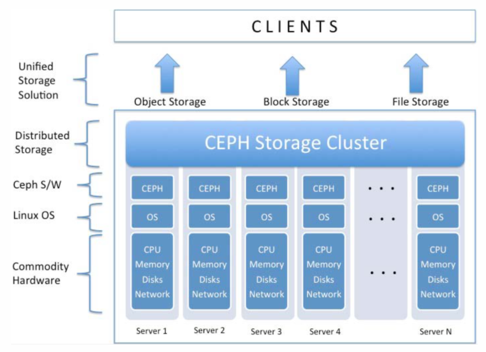

# CEPH

> ​	Ceph là một phần mềm mã nguồn mở để xây dựng hạ tầng lưu trữ phân tán, ổn định, độ tin cậy và hiệu năng cao, dễ dàng mở rộng. 

​	Ceph hỗ trợ lưu trữ dữ liệu ở ba dạng: đối tượng(Object), khối(Block), tệp(File) trong cùng một nền tảng duy nhất. Ceph có thể biến đổi cơ sở hạ tầng CNTT của người dùng và khả năng quản lý lượng lớn dữ liệu. Nếu người dùng cần chạy các ứng dụng có nhu cầu giao diện lưu trữ khác nhau, Ceph giải pháp tối ưu để sử dụng

​	

​	Ceph chạy trên nền tảng điện toán đám mây với các thiết bị phần cứng ổn định và tiên tiến nhất, giúp tiết kiệm chi phí và sử dụng dễ dàng với Linux Kernel. Nền tảng của Ceph là *Kho lưu trữ đối tượng phân tán tự động đáng tin cậy (Reliable Autonomic Distributed Object Store-RADOS)*  cung cấp khả năng mở rộng lưu trữ dữ liệu cực lớn — hàng nghìn máy khách hoặc KVM truy cập đến hàng exabyte dữ liệu. Mỗi ứng dụng có thể sử dụng đồng thời **đối tượng** , **khối** hoặc **tệp** cho cùng một cụm RADOS, có nghĩa là hệ thống lưu trữ Ceph đóng vai trò là nền tảng linh hoạt cho tất cả các nhu cầu lưu trữ dữ liệu.

​	Các nguyên tắc cơ bản của Ceph:

	- Khả năng mở rộng tất cả thành phần
	- Giải pháp dựa trên phần mềm, hoàn toàn mở, tính thích nghi cao
	- Chạy tương thích với mọi phần cứng

​	Các hướng phát triển sử dụng Ceph:

- Sử dụng thay thế lưu trữ trên ổ. đĩa thông thường.
- Sử dụng để backup, lưu trữ an toàn.
- Sử dụng để thực hiện triển khai các dịch vụ High Avaibility khác như Load Balancing for Web Server, DataBase Replication…
- Xây dựng Storage giải quyết bài toán phát triển lên Cloud Storage hoặc lưu trữ Data as a Service.

​	Các hệ thống lưu trữ của Ceph

- Ceph Object Storage: cung cấp khả năng truy cập liên tục tới các Object bằng cách sử dụng binding hoặc radosgw, giao diện REST tương thích với các ứng dụng được viết cho S3 và Swift.

