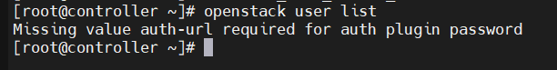
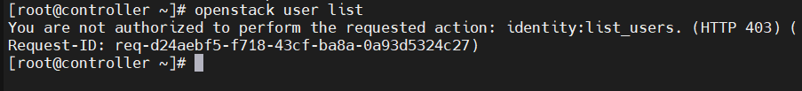
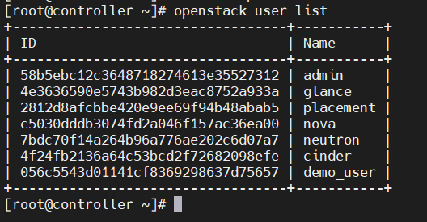
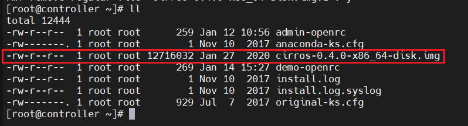
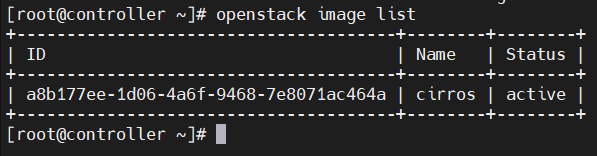
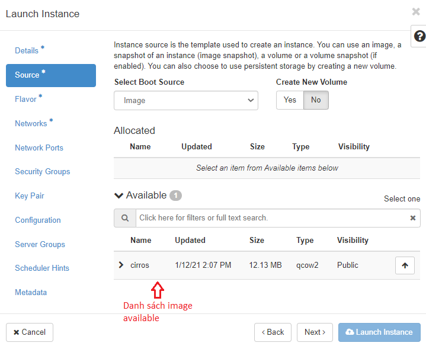
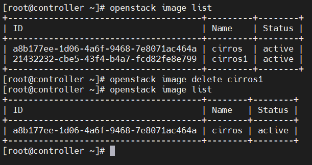
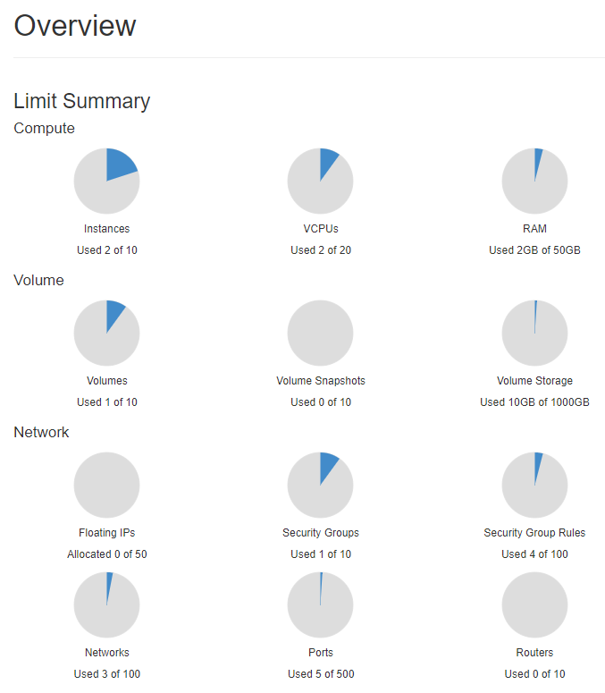

Cài đặt OpenStack (Train - CentOS 7) All in one

Thứ tự cài đặt: Môi trường -> KeyStone -> Glance -> Placement -> Nova  -> Neutron -> Horizon -> Cinder

# Tổng quan OS:

## Identity (KeyStone)

- Dịch vụ Identity thường là dịch vụ đầu tiên mà người dùng tương tác. Sau khi được xác thực, người dùng có thể sử dụng danh tính của họ để truy cập các dịch vụ OpenStack khác. Tương tự như vậy, các dịch vụ OpenStack khác tận dụng dịch vụ Identity để đảm bảo danh tính người dùng quyền truy cập, sử dụng các dịch vụ khác trong quá trình triển khai. 

- Kiểm soát đăng nhập, quyền hạn người dùng cuối:

  - Người dùng chưa đăng nhập, thiếu thông tin xác thực danh tính:

    

  - Người dùng đã xác thực danh tính, k có quyền truy cập, sử dụng dịch vụ:

    

  - Người dùng đã xác thực danh tính, được ủy quyền truy cập, sử dụng dịch vụ:

    

- KeyStone có 4 đối tượng chính : domain, project, user and role. 

  - User là ...user
  - Project
  - [Domain](https://docs.openstack.org/security-guide/identity/domains.html) là vùng chứa(high-level containers) các project, user (và group), được sử dụng để quản lý tập trung tất cả các thành phần nhận dạng, xác thực dựa trên keystone.
  - [Role](https://docs.openstack.org/keystone/latest/admin/service-api-protection.html) là đối tượng quản lý vai trò (chỉ định, ủy quyền cho đối tượng user), VD:
    - `openstack role add --project service --user nova admin` : Cấp quyền (vai trò-role) *admin* cho user *nova* đối với project *service*. 
    - Có 3 role mặc định là reader(chỉ đọc), member(thêm, sửa) và admin(thêm, sửa, xóa)

## Image(Glance)

- Dịch vụ Image cho phép người dùng khám phá, đăng ký và truy xuất image máy ảo. Nó cung cấp một API REST(kiểu kiến trúc dành cho các hệ thống siêu đa phương tiện được sử dụng cho World Wide Web) cho phép bạn truy vấn siêu dữ liệu hình ảnh máy ảo và truy xuất hình ảnh thực tế(query virtual machine image metadata and retrieve an actual image). Có thể lưu trữ hình ảnh máy ảo được tạo sẵn thông qua dịch vụ Image ở nhiều vị trí khác nhau, từ hệ thống tệp đơn giản đến hệ thống lưu trữ đối tượng như OpenStack Object Storage.

- Tạo, lưu trữ, sử dụng image 

  - Tạo image:

    - Dowload source image cirros 0.4.0: ` wget http://download.cirros-cloud.net/0.4.0/cirros-0.4.0-x86_64-disk.img`

      

    - Upload image: `glance image-create --name "cirros" --file cirros-0.4.0-x86_64-disk.img --disk-format qcow2 --container-format bare --visibility public` (tên: cirros, nguồn:  cirros-0.4.0-x86_64-disk.img, định dạng : qcow2, định dạng vùng chứa(siêu dữ liệu):  bare(k có vùng chứa siêu dữ liệu), hiển thị: public)

  - Lưu trữ: xem các image đã tạo và đang được lưu trữ gồm id, tên, trạng thái `glance image-list`

    

  - Sử dụng image: Khi tạo máy ảo, image sẽ được sử dụng để cài đặt hệ điều hành

    

  - Xóa image: `openstack image delete [image_name/image_id]`

    

## Placement 

- Được sử dụng bởi nova để theo dõi các resource trên compute node. Để theo dõi các tài nguyên có sẵn/đã sử dụng/tổng quát trên các provider. 

  

## Compute(Nova)

