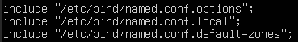
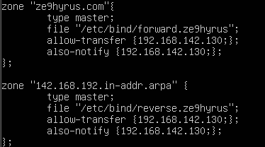
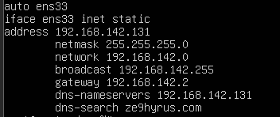
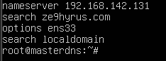
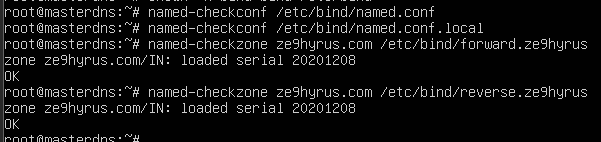

## Cấu hình master server

#### `vi /etc/bind/named.conf.ontions`

> 

#### `vi /etc/bind/named.conf`

> 

#### `vi /etc/bind/named.conf.local`

> 

- "ze9hyrus.com" : domain zone
- "etc/bind/forward.ze9hyrus": tên file và địa chỉ tuyệt đối của file forward (tương tự với "etc/bind/reverse.ze9hyrus")

#### `vi /etc/bind/forward.ze9hyrus` (tạo file mới)

> 
- masterdns.ze9hyrus.com: hostname server master
- slavedns.ze9hyrus.com: hostname server slave
- ...131: địa chỉ ip server master
- ...130: địa chỉ ip server slave
- ...129: địa chỉ ip client
#### `vi /etc/bind/reverse.ze9hyrus `(tạo file mới)

> 

#### `vi /etc/network/interfaces`
Đảm bảo rằng hệ thống đã cài đặt package *ifupdown* trước khi gõ lệnh này

> 

#### `vi /etc/resolv.conf `

> 

## Kết quả

Sau khi cấu hình xong, tiến hành `reboot` lại hệ thống và kiểm tra

#### Check file conf, zone 

> 

#### Check server `nslookup ze9hyrus.com`

> 

## Cấu hình slave server

#### /etc/bind/named.conf [làm tương tự master server](#1)

#### `vi /etc/bind/named.conf.local`

> 

#### `vi /etc/network/interfaces`
Đảm bảo rằng hệ thống đã cài đặt package *ifupdown* trước khi gõ lệnh này

> 

#### `vi /etc/resolv.conf `

> 

## Kiểm tra

Sau khi cấu hình xong, tiến hành `reboot` lại hệ thống và kiểm tra

#### Check server `nslookup ze9hyrus.com`

> 
