# BACKUP AND RESTORE
### [1.Archiving with tar](#1)
### [2.Using the dd command](#2) 
### [3.Mirroring data between systems: rsync](#3)
------------------------------------------------------------------------------------------------------------------------------------------------------------------------------------

## 1. Archiving with tar 
#### 1.1. Tar
   > Tar trong linux(viết tắt của *tape archive*) là lệnh được sử dụng rộng rãi nhất trên Linux để tạo các tệp lưu trữ nén và có thể được di chuyển dễ dàng từ đĩa này sang đĩa khác hoặc máy này sang máy khác. Lệnh tar có thể nén(và giải nén) các tệp, thư mục thành tệp tin nén có độ nén cao được gọi là tarball. Các định dạng nén tar có thể thực hiện là .tar, .tar.gz và .tar.bz2.
   
#### 1.2. Archiving with tar : `tar [option] [target] [directory]`
   - Create tar Archive File: tạo file nén tar trong thư mục hiện tại với lệnh`tar -cvf example.tar /home/example/` 
      - c: Tạo mới một file nén .tar
      - v: Hiển thị quá trình nén
      - f: Loại file nén
      
      > 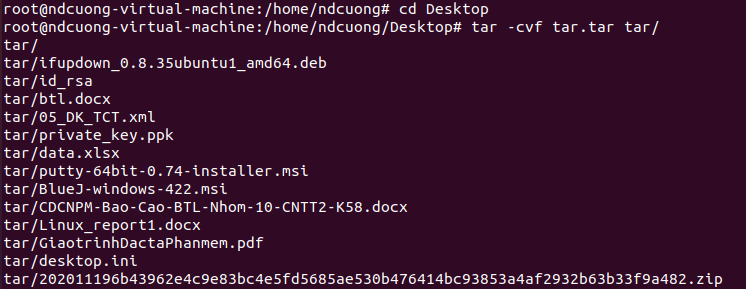
      
      > 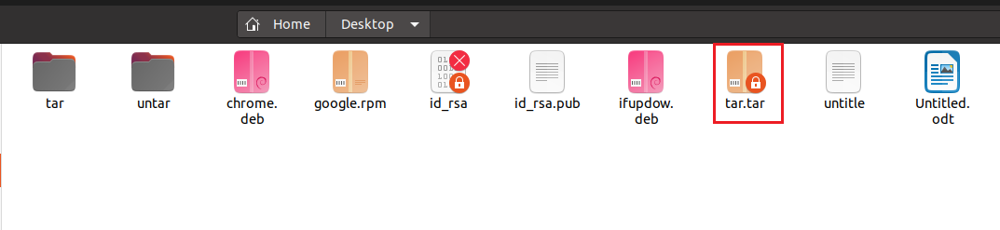
      
      > 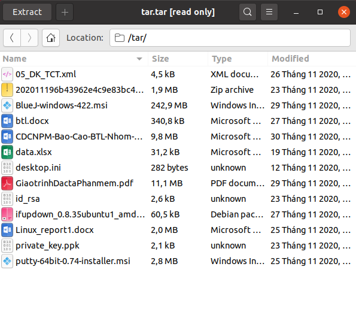
      
   - Create tar.gz Archive File: `tar cvzf example.tar.gz /home/example` hoặc `tar cvzf example.tgz /home/example`
      - z: Nén dạng gzip
   - Create tar.bz2 Archive File: bz2 có độ nén cao hơn gz và tar nhưng cũng mất nhiều thời gian để nén và giải nén hơn. Nén file với định dạng bz2 với lệnh: `tar cvfj example.bz2 /home/example` hoặc `tar cvfj example.tbz /home/example` hoặc `tar cvfj example.tb2 /home/example`
      - j: Nén dạng bz2
#### 1.3. Uncompress 
   - Untar tar Archive File: Để giải nén file tar, sử dụng option x(extract) trong lệnh tar: `tar -xvf example.tar`
      - x: Giải nén
      
      > 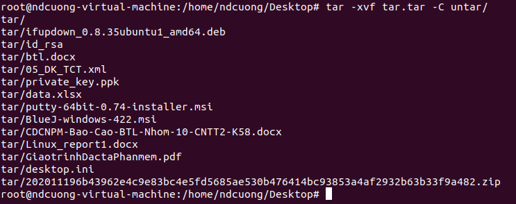
         
      > 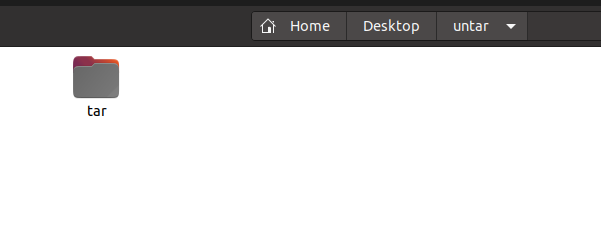
   
   Ngoài ra có thể thêm vào option -C ở sau để đặt vị trí dữ liệu sau khi giải nén: `tar -xvf example.tar -C Desktop/`
   - Uncompress tar.gz Archive File & Uncompress tar.bz2 Archive File: Tương tự như uncompress với tar
#### 1.4. List Content of tar Archive File
   - Để hiển thị danh sách file có trong file nén tar, sử dụng option -t: `tar -tvf example.tar` . Câu lệnh này hoạt động với cả file .gz và .bz2
   
   > 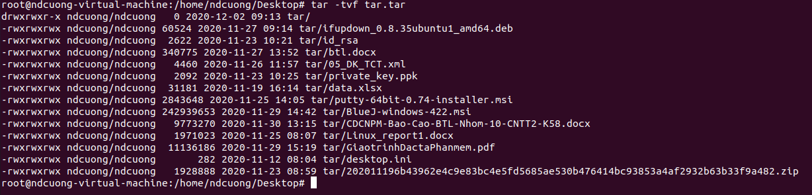
   
   
#### 1.5. Untar Multiple files from tar
   - Tar còn có chức năng giải nén một (số) file theo mục đích người dùng. Tương tự như [Uncompress](#Uncompress), Untar Multiple files cũng sử dụng option -x để giải nén, tuy nhiên sẽ có thêm tên file (file con bên trong file nén tar) cần giải nén ở phía sau tên file nén: `tar -xvf example.tar [file1] [file2]...`
      
   > 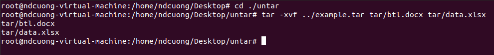
   
      
   > 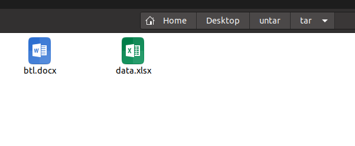
   
   - Đối với file nén .gz và .bz2, sử dụng các option -z(đối với .gz) và -j(đối với .bz2) ở phía trước -x 
#### 1.6. Extract Group of Files using Wildcard
   Sử dụng từ khóa wildcards để chọn ra nhóm file cần giải nén. Tính năng này hoạt động như 1 filter để search theo tên file chứa trong file nén. 
   
   Ví dụ : `tar -xvf example.tar --wildcards '*.docx'` lệnh này sẽ giải nén các file word có phần mở rộng .docx
   
   Hoặc một ví dụ khác: `tar -xvf example.tar --wildcards 't*'` lệnh này giải nén các file, folder có tên bắt đầu bằng 't'
      
   > 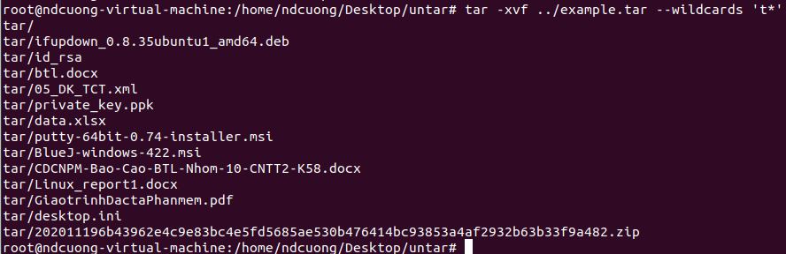
   
#### 1.7. Add Files or Directories to tar Archive File
   Sử dụng option -r để thêm một file hay folder vào file nén tar: `tar -rvf example.tar [file/directory]`
   Ví dụ: `tar -rvf tar.tar google.rpm`
      
   > 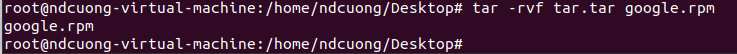
   
   > 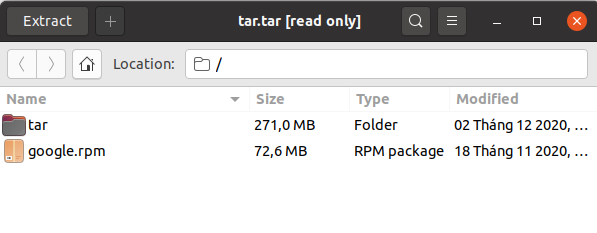
   
   > File nén dạng .gz và .bz2 không thể thêm file vào sau khi đã nén
#### 1.8. Check the Size of the tar Archive File
   Kiểm tra dung lượng file nén bằng lệnh : `tar -cvf - example.tar | wc -c`
   Ví dụ : `tar -cvf - tar.tar | wc -c`
      
   > 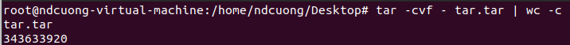
   
## 2. Using the dd command 
#### 2.1. dd command
 -  Command dd là lệnh dùng để chuyển đổi và sao chép tệp, một số đặc điểm của command dd:
   - Có thể đọc/ghi lên các file đặc biệt (như /dev/) và các device driver. Do đó có thể sử dụng để sao lưu các khu vực như khu vực khởi động của ổ cứng.
   - Có thể chuyển đổi trên các dữ liệu đã được nó sao chép, như hoán đổi thứ tự byte (byte order swapping) và đổi dữ liệu từ (hoặc sang)(conversion to and from) các văn bản mã hóa dạng ASCII và EBCDIC.
 - Cú pháp dòng lệnh của dd khác với các lệnh Unix khác, ở chỗ nó sử dụng cú pháp option = value cho các tùy chọn dòng lệnh của nó, thay vì các cú pháp -[option value]. Và option thường dùng nhất của nó là if(chỉ định tệp đầu vào - copy) và of(chỉ định tệp đầu ra - paste)
 Ví dụ: `dd if=/dev/sda of=/dev/sdb`
#### 2.2. Using the dd command 
> Command dd có một số ứng dụng thực tế thường được sử dụng
   - Sao chép toàn bộ đĩa cứng: `dd if=/dev/sda of=/dev/sdb`
      - Bản sao chính xác của ổ đĩa /dev/sda sẽ nằm trong /dev/sdb
      - Có thể sử dụng tham số “convert = noerror” để bỏ qua các lỗi gặp trong quá trình sao lưu, nếu không, khi gặp lỗi quá trình sao lưu sẽ dừng lại : `dd if=/dev/sda of=/dev/sdb convert = noerror`
      - Cần phải chú ý địa chỉ nguồn và đích, nếu ghi ngược 2 địa chỉ này có thể làm toàn bộ dữ liệu bị mất
   -  Sao lưu phân vùng, ổ cứng vào file ảnh (.img hoặc .iso): `dd if=/dev/sda of=~/sdadisk.img`
      - Phương pháp này nhanh hơn so với việc sao lưu bằng cách sao chép toàn bộ đĩa cứng, và cũng dễ sử dụng hơn khi có thể di chuyển file .img sang các thiết bị lưu trữ khác và có thể nhanh chóng khôi phục dữ liệu với file .img này.
    - Khôi phục bằng file .img: `dd if=sdadisk.img of=/dev/sda`
      - Command dd có thể nhanh chóng khôi phục chỉ với việc đặt địa chỉ nguồn và đích ngược lại quá trình sao lưu
    - Tạo CDROM backup: `dd if=/dev/cdrom of=tgsservice.iso bs=2048`
      - Command dd cho phép tạo một tệp iso từ một tệp nguồn. Vì vậy, chúng ta có thể chèn đĩa CD và nhập lệnh dd để tạo tệp iso của nội dung CD. Option bs chỉ định kích thước tệp (cả nguồn và đích), ở đây chỉ định file iso có dung lượng 2048 byte
    - Các option: Có 1 số option bổ sung cho dd command, tham khảo tại <a href="https://github.com/hocchudong/command-linux/blob/master/command-dd.md#b-c%C3%A1c-t%C3%B9y-ch%E1%BB%8Dn">đây</a>
## 3. Mirroring data between systems: rsync 
#### 3.1. rsync
> rsync là một tiện ích(utility) để truyền và đồng bộ hóa hiệu quả các tệp giữa máy tính với ổ cứng ngoài và giữa các máy tính nối mạng bằng cách so sánh thời gian sửa đổi và kích thước của tệp, thường được sử dụng trên các hệ thống Unix. rsync được viết bằng ngôn ngữ C dưới dạng ứng dụng đơn luồng.

Đồng bộ folder hoặc copy files thủ công thường rất tốn thời gian. Tính năng rsync lại có thể làm được hầu hết mọi công việc đó, giúp tiết kiệm được nhiều thời gian. Thậm chí là khi bị ngắt kết nối trong qua trình chuyển đổi, công cụ này sẽ tạm ngưng, và được mở lại tại điểm tạm ngưng đó khi kết nối lại.
