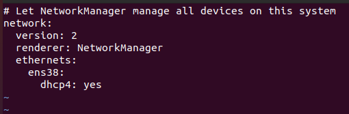
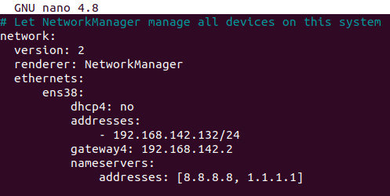
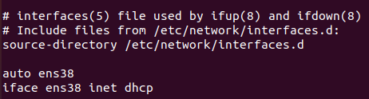
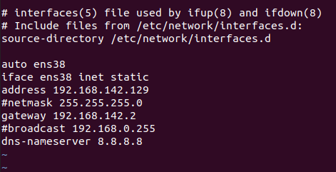
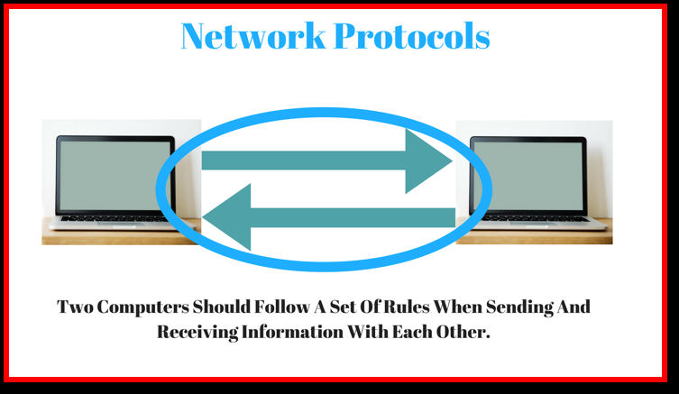
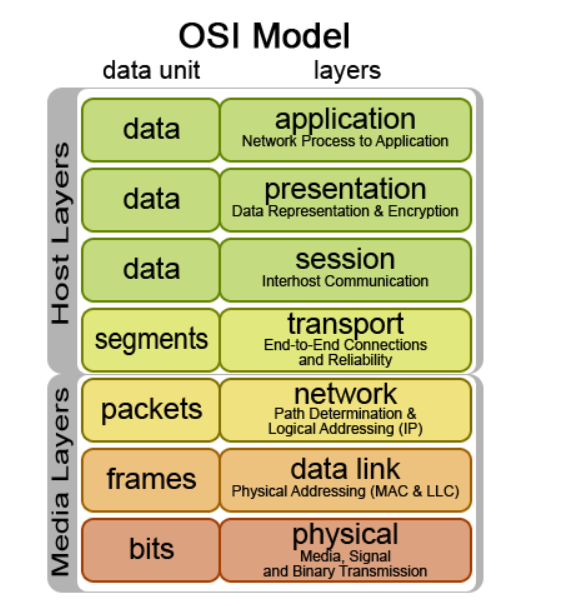
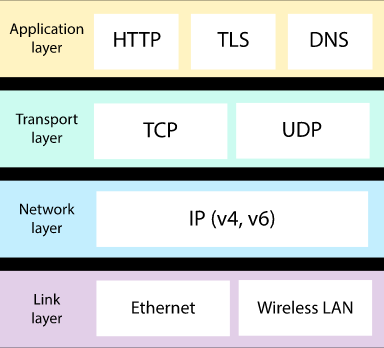
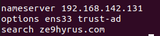
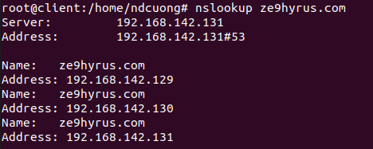

# CONNECTING LINUX TO NETWORK
#### [1.Basic network configuration](#1)
#### [2.IPv4 addressing (dhcp/static)](#2)
#### [3.Network protocols](#3)
#### [4.Network services and port numbers](#4)
#### [5.Managing network devices](#5)
#### [6.Hostnames and DNS](#6)
#### [7.Searching domains](#7)
#### [8.Routing under Linux](#8)
#### [9.Configuring network time](#9)
#### [10.The time zone](#0) 

## 1. Basic network configuration 
> Cấu hình mạng(network configuration)(còn được gọi là thiết lập mạng(network setup)) là quá trình thiết lập các điều khiển, luồng và hoạt động của mạng để hỗ trợ giao tiếp mạng của một tổ chức và (hoặc) chủ sở hữu mạng. Thuật ngữ này kết hợp nhiều quá trình cấu hình và thiết lập trên phần cứng, phần mềm mạng và các thiết bị và thành phần hỗ trợ khác.

- Các thông tin cần thiết cho quá trình cấu hình mạng:
  - Tên đầy đủ của máy tính
  - Địa chỉ IP, địa chỉ mac của máy
  - Mặt nạ mạng ( subnet mask) (nếu có)
  - Địa chỉ quảng bá (broadcast address) 
  
 - Quá trình bao gồm các nhiệm vụ sau(các bước cơ bản) : 
  - Cấu hình bộ định tuyến: chỉ định địa chỉ ip chính xác hoặc để bộ định tuyến tạo tự động, cài đặt route v.v.  Có thể thực hiện theo hướng dẫn của hãng sản xuất router: Kết nối cáp mạng -> thiết lập chế độ cho router -> thiết lập các tùy chọn theo nhu cầu/cách thức sử dụng)
  - Cấu hình máy chủ: Thiết lập kết nối mạng trên máy tính bằng cách ghi lại cài đặt mạng như địa chỉ IP, proxy, tên mạng, ID/password để kích hoạt kết nối mạng và giao tiếp: Đăng nhập vào mạng thông qua id/password của router(nếu có) -> cài đặt địa chỉ ip, proxy, dns v.v.
  - Cấu hình phần mềm: Thiết lập các phần mềm sử dụng kết nối: thiết lập theo yêu cầu của từng phần mềm
  - Các cấu hình khác như internet, network sharing, firewall v.v.
 

## 2. IPv4 addressing (dhcp/static) 
> Giao thức Internet phiên bản 4 (IPv4/Internet Protocol version 4) là phiên bản thứ tư trong quá trình phát triển của các giao thức Internet (IP). Đây là phiên bản đầu tiên của IP được sử dụng rộng rãi. IPv4 cùng với IPv6 là nòng cốt của giao tiếp internet. Hiện tại, IPv4 vẫn là giao thức được triển khai rộng rãi nhất trong bộ giao thức của lớp internet.

> IPv4 có chiều dài 32 bit để đánh địa chỉ, theo đó, số địa chỉ tối đa có thể sử dụng là 4.294.967.296 (2^32). Tuy nhiên, do một số được sử dụng cho các mục đích khác như: cấp cho mạng cá nhân (xấp xỉ 18 triệu địa chỉ), hoặc sử dụng làm địa chỉ quảng bá (xấp xỉ 16 triệu), nên số lượng địa chỉ thực tế có thể sử dụng cho mạng Internet công cộng bị giảm xuống. Với sự phát triển không ngừng của mạng Internet, nguy cơ thiếu hụt địa chỉ đã được dự báo, tuy nhiên, nhờ công nghệ NAT (Network Address Translation) tạo nên hai vùng mạng riêng biệt: Mạng riêng và Mạng công cộng, địa chỉ mạng sử dụng ở mạng riêng có thể dùng lại ở mạng công công mà không hề bị xung đột, qua đó trì hoãn được vấn đề thiếu hụt địa chỉ.

- Configuring Static IP address using DHCP:
Dynamic Host Configuration Protocol (DHCP) là một giao thức cho phép cấp phát địa chỉ IP một cách tự động cùng với subnet mask và gateway mặc định. Máy tính được cấu hình một cách tự động vì thế sẽ giảm việc can thiệp vào hệ thống mạng, mục đích quan trọng nhất là tránh trường hợp hai máy tính khác nhau lại có cùng địa chỉ IP. DHCP thường là cài đặt mặc định có sẵn, nếu không, các bước để định cấu hình đặt trước DHCP khác nhau giữa các bộ định tuyến và có thể tham khảo tài liệu của nhà cung cấp.

- Configuring Static IP address on Ubuntu:
Các bước cấu hình ip một cách thủ công trong hệ thống ubuntu:
  - B1: Kiểm tra tên của ethernet interface, gõ `ip link`, hệ thống sẽ in ra danh sách các ethernet interface có sẵn, trong đa số các trường hợp sẽ có 2 ethernet interface: lo - giao diện loopback được hệ thống sử dụng để giao tiếp với chính nó - và 1(hoặc nhiều) ethernet interface được sử dụng để kết nối ethernet - trong trường hợp này là ens38
  
  > 
  
  - B2: Mở và tiến hành cấu hình thủ công ethernet interface với file config:
    > Với các hệ thống ubuntu 17.10 trở lên, netplan là công cụ quản lý mạng mặc định. Để chỉnh sửa file config: `vi /etc/netplan/01-network-manager-all.yaml`
    
    > 
    
    Với hệ thống trên, 3 từ khóa network, version và renderer là 3 thuộc tính mặc định. Tiếp theo, ethernets là loại thiết bị được cấu hình (loại thiết bị có thể là ethernets, bonds, bridges, hoặc vlans. Với mỗi loại thiết bị có thể chỉ định nhiều ethernet interface, ở đây có 1 giao diện là ens38 được cấu hình để lấy ip từ máy chủ dhcp: `dhcp4: yes`
    
    Để cấu hình ip tĩnh:
    
    > 
    
    - dhcp4: no : k sử dụng ip từ máy chủ dhcp
    - addresses : địa chỉ ip tĩnh đặt cho ethernet interface, không được trùng với các ip của máy khác.
    - gateway : cổng cho phép kết nối đến internet
    - nameserver : ip của máy chủ định danh 
    
    //error
    
    > Hoặc sử dụng ifconfig cho mọi hệ thống ubuntu: `vi /etc/network/interfaces`
    
    > 
    
    - auto: interface sẽ được cấu hình khi khởi động
    - iface: interface
    - inet: sử dụng TCP/IP networking
    
    Để cấu hình ip tĩnh:
    
    > 
    
    - inet static: sử dụng địa chỉ ip tĩnh
    - address: địa chỉ ip tĩnh đặt cho ethernet interface, không được trùng với các ip của máy khác.
    - gateway : cổng cho phép kết nối đến internet
    - netmask, broadcast: 
    - dns-nameserver : ip của máy chủ định danh 

## 3. Network protocols
#### 3.1. Network protocol
> Giao thức mạng(Network protocols) là một tập hợp các quy tắc được thiết lập để xác định cách dữ liệu được truyền giữa các thiết bị khác nhau trong cùng một mạng. Về cơ bản, nó cho phép các thiết bị được kết nối giao tiếp với nhau, bất kể bất kỳ sự khác biệt nào về quy trình, cấu trúc(phần cứng) hoặc thiết kế nội bộ của chúng.

> 

Các giao thức mạng có ba hành động chính: giao tiếp(Communication), quản lý (Network management) và bảo mật(Security)
- Communication: Các giao thức truyền thông cho phép các thiết bị mạng khác nhau giao tiếp với nhau. Các loại giao thức truyền thông phổ biến bao gồm:
  - Tự động hóa : Các giao thức này được sử dụng để tự động hóa các quy trình khác nhau trong cả cài đặt thương mại và cá nhân, chẳng hạn như trong các tòa nhà thông minh, công nghệ đám mây hoặc xe tự lái.
  - Định tuyến(routing): phương thức giao tiếp giữa bộ định tuyến và các thiết bị mạng khác
  - Internet Protocol(IP): cho phép dữ liệu chuyển đi giữa các thiết bị thông qua internet
  - Bluetooth, transfer, v.v.
- Network management: Các giao thức quản lý mạng xác định và mô tả các thủ tục khác nhau cần thiết để vận hành hiệu quả một mạng máy tính. Các giao thức này ảnh hưởng đến các thiết bị khác nhau trên một mạng - bao gồm bộ định tuyến và máy chủ và các thiết bị kết nối đến mạng - để đảm bảo mỗi thiết bị và toàn bộ mạng hoạt động tối ưu. Gồm các chức năng:
  - Kết nối : Các giao thức này thiết lập và duy trì kết nối ổn định giữa các thiết bị khác nhau trên cùng một mạng.
  - Tổng hợp liên kết : Các giao thức tổng hợp liên kết cho phép bạn kết hợp nhiều kết nối mạng thành một liên kết giữa hai thiết bị. Điều này có tác dụng tăng cường độ bền của kết nối và giúp duy trì kết nối nếu một trong các liên kết bị lỗi.
  - Khắc phục sự cố : Các giao thức khắc phục sự cố cho phép quản trị viên mạng xác định các lỗi ảnh hưởng đến mạng, đánh giá chất lượng kết nối mạng và xác định cách quản trị viên có thể khắc phục mọi sự cố.
- Security: Các giao thức bảo mật hoạt động để đảm bảo rằng mạng và dữ liệu được gửi qua nó được bảo vệ khỏi những người dùng trái phép. Các chức năng gồm:
  - Mã hóa
  - Xác thực danh tính
  
  #### 3.2. Mô hình OSI
 > Mô hình OSI (Open Systems Interconnection Reference Model)còn được gọi với cái tên: mô hình kết nối hệ thống mở.Khác với TCP/IP(là mô hình được phát triển dựa trên giao thức), OSI là một chuẩn giao thức độc lập. Mô hình này chia giao tiếp mạng thành 7 lớp. Trong đó, lớp 1 đến 4 là những cấp thấp và chỉ thực hiện nhiệm vụ truyền tải dữ liệu. Lớp 5 đến lớp 7 sẽ là lớp cấp cao, có nhiệm vụ đặc phù, xử lý các vấn đề ứng dụng và tham gia vào chuỗi mắt xích truyền tải dữ liệu đến những lớp tiếp theo.
 
 > 
 
 Mô hình OSI phân chia chức năng của một giao thức ra thành một chuỗi các tầng cấp. Một hệ thống cài đặt các giao thức bao gồm một chuỗi các tầng nói trên được gọi là "chồng giao thức" (protocol stack).  Chồng giao thức có thể được cài đặt trên phần cứng, hoặc phần mềm, hoặc là tổ hợp của cả hai. Thông thường thì chỉ có những tầng thấp hơn là được cài đặt trong phần cứng, còn những tầng khác được cài đặt trong phần mềm. Mỗi một tầng cấp có một đặc tính là nó chỉ sử dụng chức năng của tầng dưới nó, đồng thời chỉ cho phép tầng trên sử dụng các chức năng của mình. Mỗi tầng đảm nhiệm một công việc rất cụ thể và sau đó chuyển dữ liệu cho tầng tiếp theo.
 
 Mộ hình OSI gồm 7 tầng:
  - Tầng vật lý (Physical) : truyền tải luồng bit, xung điện, tín hiệu radio hoặc ánh sáng thong qua mạng ở mức điện hoặc máy móc. Nó chỉ đến các chi tiết kỹ thuật của phần cứng. Lớp vật lý định nghĩa các đặc điểm như định thời và điện áp. Lớp này cũng định nghĩa các chi tiết kỹ thuật phần cứng được sử dụng bởi các adapter mạng và bởi cáp mạng. Để đơn giản hóa, lớp vật lý định nghĩa những gì để nó có thể truyền phát và nhận dữ liệu.
  - Tầng Data Link: các gói dữ liệu được mã hóa thành các bit. Nó cho biết giao thức truyền tải, quản lý và xử lý lỗi trong lớp vật lý Physical, điều khiển luồng và đồng bộ khung. Lớp liên kết dữ liệu Data Link có thể được chia nhỏ thành hai lớp khác; Media Access Control (MAC) và Logical Link Control (LLC). MAC về cơ bản thiết lập sự nhận dạng của môi trường trên mạng thông qua địa chỉ MAC(được gán cho adapter mạng ở mức phần cứng) của nó. Đây là địa chỉ được sử dụng cuối cùng khi gửi và nhận các gói. Lớp LLC điều khiển sự đồng bộ khung, điều khiển luồng và cung cấp một mức kiểm tra lỗi.
  - Tầng Network: quyết định xem dữ liệu sẽ đến máy nhận như thế nào. Lớp này nắm những thành phần như việc định địa chỉ, định tuyến, và các giao thức logic. Lớp mạng này tạo các đường logic được biết đến như các mạch ảo giữa máy nguồn và máy đích. Mạch ảo này cung cấp các gói dữ liệu riêng lẻ, gán vào mỗi gói nhỏ này một số thứ tự nhận dạng để chúng có thể đến được đích của chúng, sau khi đến đích số thứ tự này sẽ được dùng để sắp xếp và kiểm tra lại dữ liệu. Bên cạnh đó lớp mạng cũng chịu trách nhiệm cho việc quản lý lỗi của chính nó, cho việc điều khiển xếp chuỗi và điều khiển tắc nghẽn.
  - Tầng Transport: chịu trách nhiệm chuyển dữ liệu giữa các hệ thống đầu cuối hoặc máy chủ (host). Hệ điều hành Windows cho phép người dùng có thể chạy nhiều ứng dụng một cách đồng thời, chính vì vậy mà nhiều ứng dụng, và bản thân hệ điều hành cần phải truyền thông trên mạng đồng thời. Lớp Transport lấy dữ liệu từ mỗi ứng dụng và tích hợp tất cả dữ liệu đó vào trong một luồng. Lớp này cũng chịu trách nhiệm cho việc cung cấp vấn đề kiểm tra lỗi và thực hiện khôi phục dữ liệu khi cần thiết. Bản chất mà nói, tầng Transport chịu trách nhiệm cho việc bảo đảm tất cả dữ liệu được truyền từ máy gửi đến máy nhận.
  - Tầng Session: khi dữ liệu đã được biến đổi thành định dạng chuẩn, máy gửi đi sẽ thiết lập một phiên – session với máy nhận. Đây chính là tầng sẽ đồng bộ hoá quá trình liên lạc của hai máy và quản lý việc trao đổi dữ liệu. Tầng này chịu trách nhiệm cho việc thiết lập, quản lý và chấm dứt session với máy từ xa. 
  - Tầng Presentation: lấy dữ liệu đã được cung cấp bởi tầng ứng dụng(Application), biến đổi chúng thành một định dạng chuẩn để tầng khác có thể hiểu được định dạng này. Tương tự như vậy tầng này cũng biến đổi dữ liệu mà nó nhận được từ tầng session thành dữ liệu mà tầng Application có thể hiểu được. Lý do lớp này cần thiết đến vậy là vì các ứng dụng khác nhau có dữ liệu khác nhau. Để việc truyền thông mạng được thực hiện đúng cách thì dữ liệu cần phải được cấu trúc theo một chuẩn nào đó.
  - Tầng Application: hỗ trợ ứng dụng và các tiến trình liên quan đến người dùng cuối. Đối tác truyền thông, chất lượng dịch vụ, xác thực người dùng, quyền riêng tư và bất cứ ràng buộc nào về cú pháp dữ liệu sẽ được xem xét và xác định tại lớp này. Tất cả mọi thứ ở tầng này được cụ thể thành ứng dụng. Lớp này cung cấp các dịch vụ ứng dụng cho truyền file, email và các dịch vụ phần mềm mạng khác. Telnet, FTP là các ứng dụng nằm hoàn toàn trong trong tầng Application.
  
  > Khi quá trình truyền dữ liệu bắt đầu, dữ liệu sẽ đi từ tầng Application đi dần xuống tầng Physical của máy gửi, sau đó được truyền sang máy nhận và đi ngược từ tầng Physical lên Application.
  

#### 3.3. Mô hình TCP/IP
> TCP/IP (Transmission Control Protocol và Internet Protocol- giao thức điều khiển giao vận dữ liệu và giao thức kết nối internet) là giao thức mà hầu hết các mạng máy tính ngày nay đều sử dụng để kết nối. Cơ chế hoạt động của mô hình này là IP đóng vai trò kết nối và TCP truyền dữ liệu giữa các thiết bị đã được kết nối và kiểm soát dữ liệu được truyền đi đó, đảm bảo rằng dữ liệu được truyền đi 1 cách đầy đủ, toàn vẹn

> 

Mô hình TCP/IP tiêu chuẩn bao gồm 4 tầng, bắt đầu từ tầng thấp nhất là:
- Tầng vật lý (Physical) : chịu trách nhiệm truyền dữ liệu giữa hai thiết bị trong cùng một mạng. Tại đây, các gói dữ liệu được đóng vào khung (gọi là Frame) và được định tuyến đi đến đích đã được chỉ định ban đầu.
- Tầng 2: Tầng mạng (Network, Internet): đảm nhận việc truyền tải dữ liệu một cách hợp lý. Các giao thức bao gồm IP (Internet Protocol), ICMP (Internet Control Message Protocol), IGMP (Internet Group Message Protocol).
- Tầng 3: Tầng giao vận (Transport): hoạt động thông qua hai giao thức chính là TCP (Transmisson Control Protocol) và UDP (User Datagram Protocol). TCP sẽ đảm bảo chất lượng truyền gửi gói tin, tuy nhiên lại mất thời gian khá lâu để thực hiện các thủ tục kiếm soát dữ liệu. Ngược lại, UDP lại cho tốc độ truyền tải nhanh nhưng lại không đảm bảo được chất lượng dữ liệu. Ở tầng này, TCP và UDP sẽ hỗ trợ nhau phân luồng dữ liệu.
- Tầng 4: Tầng ứng dụng (Application): đảm nhận vai trò giao tiếp dữ liệu giữa 2 máy khác nhau thông qua các dịch vụ mạng khác nhau (duyệt web, các giao thức trao đổi dữ liệu SMTP, SSH, FTP, HTTP…).

 #### 3.4. So sánh TCP/IP và OSI
 > Mô hình TCP/IP và OSI có một số đặc điểm chung như đều sử dụng cấu trúc phân tầng, cùng sử dụng kỹ thuật chuyển dữ liệu dạng Packet
 
 Bảng so sánh:
 |Nội dung|TCP/IP|OSI|
 |--------|------|---|
 |Mức độ phổ biến|Được chuẩn hóa, là lựa chọn đáng tin cậy hơn OSI và được sử dụng phổ biến trên toàn cầu|Là mô hình có trên hệ điều hành Window và hầu hết các hệ điều hành mạng khác, tuy nhiên nhiều người cho rằng đây là mô hình cũ, chỉ để tham khảo, số người sử dụng hạn chế hơn so với TCP/IP|
 |Tính quy tắc|Cho phép “nới lỏng” các quy tắc, cung cấp các nguyên tắc chung được đáp ứng|Giao thức và ranh giới chặt chẽ|
 |Phương pháp tiếp cận|Chiều ngang|Chiều dọc|
 |Mô hình phân tầng|4 tầng, tầng Application đảm nhiệm chức năng Presentation và Session|7 tầng và mỗi tầng thực hiện 1 chức năng riêng biệt|
 |Thiết kế|Thiết kế giao thức trước, sau đó mô hình được phát triển dựa theo giao thức|Thiết kế mô hình trước và giao thức được xây dựng theo các tầng của mô hình|
 |Tính phụ thuộc|Phụ thuộc vào giao thức|Là 1 chuẩn giao thức độc lập|
 |Ưu điểm|Được sử dụng rộng rãi hơn, k chịu sự kiểm soát nên có thể tự do sử dụng, có khả năng tương thích với các mạng, hệ điều hành và phần cứng máy tính, hoạt động độc lập với hệ điều hành, có khả năng định tuyến, mở rộng và nhận định được đường dẫn tốt nhất thông qua mạng.|Phân thành nhiều tầng nhỏ và đơn giản, mỗi tầng có 1 cấu trúc và chức năng riêng nên dễ dàng xây dựng và sửa chữa, có thể tích hợp trong nhiều mạng lưới khác nhau|
 |Nhược điểm|Một tầng có nhiều chức năng nên phức tạp hơn, khó khăn trong việc thay thế các giao thức mới|Tầng Presentation và Session thường không được sử dụng nhiều so với các tầng khác vì chức năng hạn hẹp của nó, không hỗ trợ các giao thức, không định nghĩa bất kì giao thức nào, nhiều dịch vụ trùng lặp tại các tầng, các tầng không thể hoạt động song song, tầng dưới phải chờ dữ liệu từ tầng trên(và ngược lại)|
 
 
 #### 3.5. Cài đặt và sử dụng giao thức DNS 
 > DNS(Domain Name Servers) có nhiệm vụ dịch một tên miền thành địa chỉ IP để các máy tính sử dụng nhận dạng trên hệ thống mạng. Khi chúng ta truy cập vào trang web như google.com, địa chỉ URL này sẽ được biên dịch sang địa chỉ IP dạng số và truy cập tới trang web. DNS được áp dụng rất rộng rãi và phổ biến, đặc biệt trong việc giúp truy cập những trang web bị chặn 🙄(nhà mạng chặn ip trả về của máy chủ dns nên máy client k truy cập được), duy trì kết nối ổn định và tăng tốc độ kết nối mạng
 
 Cài đặt và cấu hình giao thức DNS với công cụ bind9:
  - Cài đặt bind9 : `apt install bind9 bind9-doc bind9utils`
  -  <a href="https://github.com/ze9hyrus/Training-Linux/blob/main/NDCuong/configDNS.md" target="blank" >Cấu hình máy server</a>
  - Kiểm tra server DNS bằng máy client: chỉ định máy chủ dns trong file resolv.conf `vi /etc/resolv.conf`
  > 
  
  Và kiểm tra kết quả: `nslookup ze9hyrus.com`
  
  > 
  
  > Ví dụ trên đã thực hiện việc cấu hình máy chủ dns mô hình master-slave để biên dịch url "ze9hyrus.com" ra địa chỉ ip của server "192.168.142.131" để client có thể truy cập đến server thông qua ip đó. Trong hệ thống dns này, master server đóng vai trò máy chủ để biên dịch các url được cài đặt riêng thành các địa chỉ ip. Và  slave server là máy chủ dự phòng, nhận và biên dịch yêu cầu của client thay cho master server khi nó bị lỗi.
  #### 3.6. Cài đặt và sử dụng giao thức FTP
## 4. Network services and port numbers
## 5. Managing network devices
## 6. Hostnames and DNS
## 7. Searching domains
## 8. Routing under Linux
## 9. Configuring network time
## 10. The time zone 
