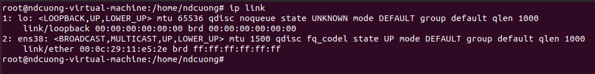

# CONNECTING LINUX TO NETWORK
#### [1.Basic network configuration](#1)
#### [2.IPv4 addressing (dhcp/static)](#2)
#### [3.Network protocols](#3)
#### [4.Network services and port numbers](#4)
#### [5.Managing network devices](#5)
#### [6.Hostnames and DNS](#6)
#### [7.Searching domains](#7)
#### [8.Routing under Linux](#8)
#### [9.Configuring network time](#9)
#### [10.The time zone](#0) 

## 1. Basic network configuration 
> Cấu hình mạng(network configuration)(còn được gọi là thiết lập mạng(network setup)) là quá trình thiết lập các điều khiển, luồng và hoạt động của mạng để hỗ trợ giao tiếp mạng của một tổ chức và (hoặc) chủ sở hữu mạng. Thuật ngữ này kết hợp nhiều quá trình cấu hình và thiết lập trên phần cứng, phần mềm mạng và các thiết bị và thành phần hỗ trợ khác.

- Các thông tin cần thiết cho quá trình cấu hình mạng:
  - Tên đầy đủ của máy tính
  - Địa chỉ IP, địa chỉ mac của máy
  - Mặt nạ mạng ( subnet mask) (nếu có)
  - Địa chỉ quảng bá (broadcast address) 
  
 - Quá trình bao gồm các nhiệm vụ sau(các bước cơ bản) : 
  - Cấu hình bộ định tuyến: chỉ định địa chỉ ip chính xác hoặc để bộ định tuyến tạo tự động, cài đặt route v.v.  Có thể thực hiện theo hướng dẫn của hãng sản xuất router: Kết nối cáp mạng -> thiết lập chế độ cho router -> thiết lập các tùy chọn theo nhu cầu/cách thức sử dụng)
  - Cấu hình máy chủ: Thiết lập kết nối mạng trên máy tính bằng cách ghi lại cài đặt mạng như địa chỉ IP, proxy, tên mạng, ID/password để kích hoạt kết nối mạng và giao tiếp: Đăng nhập vào mạng thông qua id/password của router(nếu có) -> cài đặt địa chỉ ip, proxy, dns v.v.
  - Cấu hình phần mềm: Thiết lập các phần mềm sử dụng kết nối: thiết lập theo yêu cầu của từng phần mềm
  - Các cấu hình khác như internet, network sharing, firewall v.v.
 

## 2. IPv4 addressing (dhcp/static) 
> Giao thức Internet phiên bản 4 (IPv4/Internet Protocol version 4) là phiên bản thứ tư trong quá trình phát triển của các giao thức Internet (IP). Đây là phiên bản đầu tiên của IP được sử dụng rộng rãi. IPv4 cùng với IPv6 là nòng cốt của giao tiếp internet. Hiện tại, IPv4 vẫn là giao thức được triển khai rộng rãi nhất trong bộ giao thức của lớp internet.

> IPv4 có chiều dài 32 bit để đánh địa chỉ, theo đó, số địa chỉ tối đa có thể sử dụng là 4.294.967.296 (2^32). Tuy nhiên, do một số được sử dụng cho các mục đích khác như: cấp cho mạng cá nhân (xấp xỉ 18 triệu địa chỉ), hoặc sử dụng làm địa chỉ quảng bá (xấp xỉ 16 triệu), nên số lượng địa chỉ thực tế có thể sử dụng cho mạng Internet công cộng bị giảm xuống. Với sự phát triển không ngừng của mạng Internet, nguy cơ thiếu hụt địa chỉ đã được dự báo, tuy nhiên, nhờ công nghệ NAT (Network Address Translation) tạo nên hai vùng mạng riêng biệt: Mạng riêng và Mạng công cộng, địa chỉ mạng sử dụng ở mạng riêng có thể dùng lại ở mạng công công mà không hề bị xung đột, qua đó trì hoãn được vấn đề thiếu hụt địa chỉ.

- Configuring Static IP address using DHCP:
Dynamic Host Configuration Protocol (DHCP) là một giao thức cho phép cấp phát địa chỉ IP một cách tự động cùng với subnet mask và gateway mặc định. Máy tính được cấu hình một cách tự động vì thế sẽ giảm việc can thiệp vào hệ thống mạng, mục đích quan trọng nhất là tránh trường hợp hai máy tính khác nhau lại có cùng địa chỉ IP. DHCP thường là cài đặt mặc định có sẵn, nếu không, các bước để định cấu hình đặt trước DHCP khác nhau giữa các bộ định tuyến và có thể tham khảo tài liệu của nhà cung cấp.

- Configuring Static IP address on Ubuntu:
Các bước cấu hình ip một cách thủ công trong hệ thống ubuntu:
  - B1: Kiểm tra tên của ethernet interface, gõ `ip link`, hệ thống sẽ in ra danh sách các ethernet interface có sẵn, trong đa số các trường hợp sẽ có 2 ethernet interface: lo - giao diện loopback được hệ thống sử dụng để giao tiếp với chính nó - và 1(hoặc nhiều) ethernet interface được sử dụng để kết nối ethernet - trong trường hợp này là ens38
  
  > 
  
  - B2: Mở và tiến hành cấu hình thủ công ethernet interface với file config:
    > Với các hệ thống ubuntu 17.10 trở lên, netplan là công cụ quản lý mạng mặc định. Để chỉnh sửa file config: `vi /etc/netplan/01-network-manager-all.yaml`
    
    > 
    
    Với hệ thống trên, 3 từ khóa network, version và renderer là 3 thuộc tính mặc định. Tiếp theo, ethernets là loại thiết bị được cấu hình (loại thiết bị có thể là ethernets, bonds, bridges, hoặc vlans. Với mỗi loại thiết bị có thể chỉ định nhiều ethernet interface, ở đây có 1 giao diện là ens38 được cấu hình để lấy ip từ máy chủ dhcp: `dhcp4: yes`
    
    Để cấu hình ip tĩnh:
    
    > 
    
    - dhcp4: no : k sử dụng ip từ máy chủ dhcp
    - addresses : địa chỉ ip tĩnh đặt cho ethernet interface, không được trùng với các ip của máy khác.
    - gateway : cổng cho phép kết nối đến internet
    - nameserver : ip của máy chủ định danh 
    //error
    > Hoặc sử dụng ifconfig cho mọi hệ thống ubuntu: `vi /etc/network/interfaces`
    
    > 
    
    - auto: interface sẽ được cấu hình khi khởi động
    - iface: interface
    - inet: sử dụng TCP/IP networking
    
    Để cấu hình ip tĩnh:
    
    > 
    
    - inet static: sử dụng địa chỉ ip tĩnh
    - address: địa chỉ ip tĩnh đặt cho ethernet interface, không được trùng với các ip của máy khác.
    - gateway : cổng cho phép kết nối đến internet
    - netmask, broadcast: 
    - dns-nameserver : ip của máy chủ định danh 

## 3. Network protocols

## 4. Network services and port numbers
## 5. Managing network devices
## 6. Hostnames and DNS
## 7. Searching domains
## 8. Routing under Linux
## 9. Configuring network time
## 10. The time zone 

