# [1. Rsyslog/syslog configuration](#1)
# [2. Testing using logger](#2)
# [3. Managing logs with logrotate](#3)
# [4. The systemd journal: journalctl](#4) 


##  1. Rsyslog/syslog configuration <a name="1"></a>

#### 1.1. Syslog 

> ​	Syslog là một giao thức client/server dùng để gửi log và message đến máy nhận log. Máy nhận log thường được gọi là syslogd, syslog daemon hoặc syslog server. Syslog có thể gửi qua UDP hoặc TCP. Các dữ liệu được gửi dạng cleartext. Syslog dùng port 514 cho UDP và port 10514 cho TCP.

Giao thức **syslog** có những yếu tố sau:

- **Defining an architecture** : Syslog là một giao thức, là một phần của kiến trúc mạng hoàn chỉnh, với nhiều máy khách và máy chủ.
- **Message format**: syslog xác định cách định dạng tin nhắn. Điều này rõ ràng cần phải được chuẩn hóa vì các bản ghi thường được phân tích cú pháp và lưu trữ vào các công cụ lưu trữ khác nhau. Do đó, chúng ta cần xác định những gì một máy khách syslog có thể tạo ra và những gì một máy chủ có thể nhận được.
- **Specifying reliability** : syslog cần xác định cách xử lý các tin nhắn không thể gửi được. Là một phần của TCP/IP, syslog rõ ràng sẽ bị thay đổi trên giao thức mạng cơ bản (TCP hoặc UDP) để lựa chọn.
- **Dealing with authentication or message authenticity** : syslog cần một cách đáng tin cậy để đảm bảo rằng máy khách và máy chủ đang nói chuyện một cách an toàn và tin nhắn nhận được không bị thay đổi.

>  Hiện nay, rsyslog được sử dụng thay thế cho syslog trên các hệ thống hiện đại. Rsyslog là một sự phát triển của syslog, cung cấp các khả năng như các mô đun có thể cấu hình, được liên kết với nhiều mục tiêu khác nhau. 

#### 1.2. Syslog message format 

Theo mặc định, Syslog message format được chia thành hai phần, độ dài một message không được vượt quá 1024 bytes

>  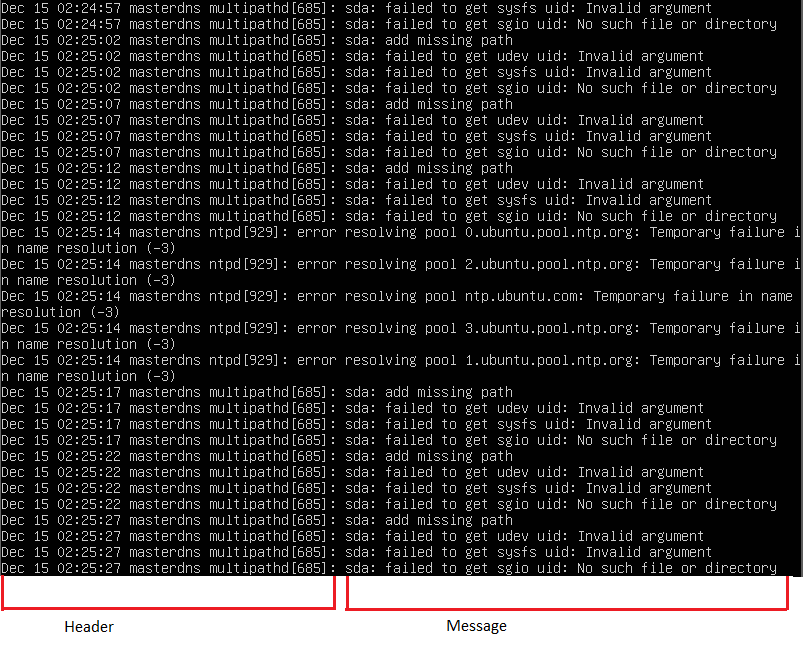


Để tùy chỉnh Syslog message format, mở file rsyslog.conf : `vi /etc/rsyslog.conf`

Khởi tạo template có tên precise, sau đó đặt precise làm template mặc định. 


>  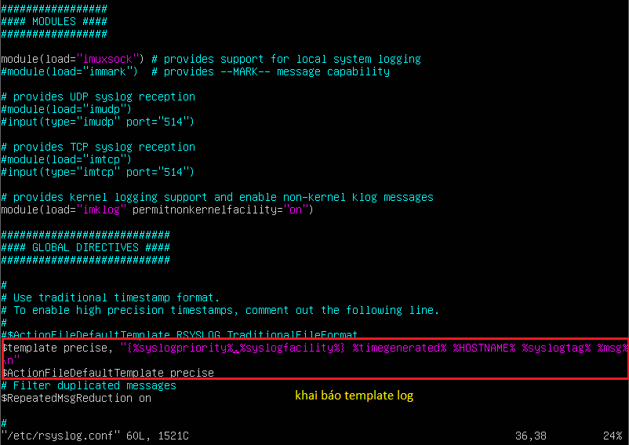


Ở đây template có dạng: ` $template precise, "{%syslogpriority%,%syslogfacility%} %timegenerated% %HOSTNAME% %syslogtag% %msg%\n" `. Trong đó:

	- {%syslogpriority%,%syslogfacility%} là mức độ ưu tiên (priority levels: facility levels and severity levels)
	- %timegenerated% %HOSTNAME% là phần Header, gồm timestamp và hostname
	- %syslogtag% %msg% là phần chứa nội dung của log, gồm tag và message

Sau khi thay đổi, Syslog message format trả ra kết quả:


>  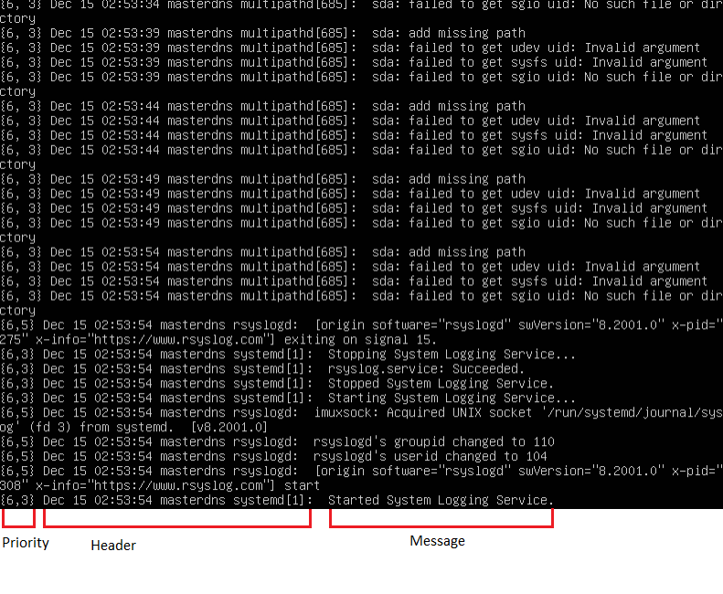


#### 1.3. Priority levels

- Facility levels là mức độ cơ sở, được sử dụng để xác định chương trình hoặc phần nào của hệ thống tạo ra các bản ghi. 

  - Theo mặc định, một số phần trong hệ thống của bạn được cung cấp các mức facility như kernel sử dụng kern facility hoặc hệ thống mail của bạn sử dụng mail facility.

  - Nếu một bên thứ ba muốn phát hành log, có thể đó sẽ là một tập hợp các cấp độ facility từ 16 đến 23 được gọi là “local use” facility levels.

  - Ngoài ra, họ có thể sử dụng tiện ích của người dùng cấp độ người dùng (“user-level” facility), nghĩa là họ sẽ đưa ra các log liên quan đến người dùng đã ban hành các lệnh.

    

    >  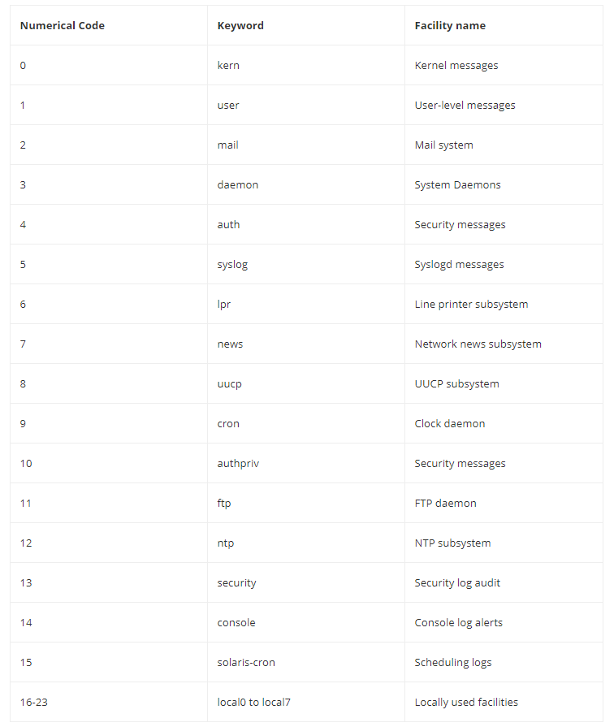

    

- Severity levels là mức độ cảnh báo của Syslog, thể hiện mức độ nghiêm trọng của log event và chúng bao gồm từ gỡ lỗi (debug), thông báo thông tin (informational messages) đến mức khẩn cấp (emergency levels), được chia thành các loại số từ 0 đến 7, 0 là cấp độ khẩn cấp quan trọng nhất


> 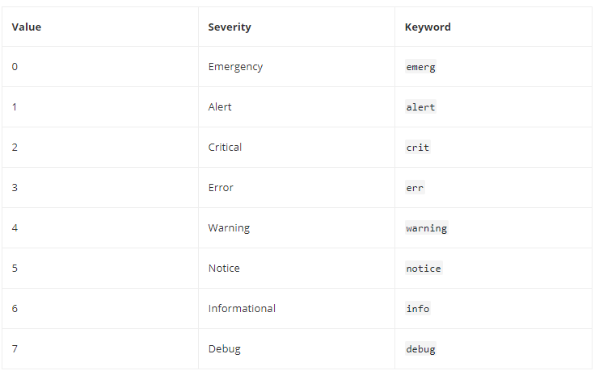


#### 1.4. Syslog message delivery

Hầu hết thời gian, quản trị viên hệ thống không giám sát một máy duy nhất mà họ phải giám sát rất nhiều máy trong hệ thống. Vậy nên cần phải tập trung syslog vào một máy chủ để dễ dàng theo dõi và quản lý. Có thể sử dụng giao thức TLS/SSL trên TCP để mã hóa các gói Syslog khi gửi đi. 

#### Cấu hình server: `vi /etc/rsyslog.conf` 

- Load các module cần thiết:  

  - `module(load="imuxsock")` : module xử lý Unix Socket Input, quản lý việc phân phối các lệnh gọi syslog,  theo dõi các log sockets của hệ thống Unix và cung cấp cho rsyslog các thông báo nhật ký khi chúng xảy ra. Đây là module được sử dụng nhiều nhất (và bắt buộc, nếu thiếu sẽ k có log nào được ghi) nên thường mặc định có sẵn

  - `module(load="imjournal")` : module cung cấp dữ liệu **có cấu trúc**, nếu k cần cấu trúc dữ liệu thì k cần thiết

  - `module(load="imklog" permitnonkernelfacility="on")` : cung cấp kernel log

  - `module(load="imtcp")`, `input(type="imtcp" port="514")` : cung cấp khả năng nhận syslog qua giao thức tcp

- Cấu hình tùy chỉnh: 
  - `$template RemoteLogs,"/var/log/%HOSTNAME%/%PROGRAMNAME%.log"` : chỉ định nơi lưu log nhận được, mỗi máy client gửi đến sẽ được lưu vào folder riêng %HOSTNAME%, RemoteLogs là tên của template
  - `*.* ?RemoteLogs`:  cú pháp tổng quát là`[Facility levels].[Severity levels]?[Template]`. Hai dấu * ở đây có ý nghĩa máy chủ sẽ nhận tất cả các log, bất kể mức độ ưu tiên.
  - `&~`: Kí tự chỉ định rsyslog dừng xử lý thông báo sau khi nó được ghi vào tệp.


>  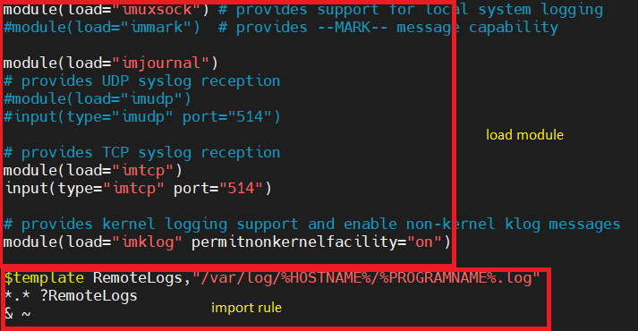


- Mở port 514 (mặc định) hoặc port được cài đặt trong cấu hình, sau đó khởi động lại rsyslog

#### Cấu hình client: `vi /etc/rsyslog.conf`

- Chỉ định máy chủ nhận log: `[Facility levels].[Severity levels]@@[IP]:[port]` , ví dụ:`*.*@@192.168.142.131:514`
- Khởi động lại rsyslog

>  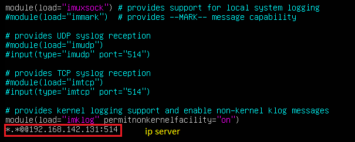

Mô hình: 2 máy client gửi syslog về server. Xuất hiện 2 folder có tên là hostname của 2 máy client chứa các file log nhận được 


>  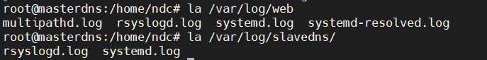


Mở file systemd.log của client "web":


> 


Sau đó thực hiện 1 hành động từ client (ví dụ restart lại service ssh), log về hành động đó sẽ được gửi sang server ngay lập tức


> 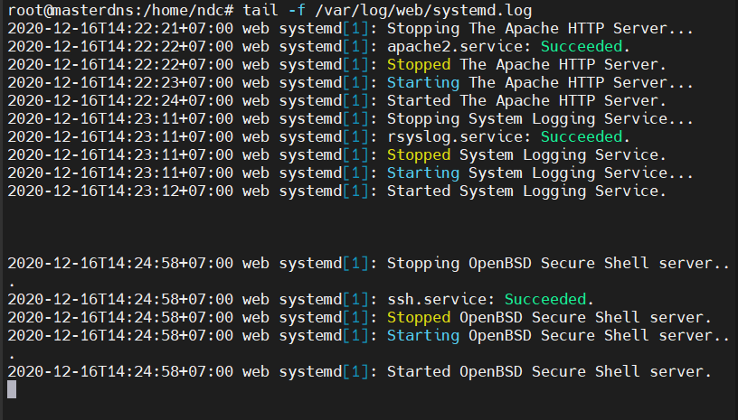


## 2. Testing using logger<a name="2"></a>

`logger` là command dùng để ghi vào cuối file /var/log/syslog. Ví dụ `logger write to rsyslog` sẽ có kết quả:


> 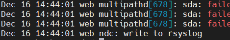


Ngoài ra, logger có thể dùng để thực hiện các lệnh (bằng dấu "`")...


> 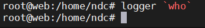
>
> 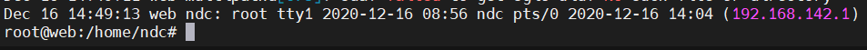


... hoặc ghi dữ liệu từ một file vào /var/log/syslog (`logger -f [file]`)...


> 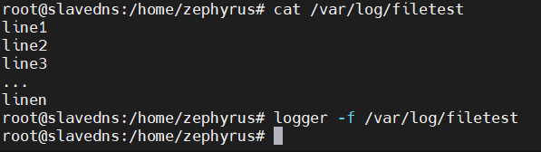
>
> 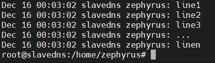


... và nhiều <a href="http://manpages.ubuntu.com/manpages/bionic/man1/logger.1.html">option khác</a>


## 3. Managing logs with logrotate<a name="3"></a>

Logrotate là một tiện ích được sử dụng trong quản trị hệ thống, trong đó các file log được nén, di chuyển ( lưu trữ ), đổi tên hoặc xóa khi chúng quá cũ hoặc quá lớn, tránh việc quá nhiều log file sẽ khiến dung lượng ổ cứng bị quá tải cũng như gây khó khăn trong việc tìm kiếm thông tin cần thiết. Dữ liệu nhật ký mới đến được chuyển hướng vào một tệp mới mới (tại cùng một vị trí). 

Bằng cách thiết lập đơn giản nhưng chặt chẽ thông qua file cấu hình, Logrotate hoạt động một cách tự động, không cần can thiệp thủ công.

Logrotate thường có sẵn trên hệ thống, nếu k sử dụng lệnh `apt install logratate` để cài đặt. File cấu hình logrotate được lưu tại /etc/logrotate.conf


>  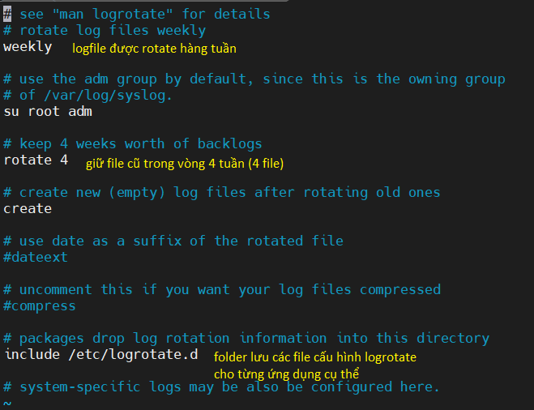


#### Rotate log file

Thông tin cấu hình log file của từng ứng dụng cụ thể được lưu tại `/etc/logrotate.d/`. Ví dụ tạo file rotate cho ssh: `vi /etc/logrotate.d/ssh`

Có thể chỉ định rotate cụ thể một hay nhiều file log với đường dẫn tuyệt đối của file log đó, phân biệt danh sách các log file cụ thể bằng khoảng trắng. Ví dụ:

`/var/log/auth.log`

hoặc

`/var/log/auth.log /var/log/syslog`

Options:

 - Thời gian: có 4 giá trị cấu hình tương ứng với khoảng thời gian log file sẽ được rotate.
   	- Daily: mỗi ngày
   - Weekly: mỗi đầu tuần
   - Monthly: mỗi đầu tháng
   - Yearly: mỗi năm
- Size: có thể quy định tiến trình rotate dựa vào dung lượng file, ví dụ nếu file đó đạt dung lượng 100mb thì tiến hành rotate. Rotate theo dung lượng sẽ được ưu tiên hơn theo thời gian. Các đơn vị kích thước file có thể sử dụng là K, M, G.
  - size 100k
  - size 100M
  - size 1G
- Missingok: nếu file log bị mất hoặc không tồn tại *.log thì logrotate sẽ tự động di chuyển tới phần cấu hình log của file log khác mà không cần phải xuất ra thông báo lỗi. Ngược lại sẽ là cấu hình `nomissingok` 
- Notifempty: không rotate log nếu file log này trống.
- rotate [number]: Quy định số lượng log file cũ đã được giữ lại sau khi rotate. Ví dụ: `rotate7` giữ lại 7 file log cũ. Trường hợp đã có đủ 7 file log cũ thì file cũ nhất sẽ bị xóa đi để chứa file log mới được tạo.
- Compress:  nén tất cả các file log lại sau khi đã được rotate, mặc định bằng gzip. Nếu muốn sử dụng dạng nén khác (ví dụ: zip) thì khai báo `Compresscmd zip`


Có thể thực thi các lệnh trước hoặc sau khi rotate, thường được dùng để restart dịch vụ sử dụng file log, tránh gián đoạn dịch vụ cũng như việc ghi log. 

- Để thực thi lệnh trước khi rotate, đặt khối lệnh giữa 2 từ khóa `prerotate` và ` endscript`. Ví dụ :

  ```
  Prerotate
  service ssh stop
  Endscript
  ```

- Để thực thi lệnh sau khi rotate, đặt khối lệnh giữa 2 từ khóa `postrotate` và ` endscript`. Ví dụ :

  ```
  Postrotate
  service ssh start
  Endscript
  ```


> 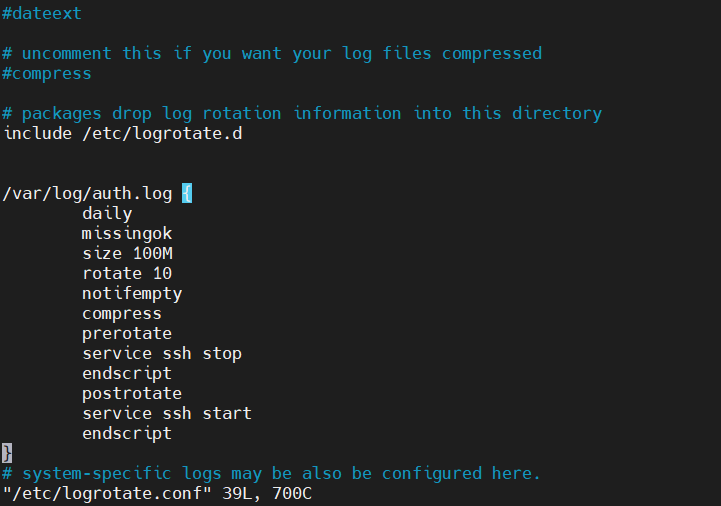


Chạy thủ công logrotate để kiểm tra: `logrotate -vf /etc/logrotate.d/ssh` (-v để hiển thị quá trình, -f để chạy thủ công)

> 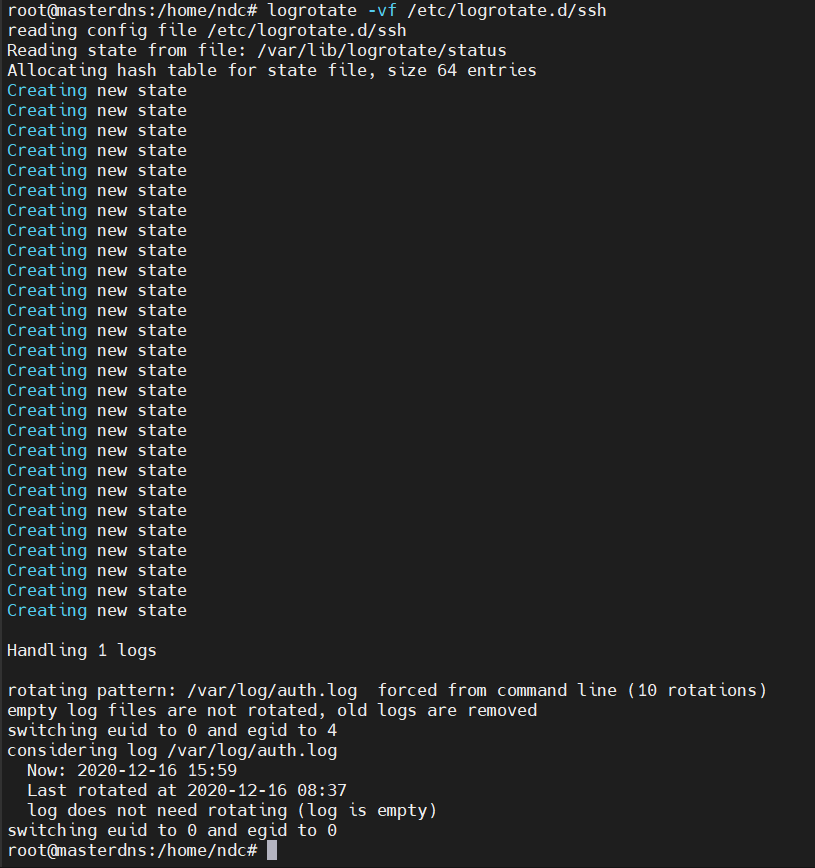


## 4. The systemd journal: journalctl <a name="4"></a>

Journalctl là một tiện ích hệ thống cung cấp khả năng truy vấn nội dung của systemd journal,  được sử dụng để xem các tệp nhật ký hệ thống.

`journalctl` khi được gọi mà k có tham số bổ sung sẽ trả ra kết quả là tất cả log file theo thứ tự cũ nhất trước tiên. 


> 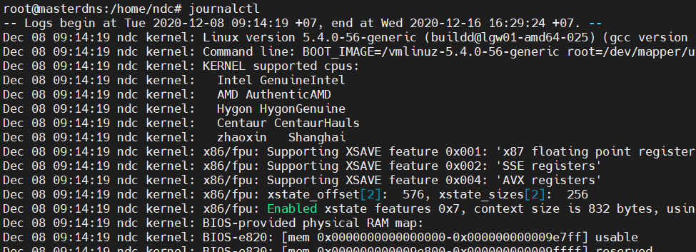


Để hiển thị các kết quả mới nhất trước, sử dụng tham số -r


> 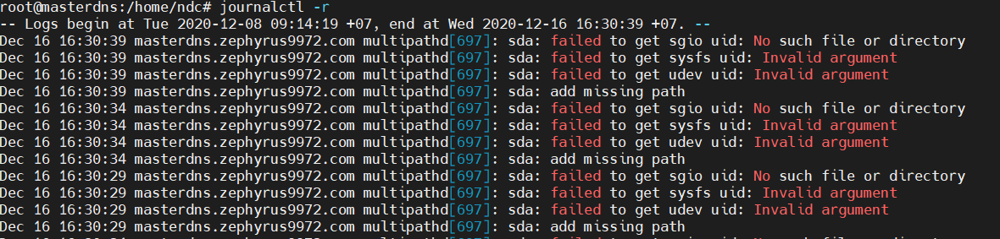


Để chỉnh sửa log file: `journalctl -f`


Giới hạn số dòng hiển thị: ` journalctl -n [number]`


> 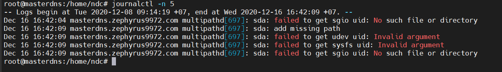


Hiển thị theo mốc thời gian, ví dụ hiện thị trong vòng 1 giờ trước: `journalctl --since "1 hour ago"`...


> 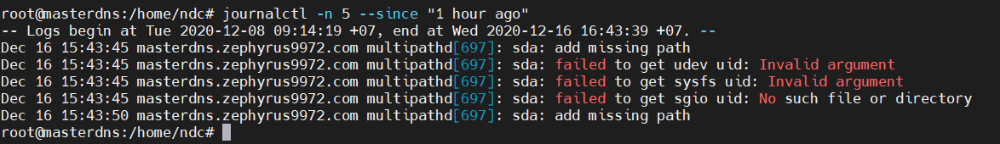


... hoặc từ ngày ... đến ngày ... : `journalctl --since "2020-12-14 20:00:00" --until "2020-12-16 20:00:00"` 


> 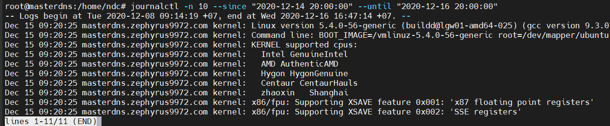


<a href="https://landoflinux.com/linux_journalctl_examples.html">Tham khảo</a>

