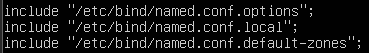
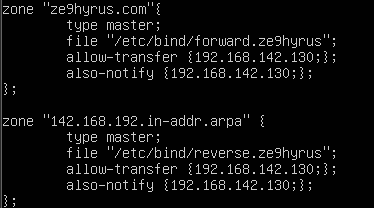
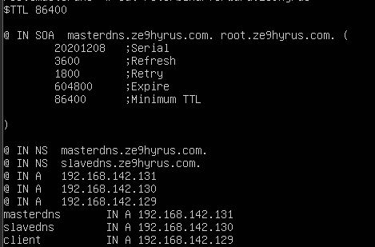
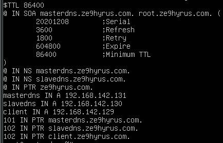
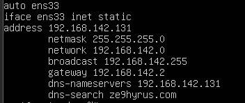
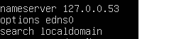

/etc/bind/named.conf

> 

/etc/bind/named.conf.local

> 

/etc/bind/forward.ze9hyrus

> 

/etc/bind/reverse.ze9hyrus

> 

/etc/network/interfaces

> 

/etc/resolv.conf **cái này sai vì interface đúng phải là ens33 nhưng trong file lại là edns0, k biết có cần sửa lại k ạ**

> 
