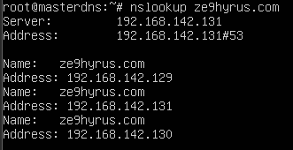

## Cấu hình

#### /etc/bind/named.conf.ontions

> 

#### /etc/bind/named.conf

> 

#### /etc/bind/named.conf.local

> 

- "ze9hyrus.com" : domain zone
- "etc/bind/forward.ze9hyrus": tên file và địa chỉ tuyệt đối của file forward (tương tự với "etc/bind/reverse.ze9hyrus")

#### /etc/bind/forward.ze9hyrus (tạo file mới)

> 
- masterdns.ze9hyrus.com: hostname server master
- slavedns.ze9hyrus.com: hostname server slave
- ...131: địa chỉ ip server master
- ...130: địa chỉ ip server slave
- ...129: địa chỉ ip client
#### /etc/bind/reverse.ze9hyrus (tạo file mới)

> 

#### /etc/network/interfaces

> 

#### /etc/resolv.conf 

> 

## Kết quả

#### Check file conf, zone

> 

#### Check server

> 
