#### 1.	cài đặt gói bằng apt, yum và dpkg,rpm
- **apt:** `sudo apt [option(install/remove/update/upgrade)] [package]`
> 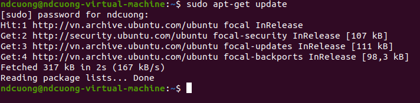
> 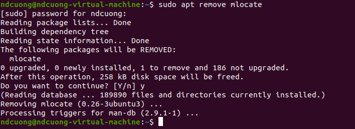
- **dpkg:**`sudo dpkg [option] [file.deb]`
> 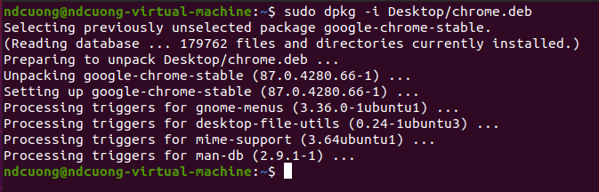
- **rpm:**`sudo alien [file.rpm]`(convert to file.deb) 
#### 2.	phân biệt đường đẫn tuyệt đối và đường dẫn tương đối
- **Đường dẫn tuyệt đối:** chỉ chính xác đến file(thư mục), có thể truy cập từ bất cứ đâu trong hệ thống
- **Đường dẫn tuyệt đối:** chỉ các bước truy cập đến file(thư mục) từ một vị trí cụ thể
#### 3.	sử dụng vi, vim để sửa file
- **Tạo(truy cập) file:** `vi [file name]`
- **Chỉnh sửa file:**
> 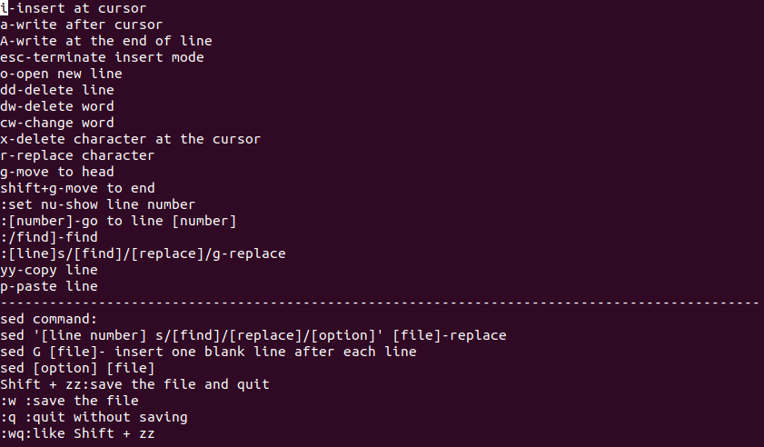
#### 4.	add disk, cấu hình lvm
- **add disk:**`lsblk`(kiểm tra ổ cứng mới thêm vào)
> 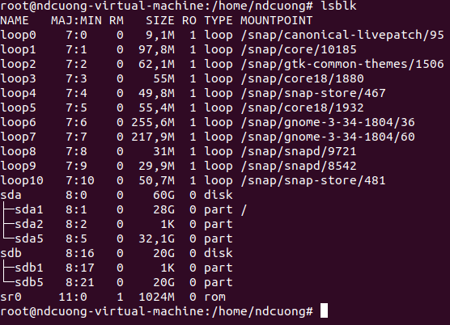
- **partition disk:**  `fdisk /dev/[disk]` => option
> 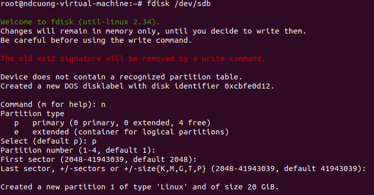
- **mount** `mount [option] ... [target] [directory]`
> 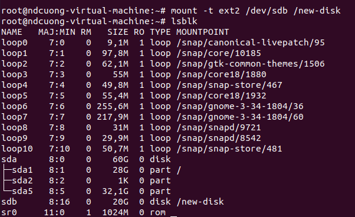
#### 5.	cấu hình ssh, truy cập máy ảo từ ssh client 
- **Khởi động, kiểm tra máy chủ ssh:** 
 + Khởi động 
 > `systemctl start ssh`
 + Kiểm tra trạng thái
 >`systemctl status ssh`
 > 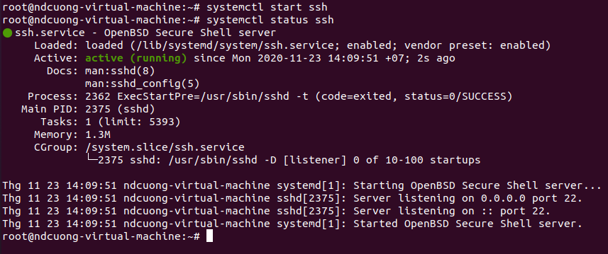
- **Kết nối đến máy chủ ssh:**
> `ssh -p [port] [username]@[host]`
> 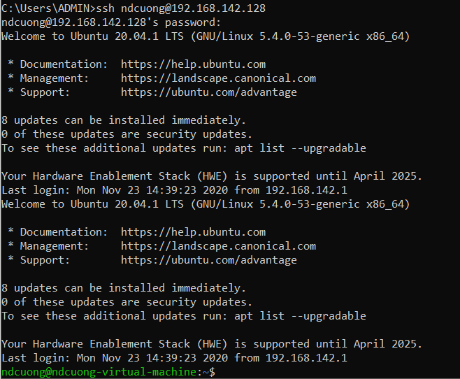
- **Cấu hình SSH key phía máy chủ:**
  + Tạo key: `ssh-keygen -t rsa` =>Chọn đường dẫn hoặc bỏ qua => nhập passphase hoặc bỏ qua
  > 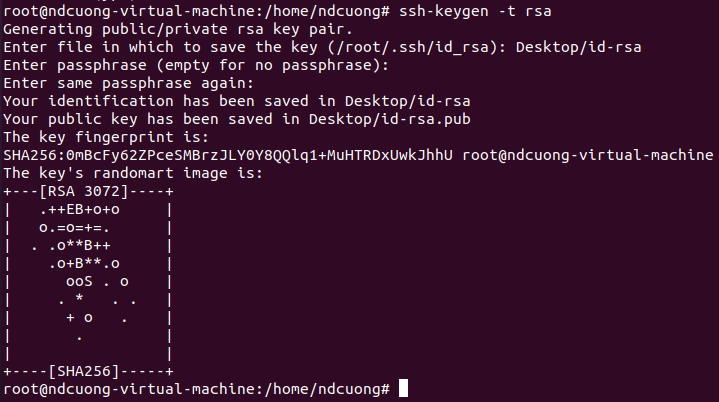
  + Sửa file ssh_config : `vi /etc/ssh/sshd_config` => nhập 2 dòng PubkeyAuthentication yes và AuthorizedKeysFile .ssh/authorized_keys 
  > 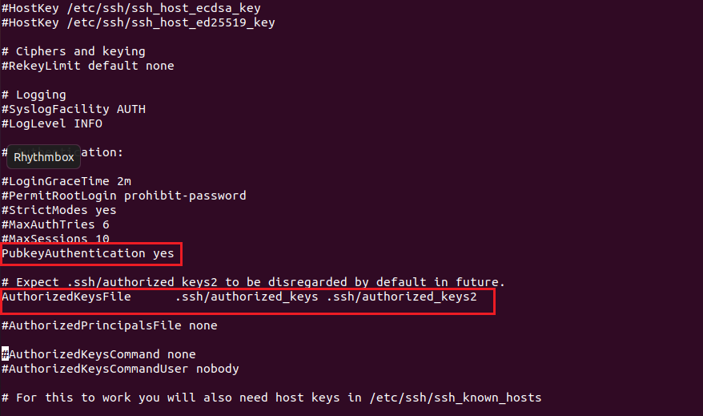
  + Đặt file public key vào thư mục /home/[username]/.ssh và rename thành authorized_keys 
  + Gửi file private key cho client
- **Cấu hình SSH key phía client (sử dụng mobaXterm):**
  + Tạo seession ssh, nhập địa chỉ máy chủ và load file private key
  > 
  + Done 🙄
