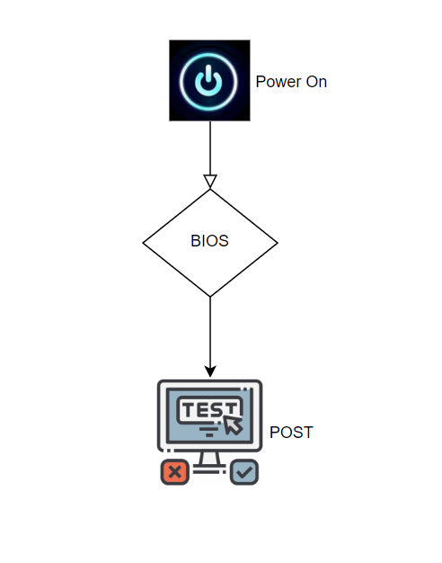
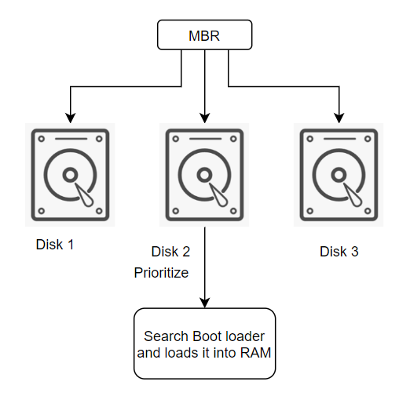
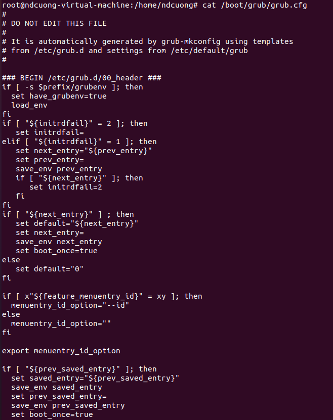
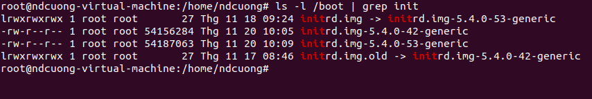
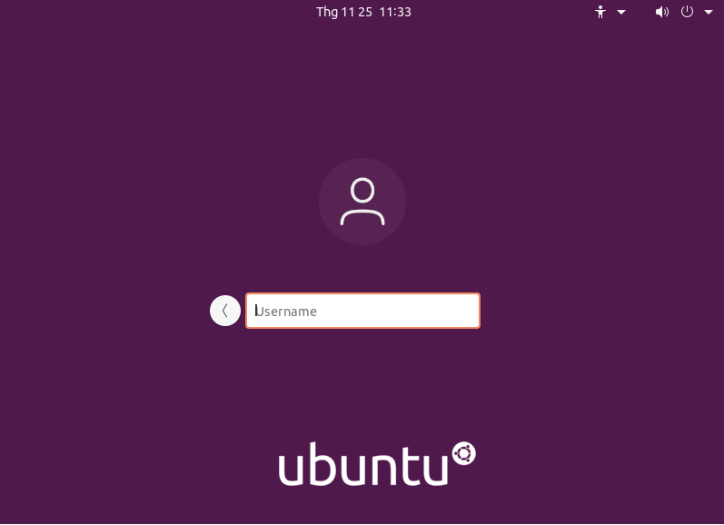
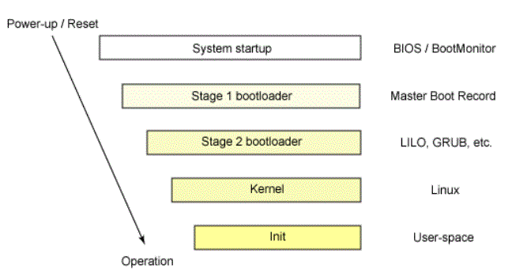
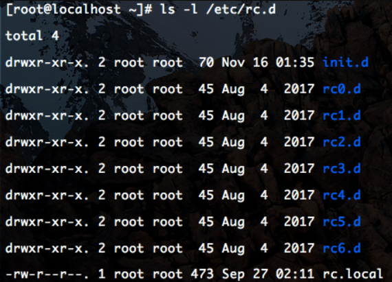
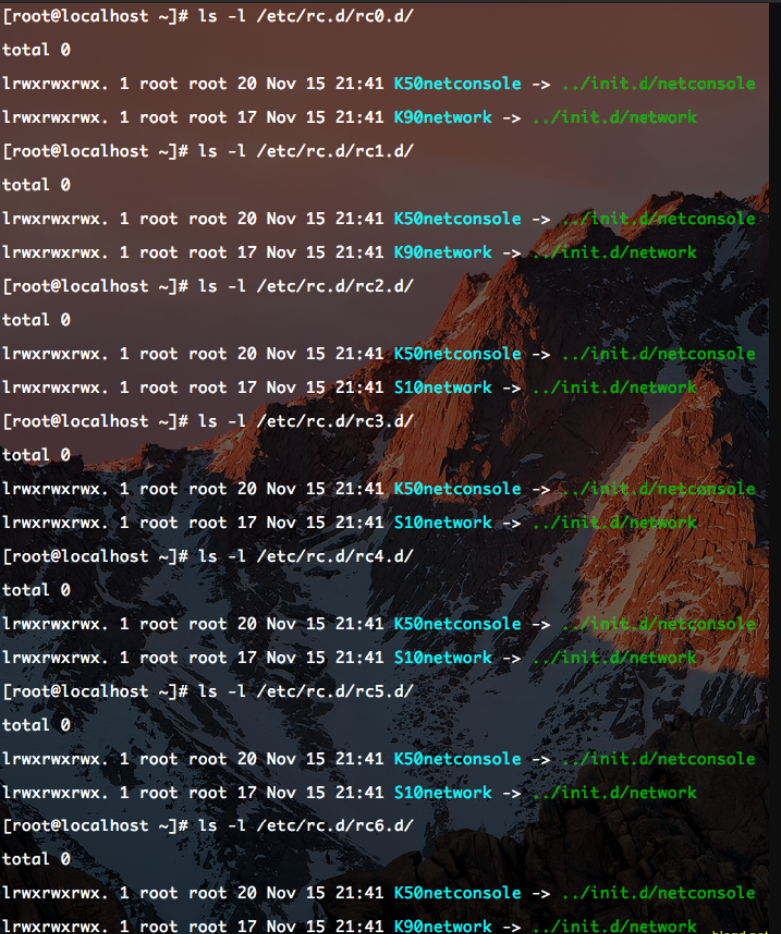
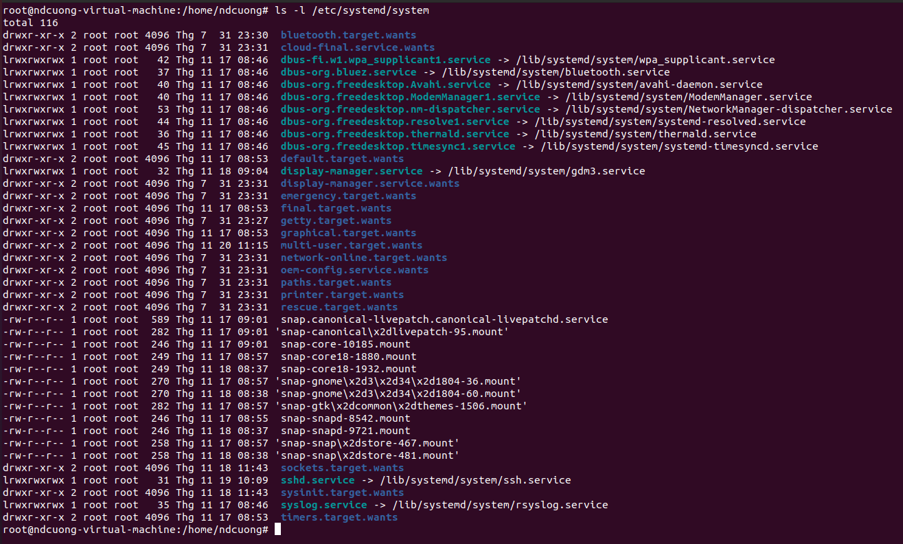
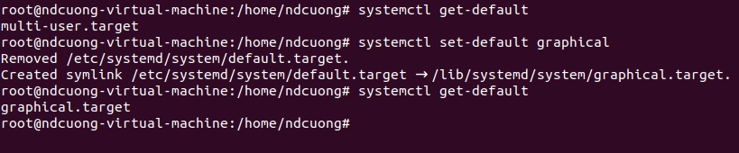

# SYSTEM STARTUP AND SHUTDOWN
1. [System startup process](#startup)
2. [The startup script framework](#startupscript)
3. [Managing services using](#manaservice)
4. [Starting and stopping services dynamically ](#servicedynamic)
5. [Managing services with system/service/systemctl ](#systemctl)
6. [Shutdown and rc](#shut)

## 1. System startup process 
Quá trình khởi động của hệ điều hành Linux từ lúc mở máy đến khi hiển thị màn hình đăng nhập bao gồm các bước:
- [BIOS](#bios)
- [MBR (Master Boot Record)](#mbr)
- [Boot loader (GRUB)](#bootloader)
- [Kernel](#kernel)
- [Initial RAM disk - initframs image](#initrd)
- [Init (parent process)](#init)
- [Login with Graphical User Interface](#login)
***
### Quy trình chi tiết:
- **BIOS:**  là một phần mềm được cài đặt sẵn (embedded) vào các chíp PROM, EPROM hay bộ nhớ flash nằm trên bo mạch chủ, được chạy đầu tiên khi bạn nhấn nút nguồn hoặc nút reset trên máy tính. 
  
  > Chương trình được thực hiện đầu tiên là POST (Power-on Self-test) nhằm kiểm tra thông số và trạng thái của các phần cứng máy tính (CPU, RAM, DISK v.v.). Nếu quá trình POST kết thúc và k phát hiện lỗi phần cứng, BIOS sẽ tìm kiếm và khởi chạy một (trong những) hệ điều hành chứa trong ổ cứng (hoặc CD/DVD, USB v.v.). 
  
  > 
  
  Người dùng có thể truy cập vào giao diện cài đặt BIOS để thay đổi các thiết lập, cấu hình máy tính, thay đổi thứ tự ưu tiên của các thiết bị lưu trữ.

- **MBR:** Với hệ thống cũ sử dụng chương trình BIOS/MBR, MBR là sector đầu tiên (được đánh số 0) của thiết bị lưu trữ, thường có kích thước 512B, được dùng để lưu một chương trình có chức năng định vị và khởi động boot loader. Với những hệ thống hiện đại hơn sử dụng EFI/UEFI, phần mềm UEFI sẽ định vị và khởi động boot loader.
  
  > Sau khi BIOS xác định được thiết bị lưu trữ nào được ưu tiên, BIOS sẽ đọc trong MBR (hoặc UEFI) của thiết bị đó để nạp vào bộ nhớ chương trình được lưu trữ trong đó. 
  
  > 
  
  Đến giai đoạn này, máy tính sẽ không truy cập vào phương tiện lưu trữ nào. Thông tin về ngày tháng, thời gian và các thiết bị ngoại vi quan trọng nhất được nạp từ CMOS.
  
- **Boot loader:**  là chương trình chịu trách nhiệm cho việc tìm và nạp nhân (kernel) của hệ điều hành.
  
  > Có 2 bootloader phổ biến trên Linux là GRUB và LILO (tiền thân của GRUB). Cả 2 chương trình này đều có chung mục đích: cho phép bạn lựa chọn một trong các hệ điều hành có trên máy tính để khởi động, sau đó chúng sẽ nạp kernel của hệ điều hành đó vào bộ nhớ và chuyển quyền điều khiển máy tính cho kernel này. Trình khởi động giai đoạn 2 nằm trong /boot. Màng hình hiển thị cho chúng ta chọn hệ điều hành để khởi động. Tiếp đến bộ nạp khởi động sẽ tải hệ điều hành vào RAM và chuyển quyền kiểm soát cho RAM.
  
  > File grub:
  
  > 
  
  GRUB hay LILO đều có thể khởi động cho cả Linux và Windows, nhưng ngược lại các bootloader trên Windows như (NTLDR, BOOTMGR) thì không hỗ trợ khởi động cho các hệ điều hành Linux.
  
- **Kernel:** Là chương trình phần mềm ở mức thấp (low-level) trong hệ thống, có khả năng thay đổi linh hoạt để phù hợp với phần cứng. Chúng tương tác với tất cả ứng dụng và hoạt động trong chế độ user mode, cho phép các quá trình khác – hay còn gọi là server, nhận thông tin từ các thành phần khác qua inter-process communication (IPC).
  
  > Boot loader nạp một phiên bản dạng nén của Linux kernel. Nó tự giải nén và tự cài đặt lên bộ nhớ hệ thống nơi mà nó sẽ ở đó cho tới khi tắt máy. Sau khi chọn kernel trong file cấu hình của boot loader, hệ thống sẽ tự động nạp chương trình init trong thư mục /sbin
  
- **INITRD(Initial RAM disk):** Một vấn đề Linux phải đối mặt là: không thể nào đoán trước được chính xác cấu trúc máy tính của người sẽ sử dụng bản Linux của họ… Máy tính của người dùng có những thành phần linh kiện nào? INITRD cung cấp một giải pháp:
  
  > Một tập các chương trình sẽ được thực thi khi kernel vừa mới được khởi chạy. Các chương trình này dò quét phần cứng và xác định xem kernel cần được hỗ trợ thêm những gì để quản lý được các phần cứng đó. Chương trình INITRD có thể nạp thêm vào kernel các module bổ trợ. Khi INITRD kết thúc thì quá trình khởi động Linux sẽ tiếp diễn.
  
  Hệ thống hình ảnh tập tin initramfs chứa các chương trình và tệp nhị phân thực hiện các hành động cần thiết để gắn kết hệ thống tệp gốc thích hợp, cung cấp chức năng hạt nhân cho hệ thống tệp và trình điều khiển thiết bị cần thiết cho bộ điều khiển lưu trữ hàng loạt với cơ sở được gọi là udev (cho thiết bị người dùng). Thiết bị nào có mặt, định vị các trình điều khiển thiết bị mà chúng cần để hoạt động chính xác và tải chúng. Sau khi hệ thống tập tin gốc đã được tìm thấy, nó được kiểm tra lỗi và được gắn kết. 
  
  Chúng ta có thể thấy tệp kernel và initramfs trong thư mục /boot.
  
  > 
  
- **Init:** Tiến trình Init là cha của tất cả các tiến trình khác mà có trên hệ thống Linux, luôn có PID = 1 
  
  > Khi Kernel được khởi chạy xong, nó sẽ gọi duy nhất chương trình init. Sau đó, init sẽ xem trong file /etc/inittab để biết được nó cần làm gì tiếp theo (ví dụ như dựa vào runlevel mặc định để thực thi các script khởi động (initscript) tương ứng trong thư mục /etc/rc.d.). Vì có tính chất cực kì quan trọng nên init k bảo giờ bị tắt (khi sử dụng lệnh kill).
  
  Nếu bạn kiểm tra trong file /etc/inittab, bạn sẽ thấy nó bao gồm hầu hết các đặc tả, chỉ dẫn để chạy các chương trình nào đó. Các script có tên bắt đầu bằng ký tự S sẽ được thực thi, bằng cách này, init sẽ khởi động tất cả các hệ thống con (subsystem) hoặc các dịch vụ (deamon) để tạo thành một hệ thống Linux hoạt động hoàn chỉnh.
  
  > Tại thời điểm này, về cơ bản Linux đã khởi động xong, init cũng hoàn thành vai trò của mình: tạm thời nó sẽ “ngủ” (ở trạng thái chờ đợi) cho tới khi có chương trình nào đó bị chết hoặc cần được khởi động lại. Tất cả các hoạt động của hệ thống bây giờ sẽ được thực hiện bởi các deamon khác nhau.
  
  Trong hệ điều hành Linux có 2 loại init phổ biến dựa trên [Unix System V](#usv) và [Systemd](#systemd)
  
  Một trong các vấn đề phổ biến thường xảy ra với một hệ thống Linux mới cài đặt (hoặc mới được cập nhật) là kernel không thể tìm thấy init. Một thông báo được đưa ra là kernel panic – not syncing. Nguyên nhân chủ yếu là sự thiết sót tham số khi bạn cấu hình cho bootloader.
  
- **Login with Graphical User Interface:** X Window (còn có các tên gọi khác là X.Org, Xorg, hay đơn giản là X), đây là một hệ thống cung cấp giao diện đồ họa người dùng (GUI) của Linux. Một thành phần của X được gọi là XDM đưa ra cho bạn màn hình đăng nhập dạng GUI.
  
  >Gần cuối quá trình khởi động, init sẽ bắt đầu một chế độ đăng nhập text mode. Nhập tên người dùng và mật khẩu của bạn để đăng nhập và xuất hiện các dấu nhắc lệnh shell. Subsystem cuối cùng được init khởi động lên là X Window.
  
  > 
  - **Sau khi đăng nhập thành công:**
  Một chương trình shell (có thể là bash, sh, csh…, mặc định là bash) sẽ được bắt đầu và sẵn sàng nhận các lệnh. Tất cả các chương trình mà bạn chạy và mọi thao tác khác mà bạn thực hiện trong suốt phiên làm việc sẽ được thực hiện bởi shell đó hoặc bởi chương trình khác mà được shell khởi động.

Khi bạn đăng xuất, shell đó và tất cả các tiến trình con của nó sẽ bị kết thúc. Sau đó init (hoặc XDM/GDM/KDM/Entrance) sẽ “thức tỉnh” và bắt đầu một lời nhắc nhở đăng nhập mới.

**Minh họa quá trình khởi động hệ thống Linux:**
> 

**2 loại init:**
 - **Unix System V** 
 Có 7 run level (File cấu hình run level /etc/inittab:)
   - Runlevel 0: Shutdown hệ thống.
   - Runlevel 1: Chỉ dùng cho 1 người dùng để sửa lỗi hệ thống tập tin.
   - Runlevel 2: Đa người dùng nhưng không có dịch vụ NFS (không có GUI).
   - Runlevel 3: Đa người dùng đầy đủ dịch vụ (không có GUI).
   - Runlevel 4: Không sử dụng.
   - Runlevel 5: Đa người dùng đầy đủ dịch vụ (có GUI).
   - Runlevel 6: Reboot hệ thống.
   
   > 
   
 Sau khi xác định run level. Chương trình /sbin/init sẽ thực thi các file statup script được đặt trong các thư mục con của thư mục /etc/rc.d.
   
   > 
   
   Trong file script theo từng level. Các tên tập tin bắt đầu bằng từ khóa "S" có nghĩa là tập tin này sẽ được thực thi lúc khởi động hệ thống. Nếu tập tin bắt đầu bằng từ khóa "K" nghĩa là tập tin đó được thực thi khi hệ thống shutdown. Số theo sau từ khóa "S" và "K" để chỉ định trình tự khởi động các script, kế tiếp là tên file script cho từng dịch vụ.
  - **Systemd**    
   Đối với các bản Linux hiện đại gần đây thì init và runlevel được thay thế bởi systemd và cũng thực hiện nhiệm vụ tương ứng. Systemd cũng giống như init là tiến trình chạy đầu tiên trên hệ thống với ID = 1.
   
   > 
   
   Systemd đọc tệp liên kết bởi /etc/systemd/system/default.target để xác định đích hệ thống mặt định. Tệp mục tiêu trong hệ thống xác định các dịch vụ mà systemd bắt đầu. Systemd sẽ bắt đầu mọi thứ trong /etc/systemd/system/basic.target trước khi bắt đầu multi-user service.
   
   Systemd sử dụng mục tiêu thay vì runlevel. Systemd có hai mục tiêu chính: multi-user.target và graphical.target tương ứng với runlevel 3 và runlevel 5.
   
   Kiểm tra mục tiêu mặc định hiện tại :
   
   > systemctl get-default
   
   Đặt mục tiêu mặc định :
   
   > systemctl set-default [target]
   
   > 
   
   ## 2. The startup script framework 
   
   ## 3. Managing services using 
   
   
   
   
