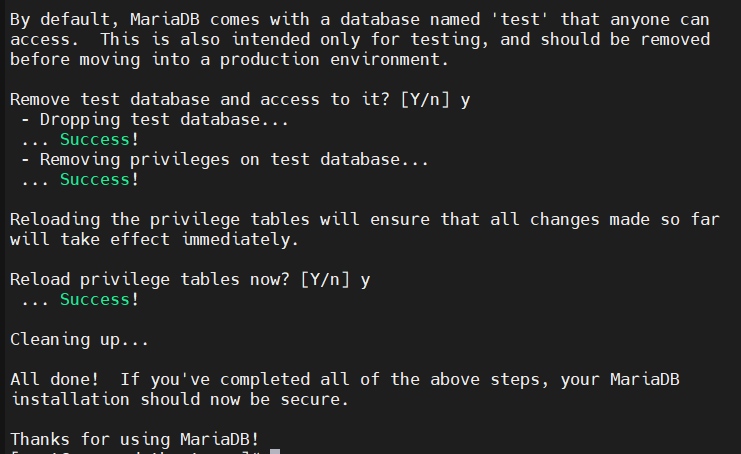

# Môi trường

#### [1.Security](#1)

#### [2.Host networking](#2)

#### [3.Network Time Protocol](#3)

#### [4.OpenStack packages](#4)

#### [5.SQL database](#5)

#### [6.Message queue](#6)

#### [7.Memcached](#7)

#### [8.Etcd](#8)

_______

## 1.Security<a name="1"></a>

## 2.Host networking<a name="2"></a>

## 3.Network Time Protocol<a name="3"></a>

Sử dụng ntp package (<a href="https://github.com/ze9hyrus/Training-Linux/blob/main/NDCuong/%5BReport3%5Dconnecting%20linux%20to%20network.md#9">tham khảo</a>) hoặc chrony package :

- Install the package: `yum install chrony`

- Config:  `vi /etc/chrony.conf`  => `server NTP_SERVER iburst` 

Lưu ý: thay NTP_SERVER bằng hostname hoặc ip của server NTP

- Đối với các node khác (k phải controller node), thêm `allow [ip_controller_node]/24` vào file config (/etc/chrony.conf)

- Restart service : `systemctl restart chronyd`

## 4.OpenStack packages<a name="4"></a>

- Installing the Train release:`yum install centos-release-openstack-train`'
- Install the appropriate OpenStack client:`yum install python-openstackclient`
- Install the openstack-selinux package to automatically manage security policies for OpenStack services: `yum install openstack-selinux`

## 5.SQL database<a name="5"></a>

Hầu hết các dịch vụ OpenStack sử dụng cơ sở dữ liệu SQL để lưu trữ thông tin. Cơ sở dữ liệu thường chạy trên controller node.

- Install the packages: `yum install mariadb mariadb-server python2-PyMySQL`
- Config:  `vi /etc/my.cnf.d/openstack.cnf` (create), input: 

```
[mysqld]
bind-address = [IP controller node]

default-storage-engine = innodb
innodb_file_per_table = on
max_connections = 4096
collation-server = utf8_general_ci
character-set-server = utf8
```

thay [IP controller node] bằng ip của controller node


- Restart service mariadb
- Config secure: `mysql_secure_installation`
  - Nhập password (ở lần đầu đăng nhập sau khi cài mariadb, password sẽ trống, chỉ cần nhấn enter)
  - Thay đổi mật khẩu (option: y-có, n-không)
  - Người dùng ẩn danh: cho phép bất kỳ ai để đăng nhập vào MariaDB mà không cần phải tạo tài khoản người dùng. Điều này chỉ nhằm mục đích thử nghiệm và thực hiện cài đặt đi mượt mà hơn một chút. Bạn nên xóa chúng trước khi sử dụng. (option: y-xóa, n-không)
  - Root:  Thông thường, root chỉ được phép kết nối từ 'localhost'. Điều này đảm bảo rằng ai đó không thể đoán được mật khẩu gốc từ mạng. (option: y-chặn root truy cập từ xa, n-cho phép root truy cập từ xa)
  - Database "test": Theo mặc định, MariaDB đi kèm với một cơ sở dữ liệu có tên 'test' mà bất kỳ ai cũng có thể truy cập. Điều này cũng chỉ nhằm mục đích thử nghiệm và nên được loại bỏ. (option: y-xóa, n-không)
  - Reload: tải lại và áp dụng các thay đổi (option: y-có, n-không)





## 6.Message queue<a name="6"></a>

OpenStack sử dụng hàng đợi tin nhắn để điều phối hoạt động và thông tin trạng thái giữa các dịch vụ. Hướng dẫn này triển khai dịch vụ hàng đợi tin nhắn RabbitMQ vì hầu hết các bản phân phối đều hỗ trợ nó.

- Install : `yum install rabbitmq-server`, khởi động dịch vụ `systemctl start rabbitmq-server.service`
- Thêm user 'openstack': `rabbitmqctl add_user openstack RABBIT_PASS` - thay RABBIT_PASS bằng mật khẩu muốn đặt
- Cấp quyền: `rabbitmqctl set_permissions openstack ".*" ".*" ".*"`

## 7.Memcached<a name="7"></a>

Cơ chế xác thực dịch vụ Identity cho các dịch vụ sử dụng Memcached để lưu trữ mã thông báo. Dịch vụ memcached thường chạy trên controller node.

- Install: `yum install memcached python-memcached`
- Config: `vi  /etc/sysconfig/memcached` =>  input `OPTIONS="-l 127.0.0.1,::1,controller"` (replace `OPTIONS="-l 127.0.0.1,::1"` nếu có )
- Restart service

## 8.Etcd<a name="8"></a>

Các dịch vụ OpenStack có thể sử dụng Etcd, một kho lưu trữ dạng khóa-giá trị (key-value) đáng tin cậy được phân phối để khóa khóa phân tán, lưu trữ cấu hình, theo dõi dịch vụ trực tiếp và các tình huống khác.

- Install: `yum install etcd` 
- Config: `vi /etc/etcd/etcd.conf` => Gán giá trị cho các tham số sau:

```
#[Member]
ETCD_DATA_DIR="/var/lib/etcd/default.etcd"
ETCD_LISTEN_PEER_URLS="http://[IP controller node]:2380"
ETCD_LISTEN_CLIENT_URLS="http://[IP controller node]:2379"
ETCD_NAME="controller"
#[Clustering]
ETCD_INITIAL_ADVERTISE_PEER_URLS="http://[IP controller node]:2380"
ETCD_ADVERTISE_CLIENT_URLS="http://[IP controller node]:2379"
ETCD_INITIAL_CLUSTER="controller=http://[IP controller node]:2380"
ETCD_INITIAL_CLUSTER_TOKEN="etcd-cluster-01"
ETCD_INITIAL_CLUSTER_STATE="new"
```

Thay [IP controller node] bằng địa chỉ ip của controller node

- Restart service


[Tham khảo](https://docs.openstack.org/install-guide/environment.html)
