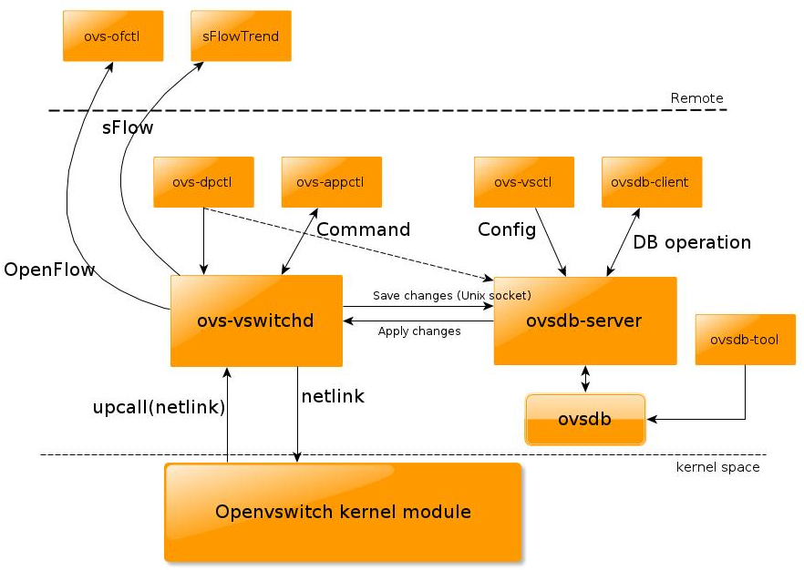

# Open vSwitch

## [1. Các khái niệm liên quan](#1)

## [2. Open vSwitch](#2)

## [3. So sánh Linux Bridge - Open vSwitch](#3)

## [4. Thành phần, kiến trúc Open vSwitch](#4)

## 1.Các khái niệm liên quan 

#### 1.1. Software Defined Networking

Các thiết bị mạng hiện nay được sản xuất bởi các nhà sx khác nhau. Mỗi nhà cung cấp thường tự đặt ra tiêu chuẩn riêng, đưa ra các API và cách thức cấu hình khác nhau, điều này hạn chế khả năng phối hợp, điều khiển lưu lượng giữa các thiết bị của các nhà sản xuất khác nhau, khả năng tái lập trình và cấu hình mạng trở lên hạn chế.Trước tình hình đó khái niệm SDN ra đời. SDN giúp giải quyết vấn đề trên bằng cách **tách biệt phần điều khiển thiết bị và phần điều hướng dữ liệu**.

 Có 3 ý chính đối với SDN đó là:

- Tách biệt phần quản lí (control plane) với phần truyền tải dữ liệu (data plane).
- Các thành phần trong network có thể được quản lí bởi các phần mềm được lập trình chuyên biệt.
- Tập trung vào kiểm soát và quản lí network.

SDN có 3 phần chính đó là:

- Network infrastructure: Bao gồm các thiết bị mạng như router, switch, bao gồm cả thiết bị ảo và thật.
- Controller: Bao gồm phần mềm dựa trên bộ điều khiển tập trung, có thể đặt trên server để giao tiếp với tất cả các thiết bị mạng bằng cách sử dụng API như OpenFlow hoặc OVMDB.
- Applications: Bao gồm hàng loạt các ứng dụng có sự tồn tại của network. Các ứng dụng này có thể nói chuyện với controller sử dụng API để thực hiện những yêu cầu.

#### 1.2. OpenFlow

Trước đây, khi người ta sử dụng Ethernet Hub làm thiết bị kết nối giữa các thành phần trong hệ thống mạng, mỗi khi nhận dữ liệu nó lại forward tới tất cả các port mà nó kết nối. Điều này gây ra nhiều hậu quả như broadcast storms, looping và giảm bandwidth. Sau đó nó bị thay thế bởi Network Switch, thiết bị này đã thông minh hơn rất nhiều khi nó biết gửi dữ liệu tới đúng interface, và từ đây khái niệm control plane cũng bắt đầu xuất hiện. Control plane cung cấp thông tin để xây lên bảng kết nối giúp các thiết bị mạng biết được chính xác nơi cần gửi dữ liệu.

OpenFlow là giao thức mạng cho phép điều khiển mạng xác định đường đi của gói tin của mạng qua các Switch, cung cấp khả năng truyền thông giữa các giao diện của lớp điều khiển và lớp chuyển tiếp trong kiến trúc **SDN**. OpenFlow cho phép truy cập trực tiếp và điều khiển  các thiết bị mạng như switch và router, cả thiết bị vật lý và thiết bị ảo, do đó giúp **di chuyển phần điều khiển mạng ra khỏi các thiết bị chuyển mạch tới phần mềm điều khiển trung tâm**(OpenFlow Controller). 

Một thiết bị OpenFlow bao gồm ít nhất 3 thành phần:

- Secure Channel: kênh kết nối thiết bị tới bộ điều khiển (controller), cho phép các lệnh và các gói tin được gửi giữa bộ điều khiển và thiết bị.
- OpenFlow Protocol: giao thức cung cấp phương thức tiêu chuẩn và mở cho một bộ điều khiển truyền thông với thiết bị.
- Flow Table: chứa các flow entry(hành động xử lý gói tin) và một "table miss flow entry" được sử dụng để xử lý các gói tin khi không có flow entry nào trong flow table match với gói tin đó.

## 2. Open vSwitch

Open vSwitch là **switch ảo** (mã nguồn mở) xây dựng trên kiến trúc SDN, sử dụng giao thức Open Flow để **quản lý network interface**. Nó là một multilayer software được viết bằng ngôn ngữ C, rất phù hợp với chức năng là một switch ảo trong môi trường ảo hóa. Nó hỗ trợ rất nhiều nền tảng như Xen/XenServer, KVM, và VirtualBox.

Các chức năng của Open vSwitch:

- Hỗ trợ tính năng VLAN chuẩn 802.1Q với các cổng trunk và access port như một switch layer thông thường.
- Hỗ trợ giao diện NIC bonding có hoặc không có LACP trên cổng uplink switch.
- Hỗ trợ NetFlow, sFlow(R), và mirroring để tăng khả năng hiển thị.
- Hỗ trợ cấu hình QoS (Quality of Service) và các chính sách thêm vào khác.
- Hỗ trợ tạo tunnel GRE, VXLAN, STT và LISP.
- Hỗ trợ tính năng quản lý các kết nối 802.1aq
- Hỗ trợ giao thức OpenFlow.
- Cấu hình cơ sở dữ liệu với C và Python.
- Hoạt động forwarding với hiệu suất cao sử dụng module trong nhân Linux.

## 3. So sánh Linux Bridge - Open vSwitch

#### 3.1. Linux Bridge

Linux bridge là một phần mềm đươc tích hợp vào trong nhân Linux để giải quyết vấn đề ảo hóa phần network trong các máy vật lý. Về mặt logic Linux bridge sẽ tạo ra một con switch ảo để cho các VM kết nối, từ đó có thể giao tiếp với nhau hoặc ra ngoài (Internet). Linux Bridge là cơ chế ảo hóa mặc định được sử dụng trong KVM, nó rất dễ dàng để cấu hình và quản lí tuy nhiên bị hạn chế một số các chức năng.

LB không hỗ trợ tunneling và OpenFlow protocols. Điều này khiến nó bị hạn chế trong việc mở rộng các chức năng. Đó cũng là lí do vì sao Open vSwitch xuất hiện.

#### 3.2. So sánh Linux Bridge - Open vSwitch

| Open vSwitch                             | Linux bridge                                           |
| ---------------------------------------- | ------------------------------------------------------ |
| Được thiết kế cho môi trường mạng ảo hóa | Mục đích ban đầu không phải dành cho môi trường ảo hóa |
| Có các chức năng của layer 2-4           | Chỉ có chức năng của layer 2                           |
| Có khả năng mở rộng                      | Bị hạn chế về quy mô                                   |
| ACLs, QoS, Bonding                       | Chỉ có chức năng forwarding                            |
| Có OpenFlow Controller                   | Không phù hợp với môi trường cloud                     |
| Hỗ trợ netflow và sflow                  | Không hỗ trợ tunneling                                 |

- OvS
  - Ưu điểm: các tính năng tích hợp nhiều và đa dạng, kế thừa từ linux bridge. OVS hỗ trợ ảo hóa lên tới layer4. Được sự hỗ trợ mạnh mẽ từ cộng đồng. Hỗ trợ xây dựng overlay network.
  - Nhược điểm: Phức tạp, gây ra xung đột luồng dữ liệu
- LB
  - Ưu điểm: các tính năng chính của switch layer được tích hợp sẵn trong nhân. Có được sự ổn định và tin cậy, dễ dàng trong việc troubleshoot Less moving parts: được hiểu như LB hoạt động 1 cách đơn giản, các gói tin được forward nhanh chóng
  - Nhược điểm: để sử dụng ở mức user space phải cài đặt thêm các gói. VD vlan, ifenslave. Không hỗ trợ openflow và các giao thức điều khiển khác. không có được sự linh hoạt

## 4. Thành phần, kiến trúc Open vSwitch

Các thành phần chính: 

- **ovs-vswitchd**: đóng vai trò daemon switch thực hiện các chức năng chuyển mạch kết hợp với module trong kernel Linux cho flow-based swtiching.

- **ovsdb-server**: database server mà ovs-vswitchd truy vấn tới để lấy cấu hình.

- **ovs-dpctl**: công cụ cấu hình module chuyển mạch trong kernel.

- **ovs-vsctl**: công cụ thực hiện truy vấn và cập nhật các cấu hình của ovs-vswitchd.

- **ovs-appctl**: công cụ gửi các lệnh tới Open Vswitch deamon. Open vSwitch cũng cung cấp một số công cụ sau:

- **ovs-ofctl**: công cụ truy vấn và điều khiển chuyển mạch Open Flow và controller.

- **ovs-pki**: Công cụ cho phép tạo và quản lý các public-key cho các Open Flow switch.

- **ovs-testcontroller**: một OpenFlow controller đơn giản có thể quản lý một số switch ảo thông qua giao thức Open Flow, khiến chúng hoạt động như các switch lớp 2 hoặc như hub. Phù hợp để kiểm tra các mạng Open Flow ban đầu.

(Tham khảo rõ hơn từng thành phần tại [đây](https://docs.openvswitch.org/en/latest/intro/install/general/) )

