Cài đặt OpenStack (Train - CentOS 7) All in one

Thứ tự cài đặt: Môi trường -> KeyStone -> Glance -> Placement -> Nova  -> Neutron -> Horizon -> Cinder

# Tổng quan OS:

##  Environment

- SQL database: Hầu hết các dịch vụ OpenStack sử dụng cơ sở dữ liệu SQL để lưu trữ thông tin. Cơ sở dữ liệu thường chạy trên nút điều khiển.

  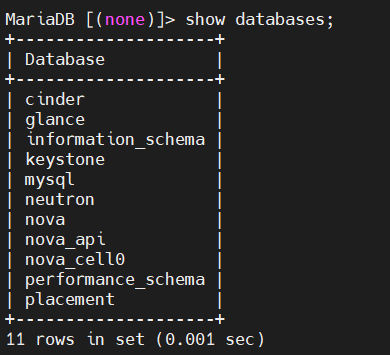

- Message queue: OpenStack sử dụng Message queue để điều phối hoạt động và thông tin trạng thái giữa các dịch vụ. Dịch vụ hàng đợi tin nhắn thường chạy trên controller node.

- Memcache: Cơ chế xác thực dịch vụ Identity cho các dịch vụ sử dụng Memcached để lưu trữ tokens. Dịch vụ memcached thường chạy trên controller node.

- Etcd: Các dịch vụ OpenStack có thể sử dụng Etcd, một kho lưu trữ khóa-giá trị (key-values) đáng tin cậy được phân phối để khóa khóa phân tán, lưu trữ cấu hình, theo dõi dịch vụ trực tiếp và các tình huống khác.

## Identity (KeyStone)

- Dịch vụ Identity thường là dịch vụ đầu tiên mà người dùng tương tác. Sau khi được xác thực, người dùng có thể sử dụng danh tính của họ để truy cập các dịch vụ OpenStack khác. Tương tự như vậy, các dịch vụ OpenStack khác tận dụng dịch vụ Identity để đảm bảo danh tính người dùng quyền truy cập, sử dụng các dịch vụ khác trong quá trình triển khai. 

- Kiểm soát đăng nhập, quyền hạn người dùng cuối:

  - Người dùng chưa đăng nhập, thiếu thông tin xác thực danh tính:

    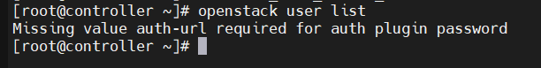

  - Người dùng đã xác thực danh tính, k có quyền truy cập, sử dụng dịch vụ:

    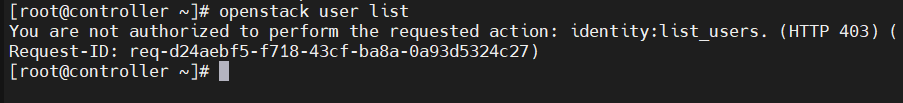

  - Người dùng đã xác thực danh tính, được ủy quyền truy cập, sử dụng dịch vụ:

    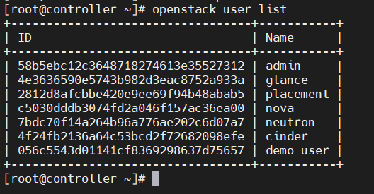

- KeyStone có 4 đối tượng chính : domain, project, user and role. 

  - User là ...user
  - Project
  - [Domain](https://docs.openstack.org/security-guide/identity/domains.html) là vùng chứa(high-level containers) các project, user (và group), được sử dụng để quản lý tập trung tất cả các thành phần nhận dạng, xác thực dựa trên keystone.
  - [Role](https://docs.openstack.org/keystone/latest/admin/service-api-protection.html) là đối tượng quản lý vai trò (chỉ định, ủy quyền cho đối tượng user), VD:
    - `openstack role add --project service --user nova admin` : Cấp quyền (vai trò-role) *admin* cho user *nova* đối với project *service*. 
    - Có 3 role mặc định là reader(chỉ đọc), member(thêm, sửa) và admin(thêm, sửa, xóa)

## Image(Glance)

- Dịch vụ Image cho phép người dùng khám phá, đăng ký và truy xuất image máy ảo. Nó cung cấp một API REST(kiểu kiến trúc dành cho các hệ thống siêu đa phương tiện được sử dụng cho World Wide Web) cho phép bạn truy vấn siêu dữ liệu hình ảnh máy ảo và truy xuất hình ảnh thực tế(query virtual machine image metadata and retrieve an actual image). Có thể lưu trữ hình ảnh máy ảo được tạo sẵn thông qua dịch vụ Image ở nhiều vị trí khác nhau, từ hệ thống tệp đơn giản đến hệ thống lưu trữ đối tượng như OpenStack Object Storage.

- Tạo, lưu trữ, sử dụng image 

  - Tạo image:

    - Dowload source image cirros 0.4.0: ` wget http://download.cirros-cloud.net/0.4.0/cirros-0.4.0-x86_64-disk.img`

      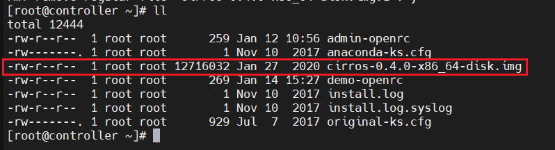

    - Upload image: `glance image-create --name "cirros" --file cirros-0.4.0-x86_64-disk.img --disk-format qcow2 --container-format bare --visibility public` (tên: cirros, nguồn:  cirros-0.4.0-x86_64-disk.img, định dạng : qcow2, định dạng vùng chứa(siêu dữ liệu):  bare(k có vùng chứa siêu dữ liệu), hiển thị: public)

  - Lưu trữ: xem các image đã tạo và đang được lưu trữ gồm id, tên, trạng thái `openstack image list`

    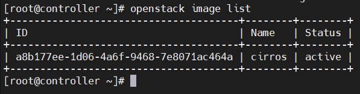

  - Sử dụng image: Khi tạo máy ảo, image sẽ được sử dụng để cài đặt hệ điều hành

    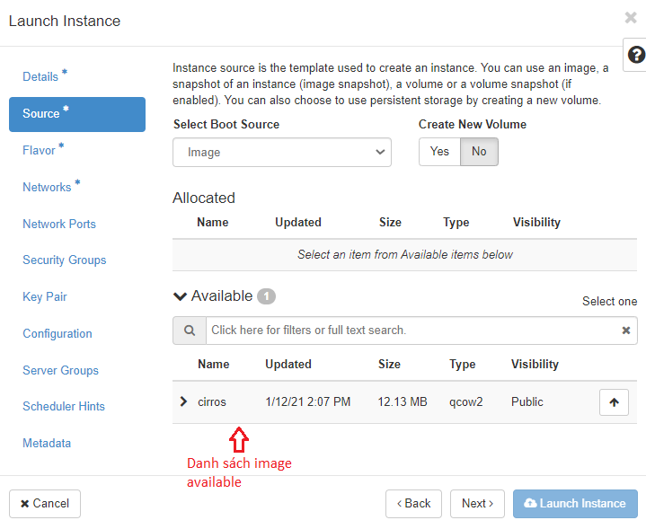

  - Xóa image: `openstack image delete [image_name/image_id]`

    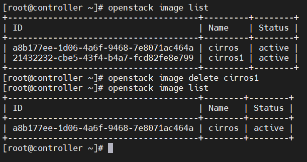

## Placement 

- Được sử dụng bởi nova để theo dõi các resource trên compute node. Để theo dõi các tài nguyên có sẵn/đã sử dụng/tổng quát trên các provider. 

  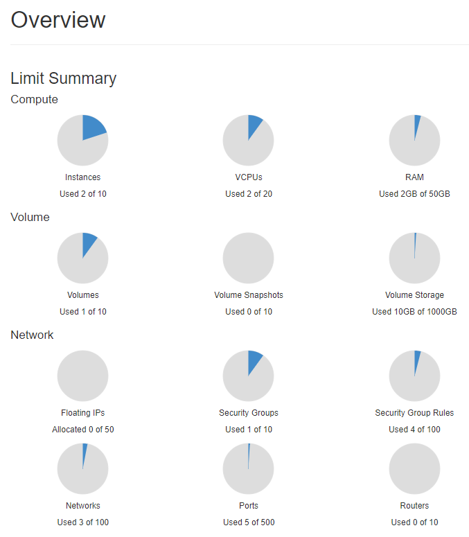

## Compute(Nova)

- Tổ chức, vận hành và quản lý(host and manage) hệ thống OpenStack. Đây là thành phần chính của hệ thống dịch vụ hạ tầng (IaaS). Module chính được triển khai bằng Python.

- OpenStack Compute tương tác với OpenStack Identity để xác thực, OpenStack Placement để theo dõi và lựa chọn kho tài nguyên, dịch vụ OpenStack Image cho hình ảnh đĩa và máy chủ, và OpenStack Dashboard cho giao diện quản trị và người dùng.

  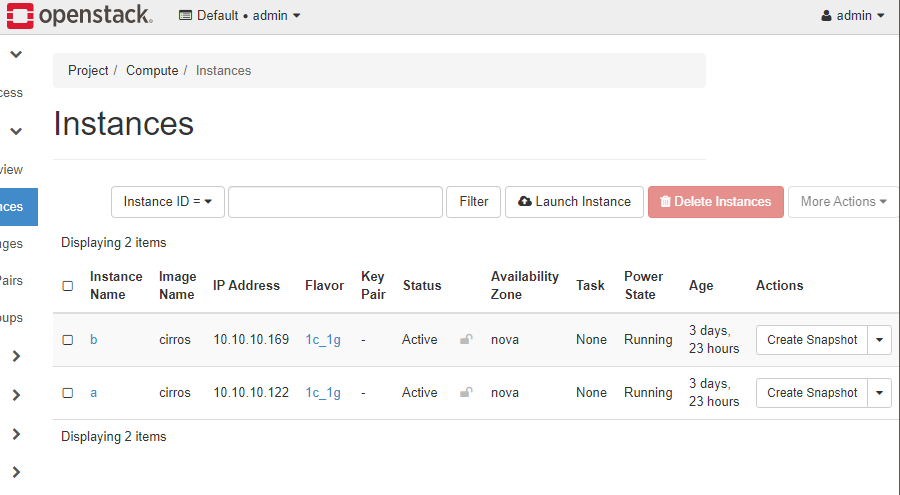

- OpenStack Compute bao gồm:

  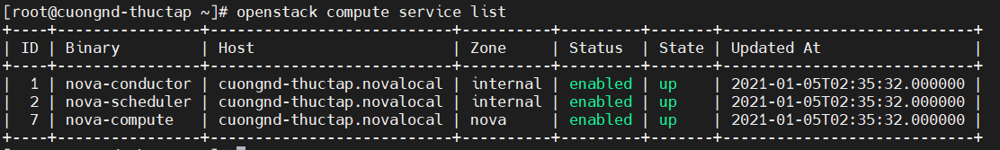

  - nova-api: Tiếp nhận và phản hồi các yêu cầu gọi API của người dùng cuối, thực thi các chính sách(policies) và bắt đầu hầu hết các hoạt động điều phối, chẳng hạn như chạy một instance
  - nova-api-metadata: Tiếp nhận yêu cầu metadata từ instances
  - nova-compute: daemon tạo và giám sát các máy ảo thông qua các API giám sát (hypervisor APIs)
  - nova-scheduler: lấy yêu cầu máy ảo từ hàng đợi và chỉ định host server cho nó
  - nova-conductor: kết nối nova-compute và database, ngăn k cho nova-compute truy cập trực tiếp vào database

  - nova-novncproxy: cung cấp proxy để truy cập các instance đang chạy thông qua kết nối VNC. Hỗ trợ ứng dụng khách novnc dựa trên trình duyệt.
  - nova-spicehtml5proxy: cung cấp proxy để truy cập các phiên bản đang chạy thông qua kết nối SPICE. Hỗ trợ ứng dụng khách HTML5 dựa trên trình duyệt.
  - nova-xvpvncproxy: cung cấp proxy để truy cập các phiên bản đang chạy thông qua kết nối VNC. Hỗ trợ máy khách Java dành riêng cho OpenStack.

- Tạo, xóa, điều khiển máy ảo

  - Tạo

    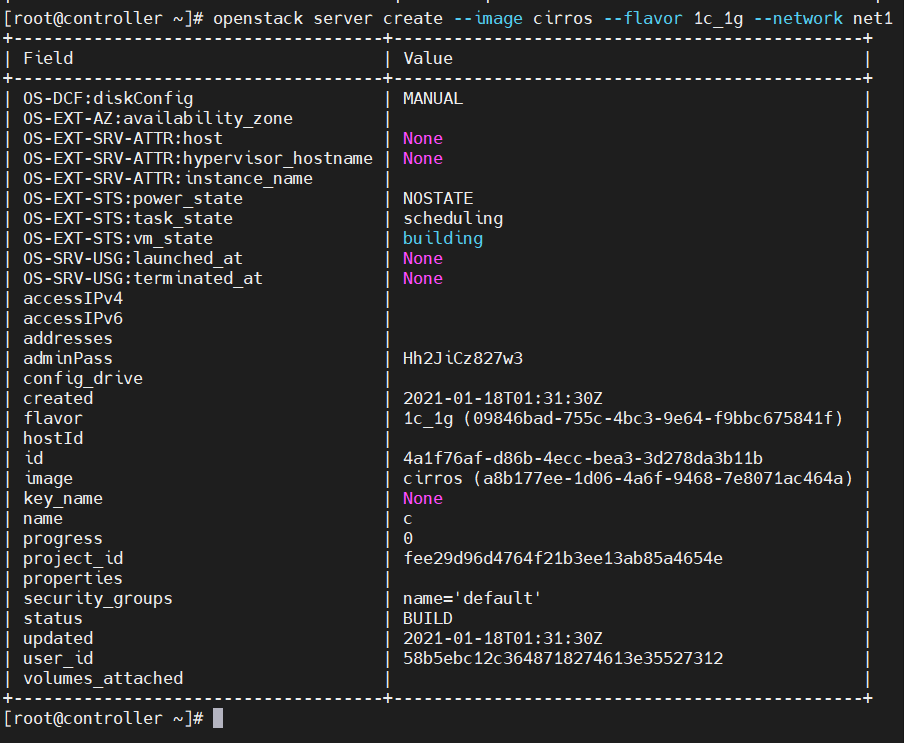

  - Xóa

    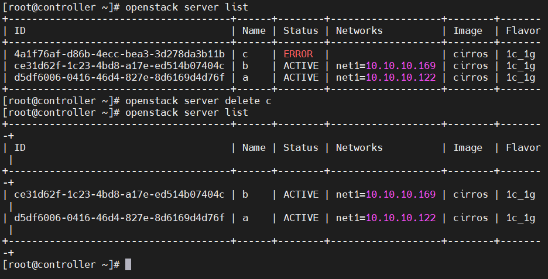

  - Điều khiển với virsh command

    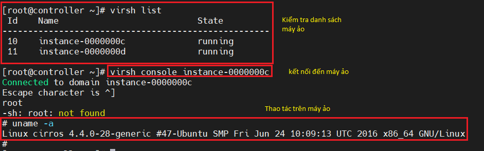

  - Điều khiển bằng dashboard

    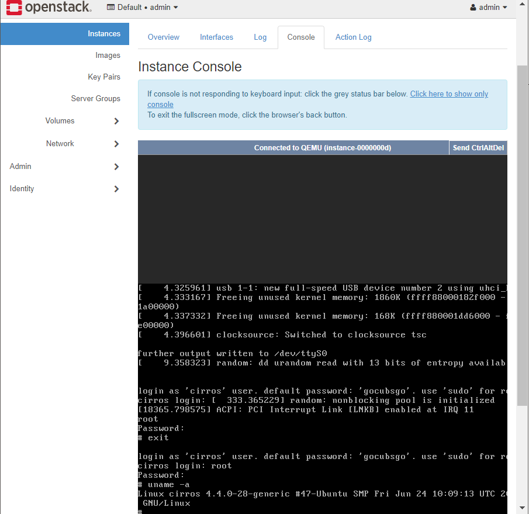

## Networking (Neutron)

- Tạo và gắn các thiết bị giao diện(interface devices) được quản lý bởi các dịch vụ OpenStack khác vào mạng. Plug-ins có thể được triển khai để phù hợp với các thiết bị mạng và phần mềm khác nhau, mang lại sự linh hoạt cho kiến trúc và triển khai OpenStack. 

  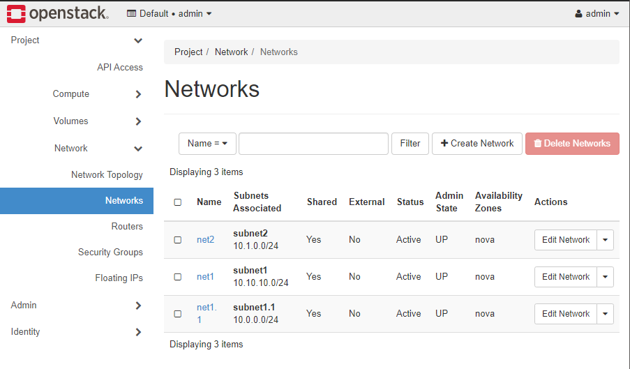

- Tiếp nhận là định tuyến các yêu cầu API (API request) đến plug-in thích hợp để thực thi.

- OpenStack Networking chủ yếu tương tác với OpenStack Compute để cung cấp mạng và kết nối cho các instance của nó.

- Chủ yếu sử dụng Messaging queue để định tuyến thông tin giữa các máy chủ neutron và các tác nhân(agents) khác nhau. Cũng hoạt động như một cơ sở dữ liệu để lưu trữ trạng thái mạng cho các plug-in cụ thể.

- Thêm, xóa network

  - Thêm 

    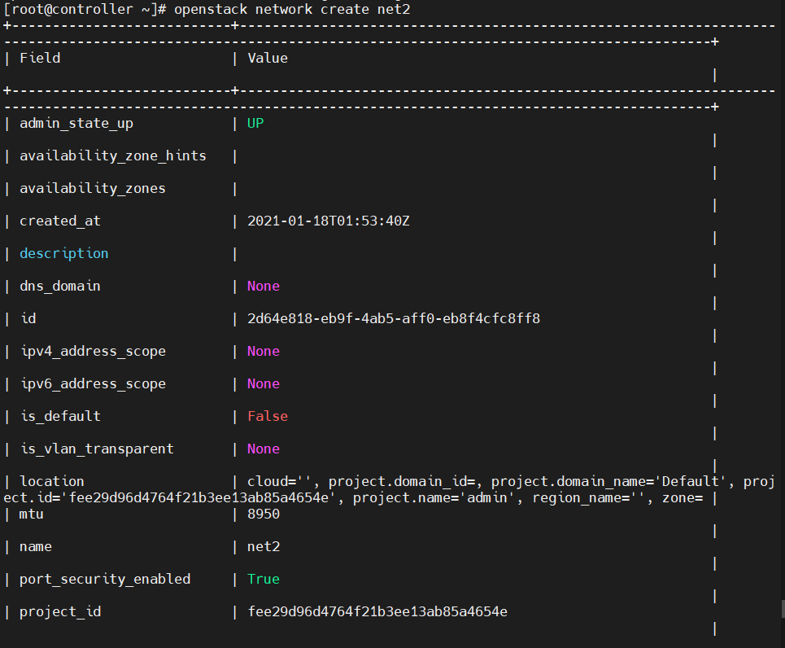

  - Xóa 

    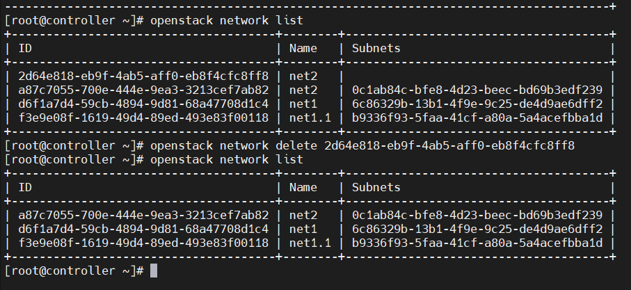

## Dashboard (Horizon)

- Là service cung cấp dịch vụ đồ họa GUI phục vụ cho quản trị hệ thống OpenStack thông qua website

  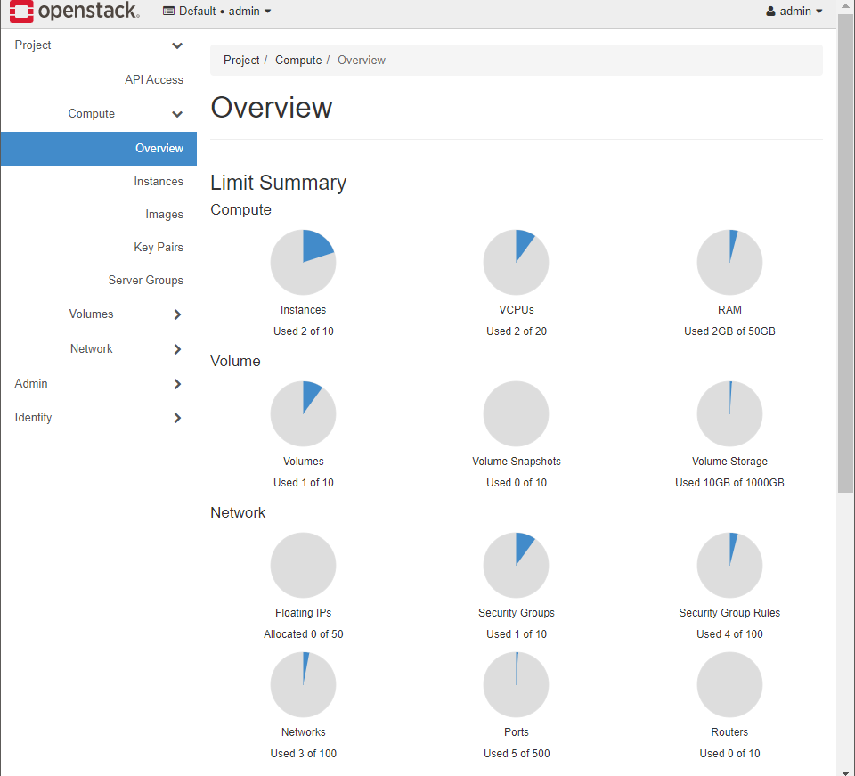

## Block Storage (Cinder)

- Cung cấp các thiết bị lưu trữ (block storage) cho instances. Phương thức lưu trữ được cung cấp và sử dụng được xác định bởi trình điều khiển Lưu trữ khối(Block Storage driver) hoặc các trình điều khiển trong trường hợp cấu hình đa phụ trợ.

  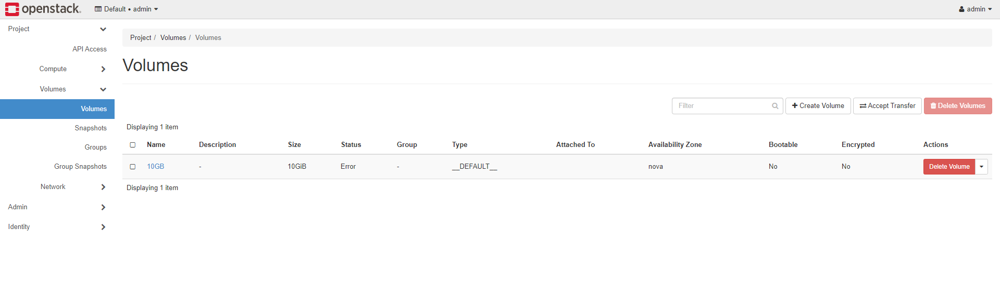

- Tạo, xóa và sử dụng volume

  - Tạo

    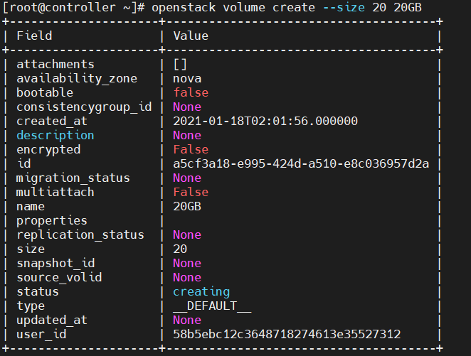

  - Xóa

    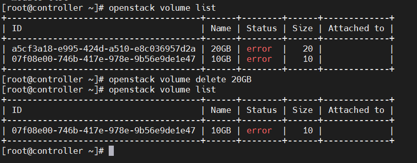

