# PROCESS MONITORING AND SCHEDULING
### [1. Monitoring processes](#mp)
### [2. Shared libraries](#sl)
### [3. Scheduling processes with cron](#sp)

## 1. Monitoring processes 
###  1.1. Process
> Trong khoa học máy tính, *process*(tiến trình) là một thực thể (instance) của một chương trình máy tính đang được thực thi bởi một hoặc nhiều luồng. Một *process* có riêng một không gian địa chỉ, có ngăn xếp (stack) riêng rẽ, có bảng chứa các đặc tả tập tin (file descriptor) được mở cùng *process* và đặc biệt là có một định danh **PID** (process identifier) duy nhất trong toàn bộ hệ thống vào thời điểm *process* đang chạy

Một số *process* có thể được liên kết với cùng một chương trình. Ví dụ, mở một số phiên bản của cùng một chương trình thường dẫn đến nhiều hơn một *process* được thực thi.

> Một phần quan trọng của việc chạy và quản trị hệ thống Ubuntu liên quan đến việc theo dõi tình trạng tổng thể của hệ thống về bộ nhớ, lưu trữ và sử dụng bộ xử lý. Điều này bao gồm việc biết cách kiểm tra và quản lý cả hệ thống và *process* đang chạy (trong nền)

The Linux terminal có một số lệnh hữu ích có thể hiển thị các *process* đang chạy, hủy chúng và thay đổi mức độ ưu tiên của chúng.

### 1.2. Monitoring processes
###### 1.2.1. Hiển thị

  - Ps

Command `ps` in ra các process đang chạy tại thời điểm thực thi, gồm PID, thời gian đã chạy và tên process, có 1 số option như:

`ps -A` liệt kê tất cả các process đang chạy

> 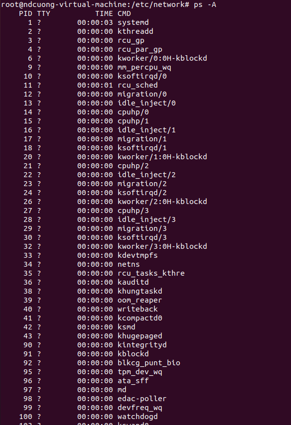

`ps -A | grep [process]` hiển thị các process có tên chứa [process]

> 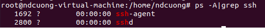

  - Ps tree

`pstree` hiển thị các process dạng cây: các process sẽ hiển thị bên dưới trình quản lý tạo ra chúng

> 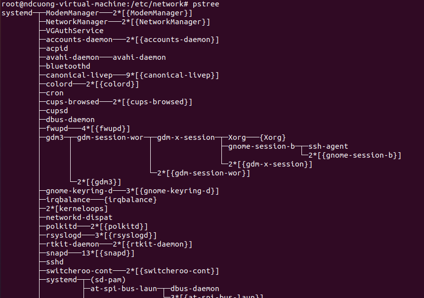

  - Top

Command `top` là lệnh hiển thị các process đang chạy trong thời gian thực, hiển thị lượng tài nguyên các process sử dụng và được sắp xếp theo mức độ sử dụng CPU

> 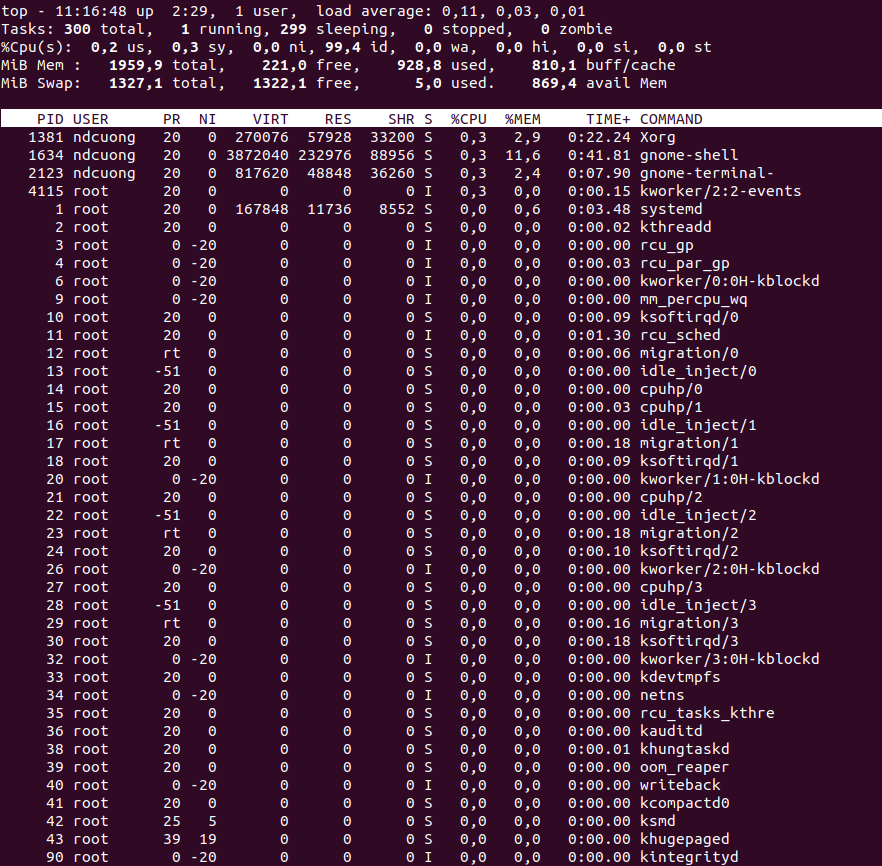

Để thoát ra, sử dụng interrupt keyboard(phím tắt này thường ngắt (kill) các process đang chạy trong terminal) `Ctrl + C`

  - Htop

Htop tương tự như lệnh top, nhưng được bổ sung các chức năng để sắp xếp, thay đổi mức độ ưu tiên hay kill process (v.v.). Htop cũng có giao diện dễ nhìn hơn top. Tuy nhiên htop thường k được cài đặt sẵn trong hệ điều hành và cần được cài đặt với lệnh > apt install htop

> 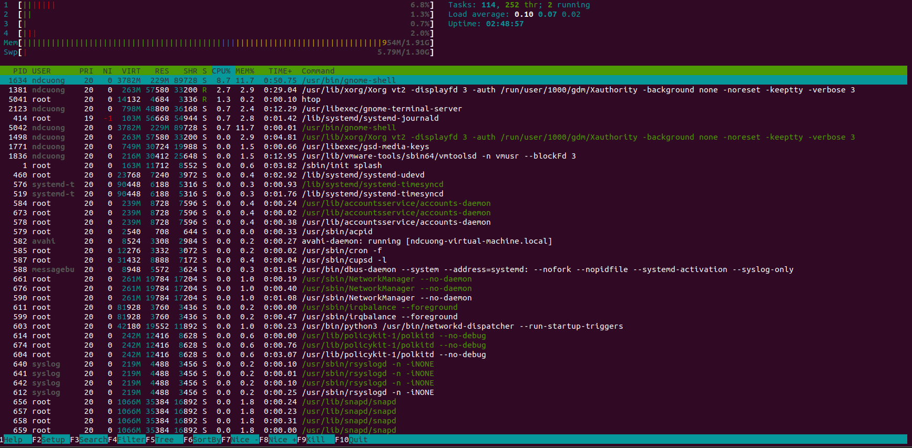

###### 1.2.2. Quản lý
  - Kill

  `kill [PID]` sẽ kill process dựa vào PID được cung cấp. PID có thể lấy bằng các lệnh hiển thị (ps, top) hoặc lệnh pgrep

  > 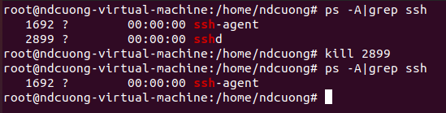

  - Pgrep

  `pgrep [process]` trả về PID của [process], có thể sử dụng như 1 biến trong lệnh kill: `kill $(pgrep [process])`

  > 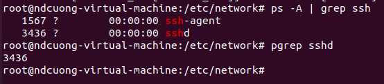

  > 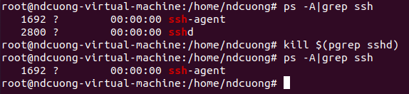

  - Pkill & killall
    Tương tự như kill, pkill & killall ngắt các process nhưng dựa theo tên, ví dụ: `pkill sshd` hoặc `killall sshd`

  > 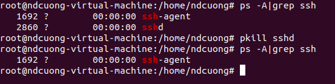

  - Renice
    `renice [priority] [PID]` là lệnh đặt thứ tự ưu tiên cho process có PID được cung cấp, với priority từ -19 đến 19 (19 có mức độ ưu tiên thấp nhất, mặc định là 0)

> 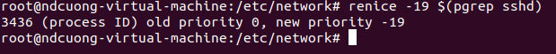

  -  Xkill
    `xkill` sẽ chuyển con trỏ chuột thành dạng dấu x, khi nhấp chuột vào bất kì cửa sổ nào, process chịu trách nhiệm thực thi cửa sổ đó sẽ đóng lại. Đây là phương pháp để kill 1 process bằng có giao diện đồ họa. Nếu k muốn kill process, click chuột phải để thoát xkill.

  > 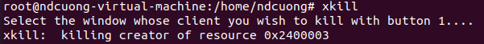

## 2. Shared libraries 

   #### 2.1. Library
   Library là file chứa các đoạn mã lệnh và dữ liệu được tổ chức thành các hàm, các lớp nhằm cung cấp chức năng nào đó cho các chương trình chạy trên máy tính. Ví dụ như khi chương trình cần sử dụng hàm sort(), trong chương trình đó k cần phải có chi tiết mã lệnh của hàm sort(), nhưng trên máy phải có 1 library nào đó chứa nội dung của hàm này và trong chương trình có khai báo library đó để khi chương trình được thực thi, nó sẽ tìm nội dung của hàm sort() trong library đó để dùng.
   Library gồm 3 loại: Static, Dynamic và Shared. Thường thì các library ở dạng mã nhị phân, không phải dạng văn bản (plain text).

   #### 2.2. Shared libraries
   - *Static linking*: Khi chương trình biên dịch, nó lấy các đoạn mã cần thiết từ library và lưu vào bộ nhớ ngoài, khi chạy không còn phụ thuộc vào sự tồn tại của đoạn mã trong library đó nữa.
   - *Dynamic linking*: Khác với static linking (chương trình và thư viện liên kết trong quá trình biên dịch), với dynamic linking thì quá trình liên kết diễn ra trong khi chương trình đang chạy (runtime). Điều này giúp giảm thiểu dung lượng (vì không phải lưu đoạn mã trong library vào chương trình khi chạy như static)
   - *Shared libraries*: Các thư viện dynamic có thể được dùng bởi nhiều chương trình khác nhau trong một thời điểm được gọi là *Shared libraries*. Các file *Shared libraries* thường có phần mở rộng .dll (window), .dylib(OS X) và .so (linux)

   > 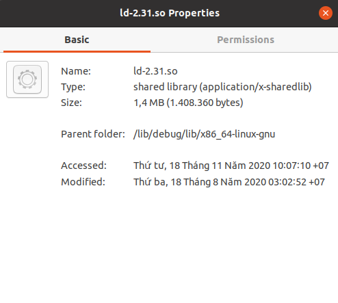

   #### 2.3. Quản lý Shared libraries
   - Xác định các *Shared libraries* cần thiết của một chương trình
  > Các chương trình nào sử dụng dynamic linking yêu cầu một vài shared library có trên hệ thống. Nếu các library cần thiết không được tìm thấy (hoặc không tồn tại), khi chạy chương trình sẽ đưa ra thông báo lỗi. Để kiểm tra các *Shared libraries* cần thiết của một chương trình: `ldd [program]` . Command ldd trả về các *Shared libraries* mà chương trình yêu cầu
  Ví dụ: `ldd /bin/bash`

  > 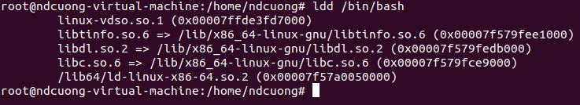

   - Thêm library mới

    Khi các chương trình ở dạng executable có sử dụng dynamic linking được chạy, thì tiện ích **ld.so** sẽ chịu trách nhiệm tìm kiếm và nạp vào bộ nhớ các shared library cần thiết cho chương trình đó. Nếu **ld.so** không thể tìm thấy các library đó thì chương trình sẽ gặp lỗi và không thể chạy được.

Thường thì các library được đặt trong các thư mục như /lib, /usr/lib, /usr/local/lib. Để hướng dẫn cho ld.so tìm kiếm library trong các thư mục này cũng như là các thư mục khác: 

 > Tạo index gồm tên các library và thư mục lưu trữ chúng. File /etc/ld.so.cache chứa thông tin index này. Đây là file nhị phân, vì thế ld.so có thể nhanh chóng đọc nội dung của file này.
   Để thêm mới index của library vào file cache trên, đầu tiên bạn thêm thư mục chứa library đó vào file /etc/ld.so.conf, đây là file cấu hình chứa các thư mục sẽ được tạo index bởi tiện ích ldconfig. Sau đó, chạy lệnh ldconfig với cú pháp như sau:

 `ldconfig [options] [lib_dirs]` hoặc đơn giản là `ldconfig`

> 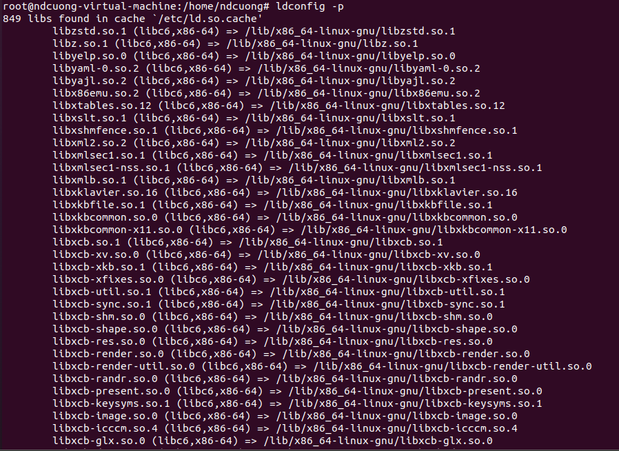

Có 2 option cho lệnh này

-p: chỉ hiển thị nội dung hiện tại của cache, không tạo lại cache.

-v: hiển thị quá trình thực hiện việc tạo lại cache.

ldconfig sẽ cập nhật cho file ld.so.cache . Thông tin cập nhật sẽ là index của các shared library nằm trong các thư mục lib_dirs (được chỉ ra ở dòng lệnh), các thư mục hệ thống là /usr/lib, /lib và các thư mục có trong file /etc/ld.so.conf. Mỗi khi có thay đổi trong các thư mục chứa library, nên chạy lại lệnh này để tạo mới lại cache.
## 3. Scheduling processes with cron 
#### 3.1. Cron
Cron(a.k.a cronjob) là phần mềm lập lịch thực hiện các công việc, hành động dựa vào thời gian trong hệ thống Linux (Unix-like). Nó được sử dụng để lập lịch các lệnh hoặc tập lệnh chạy theo định kỳ và theo khoảng thời gian cố định, phù hợp nhất để lập lịch cho các công việc lặp đi lặp lại giúp tiết kiệm thời gian. 

Các hành động của cron được điều khiển bởi một tệp crontab (bảng cron), nó chỉ định các lệnh shell chạy định kỳ theo một lịch trình nhất định. Mỗi gười dùng có thể có các tệp crontab riêng và thường có một tệp crontab trên toàn hệ thống - thường nằm trong (hoặc trong một thư mục con) của `/etc` - mà chỉ quản trị viên hệ thống mới có thể chỉnh sửa.
#### 3.2. Crontab command
- Có 3 lệnh crontab cơ bản: 
  - List: `crontab -l` xem danh sách các lệnh có trong file crontab
  
  > 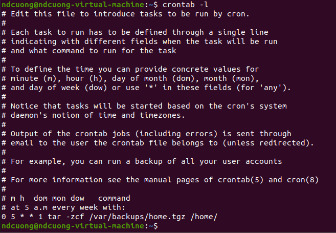
  
  - Edit: `crontab -e` mở và chỉnh sửa file crontab của user (hoặc của root với lệnh `sudo crontab -e`), tạo mới nếu chưa có
  
  > 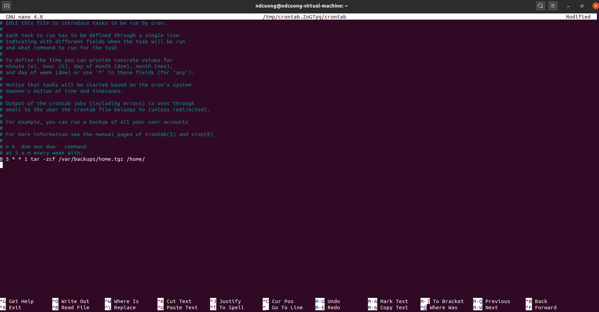
  
  - Remove: `crontab -r` xóa file crontab của user (hoặc của root với lệnh `sudo crontab -r`)

  > 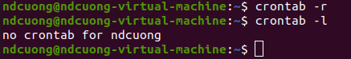

- Lập lịch:
Các công việc được lập lịch thực hiện với cú pháp: `[minute] [hour] [day] [month] [weekday] [command]`
Với:
  - minute: phút [0-59]
  - hour: giờ [0-23]
  - day: ngày trong tháng [1-31]
  - month: tháng [1-12]
  - weekday: ngày trong tuần [0-6] với 0 là chủ nhật
  - command: lệnh, tập lệnh(script) được lên lịch thực hiện
Các tham số thời gian không nhất thiết phải xác định cụ thể, sử dụng dấu * để bỏ qua tham số thời gian đó và lệnh sẽ được thực hiện định kì (nếu xác định cụ thể lệnh sẽ chỉ thực hiện một lần (trong năm?). Dấu * tương ứng với mọi giá trị tại vị trí đó đều được chấp nhận: * tại *minute* ứng với "mỗi phút", * tại *day* ứng với "mỗi ngày trong tháng", v.v.

 Ví dụ: lập lịch backup vào 5h sáng mỗi thứ 2 hàng tuần với lệnh `0 5 * * 1 tar -zcf /var/backups/home.tgz /home/`

Các tham số thời gian cũng nhận nhiều hơn 1 giá trị, các giá trị cho cùng 1 tham số sẽ cách nhau bằng dấu ","

Ví dụ: lập lịch backup vào 5h sáng ngày 5, 10, 20 với lệnh `0 5 5,10,20 * * tar -zcf /var/backups/home.tgz /home/`

Ngoài ra, có thể dùng */n để thực hiện lệnh trong khoảng thời gian thứ n

Ví dụ: thực hiện command vào phút thứ 5 của 5h sáng mỗi ngày: `*/5 5 * * * [command]` (thực hiện [command] vào 5h05, 5h10, 5h15 ... 5h55)
