 # SYSTEM SECURITY AND ENCRYPTION

 ## [1. The secure shell OpenSSH](#openssh)

 ## [2. Public/private key authentication](#key)

 ## [3.	X11 forwarding](#x11)

## 1.	The secure shell OpenSSH 
> Giao thức SSH (còn được gọi là Secure Shell) là một phương pháp để đăng nhập từ xa an toàn từ máy tính này sang máy tính khác, sử dụng mã hóa để bảo mật kết nối giữa máy khách và máy chủ. Tất cả xác thực người dùng, lệnh, đầu ra và truyền tệp được mã hóa để bảo vệ chống lại các cuộc tấn công trong mạng. Nó cung cấp một số tùy chọn thay thế để xác thực mạnh mẽ và nó bảo vệ tính toàn vẹn và bảo mật thông tin liên lạc bằng mã hóa mạnh mẽ. Đây là một giải pháp thay thế an toàn cho các giao thức đăng nhập không được bảo vệ (chẳng hạn như telnet , rlogin) và các phương thức truyền tệp không an toàn (chẳng hạn như FTP ).

Giao thức hoạt động theo mô hình máy khách-máy chủ, có nghĩa là kết nối được thiết lập bởi máy khách SSH kết nối với máy chủ SSH. Máy khách SSH thúc đẩy quá trình thiết lập kết nối và sử dụng mật mã khóa công khai để xác minh danh tính của máy chủ SSH. Sau giai đoạn thiết lập, giao thức SSH sử dụng thuật toán băm và mã hóa đối xứng mạnh để đảm bảo tính riêng tư và tính toàn vẹn của dữ liệu được trao đổi giữa máy khách và máy chủ.
#### Cài đặt và cấu hình ssh
- **Cài đặt**
Service ssh thường được đi kèm với hệ điều hành, để kiểm tra phiên bản có sẵn của ssh : `ssh -V`

> 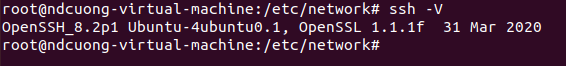

Nếu hệ thống chưa được cài đặt ssh, sử dụng lệnh : `apt install ssh`

- **Kết nối tới server ssh**
 - Truy cập vào server ssh thủ công: mở command prompt(window) hoặc terminal(linux, macOS) và gõ lệnh: `ssh -p [port] [username]@[host]`

Với port là cổng truy cập của server (mặc định là 22) Username là tên người dùng truy cập, và host là tên host server hoặc địa chỉ ip của server
Ví dụ `ssh -p 452 ndcuong@192.168.142.128`

> 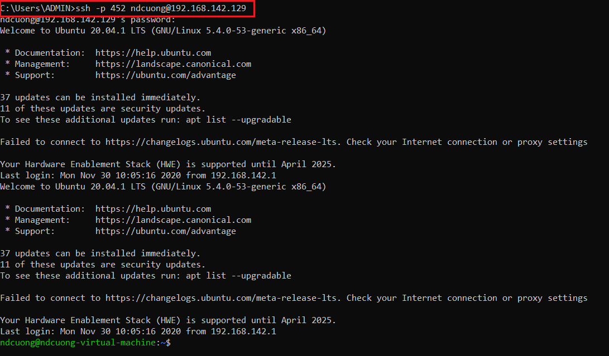

 - Truy cập vào server với các trình giả lập kết nối mobaxterm(ngoài ra có thể dùng putty, xshell):
Tạo session mới :

(1) Chọn session => (2) Chọn SSH => (3) Thông tin kết nối đến server => OK

> 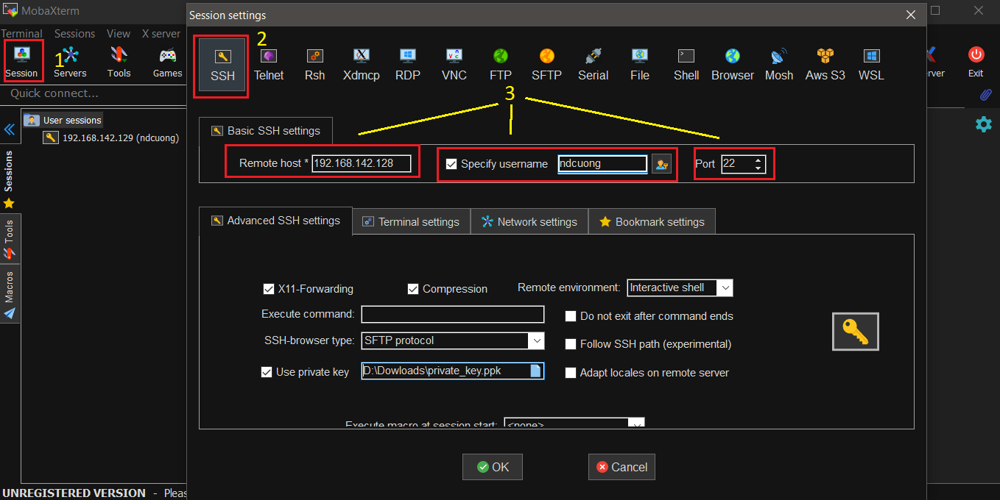

Máy ảo sẽ tự động kết nối đến server bằng phương thức ssh, sau đó người dùng sẽ đăng nhập để được cấp quyền truy cập (nếu server yêu cầu)

- **Cấu hình ssh**
 Các cài đặt, cấu hình server ssh được lưu và thực thi trong file sshd_config, gõ command: `vi /etc/ssh/sshd_config` 

 > 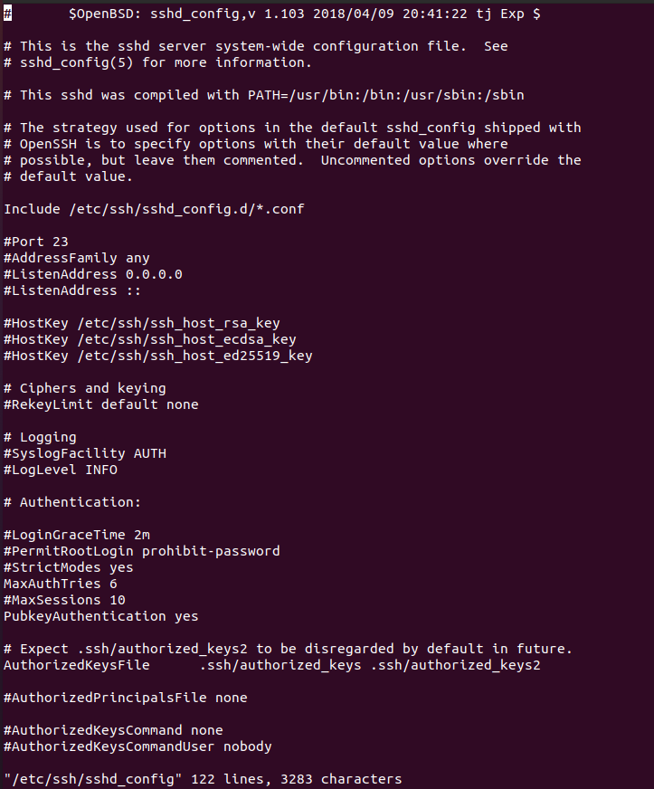

 Tại đây, có thể sử dụng các lệnh có sẵn bằng cách xóa bỏ dấu # ở trước và thay đổi tham số theo mục đích, hoặc thêm lệnh mới. Sau đó lưu file và restart lại ssh `( systemctl restart ssh )` để áp dụng các thay đổi.

 *Các cấu hình thường dùng:*
  - Thay đổi cổng (port) truy cập: `Port [new port]`

  Cổng port mặc định của ssh là 22. Để đảm bảo tính bảo mật thì nên đặt port mới cho server. Port phải nằm trong khoảng từ 0 đến 65535 và phải khả dụng (k có service khác sử dụng)
  Ví dụ:Port 452

  > 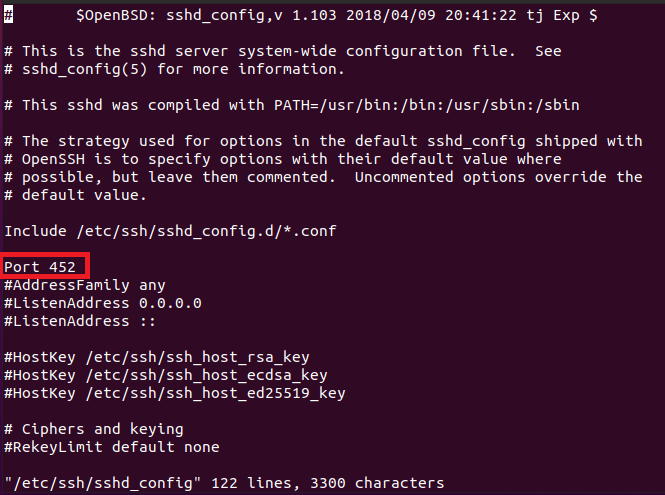

  Restart ssh và kiểm tra :

  > 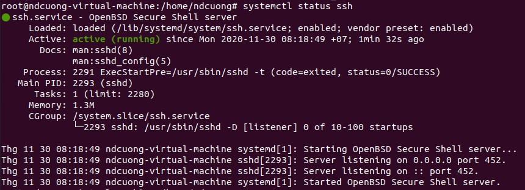

  - Đăng nhập bằng public/private key: `PubkeyAuthentication [yes/no]`
    
    Sau đó chỉ định vị trí lưu file public key: `AuthorizedKeysFile [location]` 
    
    > 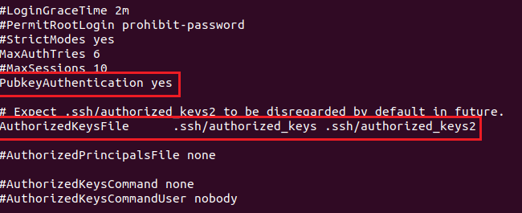
    
  - Danh sách user được truy cập: `AllowUsers [username1] [username2] ...`
    VD: AllowUsers ndcuong
    
    Chỉ duy nhất user ndcuong truy cập được. 
    
    Các user khác sẽ bị từ chối truy cập
    
    > 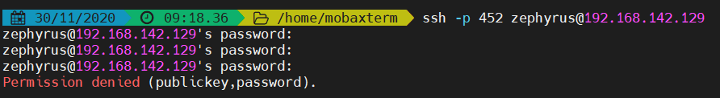
    
    Mặc định thì tất cả các user đều có thể truy cập vào server, ngoài ra có thể tạo danh sách chặn: `DenyUsers [username1] [username2] ...`
    
  - Giới hạn số lần nhập sai mật khẩu: `MaxAuthTries [number]`
  
    number là số lần nhập sai tối đa
    
  - Và rất nhiều các tùy chọn cấu hình khác, có thể tham khảo tại <a href="https://www.ssh.com/ssh/sshd_config/#authorizedkeysfile-location">đây</a>

## 2. Public/private key authentication
Có một số tùy chọn có thể được sử dụng để xác thực người dùng. Hai cách phổ biến nhất là mật khẩu và xác thực khóa công khai.

Phương pháp xác thực khóa công khai chủ yếu được sử dụng để tự động hóa và đôi khi được quản trị viên hệ thống sử dụng để đăng nhập một lần.Ý tưởng là có một cặp khóa mật mã - khóa công khai và khóa riêng tư - và định cấu hình khóa công khai trên máy chủ để cho phép truy cập và cấp cho bất kỳ ai có bản sao của khóa cá nhân quyền truy cập vào máy chủ. Các khóa được sử dụng để xác thực được gọi là khóa SSH.

> Máy chủ (hoặc máy client) sẽ thực hiện sinh bộ khóa, khóa công khai (public key) sẽ được lưu trữ và khai báo trong file /etc/ssh/sshd_config. Khóa bí mật (private key) sẽ được client sử dụng cho mỗi lần đăng nhập và có thể chia sẻ cho máy client khác, bất kì máy client nào sở hữu private key đều có thể đăng nhập được.

- Bước 1: Tạo key với lệnh `ssh-keygen`

> 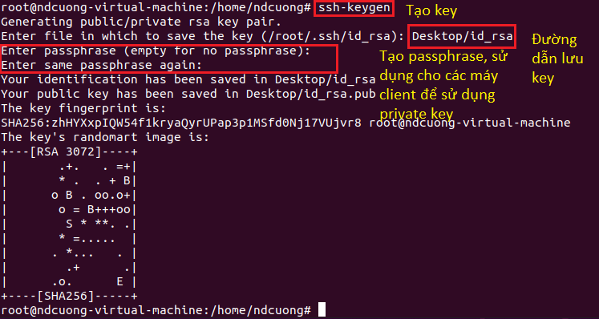

Nhớ địa chỉ lưu key và passphrase để cài đặt các bước tiếp theo

- Bước 2: Di chuyển file public key đến địa chỉ được lưu trong file [sshd_config](#pubkey),cấu hình lại file nếu cần và restart lại service ssh.

- Bước 3: Sử dụng file private key để truy cập vào server (sử dụng công cụ Mobaxterm)

> 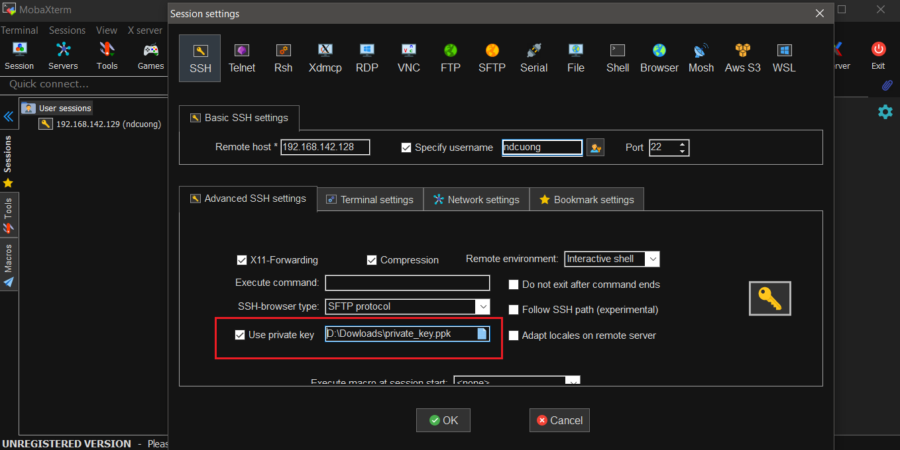

## 3.	X11 forwarding 
X11 forwarding là phương thức giúp cho người dùng có thể khởi chạy các ứng dụng có GUI được cài đặt trên hệ thống remote Linux và hiển thị về màn hình máy client.
- Bước 1: Cấu hình server
  - Enable X11 trong file [sshd_config](#cf)
  
  > 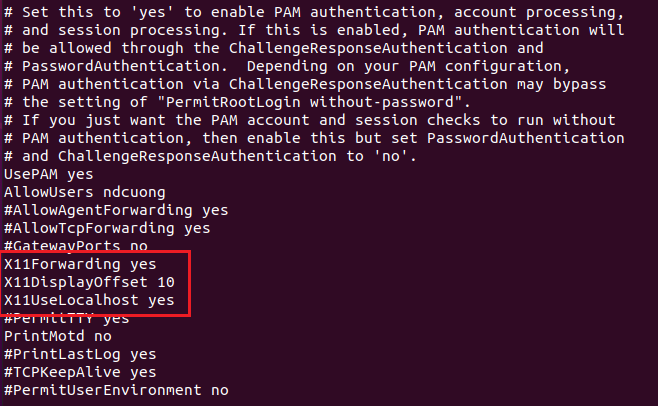
  
  - Cài đặt package x11-apps: `apt install x11-apps`
  - Restart service ssh: `service ssh restart`

- Bước 2: Đảm bảo X11 cũng được bật ở client (mặc định có sẵn với công cụ Mobaxterm, hoặc sử dụng option -X nếu truy cập bằng command: `ssh -X [name]@[host)`

> 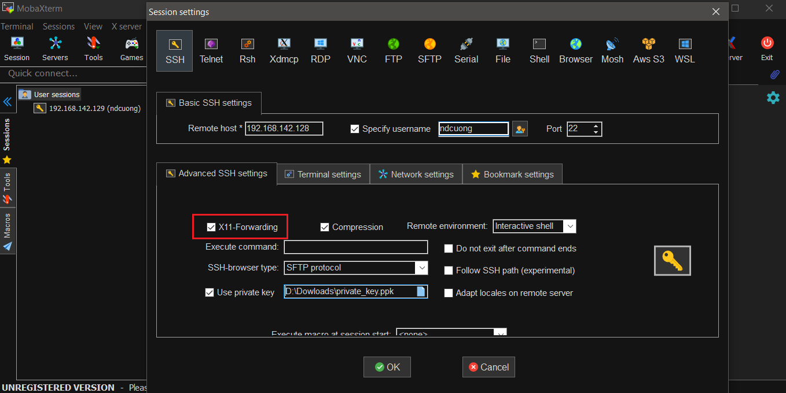

- Bước 3: Khởi động ứng dụng có GUI được cài đặt trên server
VD: `gedit`

Máy client hiển thị 1 cửa sổ cho phép thao tác trực tiếp vào ứng dụng GUI của server
> 

> gif lỗi, record k hiển thị explorer để open/save
