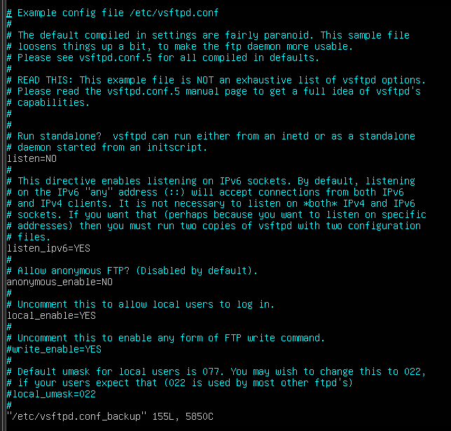
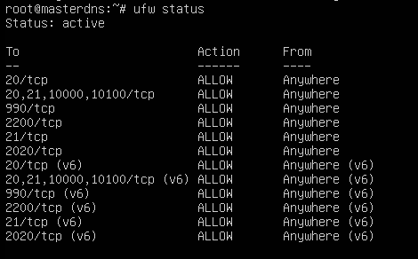
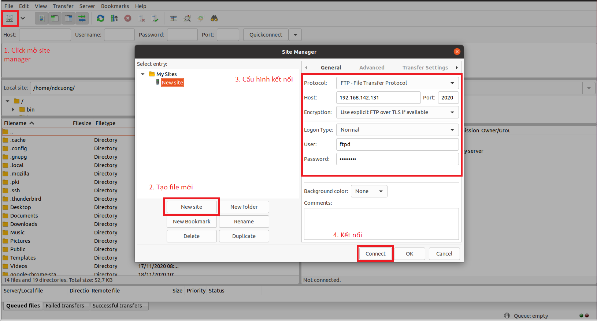

## Cấu hình server FTP
Sau khi cài đặt, file cấu hình của server FTP được đặt ở `/etc/vsftpd.conf`. Có thể backup file cấu hình này với lệnh `mv /etc/vsftpd.conf /etc/vsftpd.conf_backup` để có thể dễ dàng khôi phục lại nếu có sự cố xảy ra.

#### `vi /etc/vsftpd.conf`

> 

Đây là file cấu hình cho server dns, các thuộc tính có dạng tham số được cấu hình bằng cú pháp `[parameters] = [value]`. Tham khảo chi tiết các thuộc tính tại <a href="http://vsftpd.beasts.org/vsftpd_conf.html">đây</a>.
> Các thuộc tính cần lưu ý: 
- `write_able = YES` : cho phép client thực hiện ghi, sửa file (mặc định NO)
- `chroot_local_user = [YES/NO]` : Tạo một trình bao chroot (chroot jail) để ngăn chặn người dùng truy cập ra ngoài folder của họ. Kết hợp với thuộc tính `chroot_list_enable = [YES/NO]` sẽ tạo ra một 3 tùy chọn:
  - `chroot_local_user = YES` và `chroot_list_enable = NO` : Áp dụng chroot với tất cả người dùng.
  - `chroot_local_user = NO` và `chroot_list_enable = YES` : Áp dụng chroot với một vài người dùng cụ thể.
  - `chroot_local_user = YES` và `chroot_list_enable = YES` : Áp dụng chroot với tất cả người dùng ngoại trừ một vài người dùng cụ thể.
  - *Lưu ý*: `chroot_list_enable = YES` đi kèm với 1 file danh sách người dùng để áp dụng. File này được chỉ định với thuộc tính: `chroot_list_file = [directory]` sau đó tạo file theo địa chỉ đó và thêm danh sách người dùng vào. Mặc định 2 thuộc tính này là NO
- `pasv_min_port=[number]` và `pasv_max_port=[number]` đặt ra giới hạn port cung cấp cho các kết nối đến server. Ví dụ đặt 2 giá trị min-max lần lượt là 10000-10100 thì tối đa chỉ được 100 kết nối và port cho các kết nối đó sẽ nằm trong khoảng [10000-10100]. Mặc định 2 giá trị này là 0-0(cho phép mọi cổng và k giới hạn)
- `userlist_enable = [YES/NO]` (mặc định NO) và `userlist_deny = [YES/NO]` (mặc định YES) : khi kết hợp với `userlist_file = [directory]` sẽ tạo ra danh sách cho phép/chặn người dùng cụ thể kết nối
  - `userlist_enable = [NO]` và `userlist_deny = [YES]`: trường hợp mặc định, cho phép mọi người dùng kết nối.
  - `userlist_enable = [YES]` và `userlist_deny = [NO]` : chỉ cho phép người dùng trong danh sách được phép kết nối (while list)
  - `userlist_enable = [YES]` và `userlist_deny = [YES]` : chặn người dùng trong danh sách kết nối (black list)
- **Bảo mật kết nối với TLS(SSL)**: TLS được phát triển dựa trên SSL, là giao thức bảo mật cung cấp cho kết nối mạng máy tính. Khi kích hoạt TLS cho server FTP, dữ liệu gửi đi sẽ được mã hóa để đảm bảo an toàn, tránh nhưng trường hợp như mật khẩu được gửi đi dưới dạng văn bản rõ ràng. Cấu hình:
  - `ssl_enable=YES` : kích hoạt giao thức ssl
  - `rsa_cert_file=/etc/ssl/private/vsftpd.pem` và `rsa_private_key_file=/etc/ssl/private/vsftpd.pem`: đây là 2 khóa mặc định được cung cấp sẵn khi cài đặt vsftpd
  - `allow_anon_ssl=NO` : không cho phép truy cập ẩn danh (chỉ áp dụng khi ssl_enable=YES)
  - `force_local_data_ssl=YES` : bắt buộc các dữ liệu gửi và nhận phải sử dụng kết nối SSL (chỉ áp dụng khi ssl_enable=YES)
  - `force_local_logins_ssl=YES` : bắt buộc các mật khẩu (thông tin đăng nhập) gửi và nhận phải sử dụng kết nối SSL (chỉ áp dụng khi ssl_enable=YES)
  - `ssl_tlsv1=YES`, `ssl_sslv2=NO` và `ssl_sslv3=NO` : kích hoạt các giao thức TLS v1, SSL v2 và SSL v3 (TLS v1 được ưu tiên trong option này) (chỉ áp dụng khi ssl_enable=YES)
  - `request_ssl_reuse=NO` : Nếu được đặt thành YES, tất cả các kết nối dữ liệu SSL được yêu cầu thể hiện khả năng sử dụng lại phiên SSL. Tuy có tính bảo mật cao hơn nhưng có thể làm hỏng kết nối FTP do quá nhiều kết nối từ các FTP clients.
  - `ssl_ciphers = [ciphers]` : Chọn loại mã hóa, mặc định là DES-CBC3-SHA
  
  #### Cấu hình tường lửa
  Để server cho phép các client truy cập vào, cần phải mở các port được dùng trong vsftpd: `ufw allow [port number]`
  
  > 
  
  Kiểm tra: `ufw disable`
  
  > 
  
## Kiểm tra kết nối
 Cài đặt filezilla ở client để kết nối đến server: `apt install filezilla` (Ubuntu 20.04). 

 Mở site kết nối với server :

  > 

 Kết quả (without chroot):

 > 

 Kết quả (chroot):

 > 

 Disconnect:

 > 
