# Thiết lập firewall

#### Mô hình 

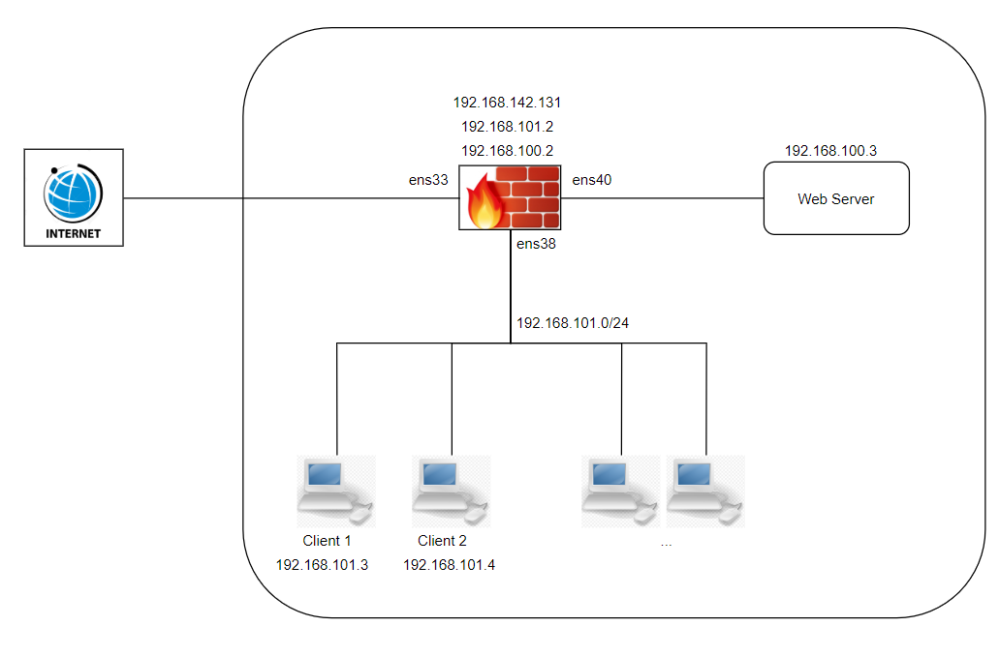

- Firewall, web server, client 2 cài đặt ubuntu server 20.04
- Client 1 cài đặt ubuntu desktop 20.04
- Cấu hình iptables trên firewall
- Web server cài đặt apache2 chạy website http (port 80)

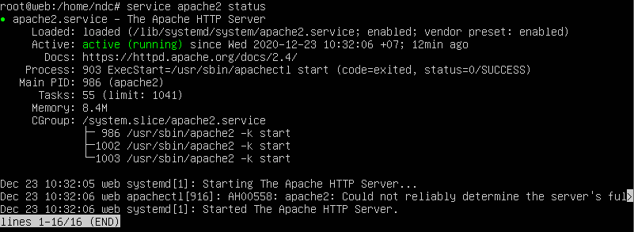

- IP Firewall

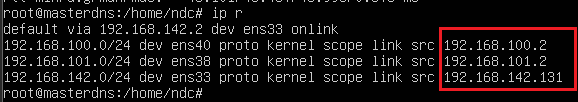

- IP Web server

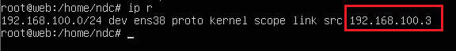

- IP Client 1

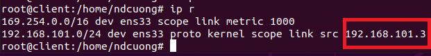

- IP Client 2

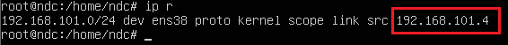

- Tất cả các client set gateway = 192.168.101.2 (ip của firewall), tương tự, web server set gateway = 192.168.100.2

#### Yêu cầu

- Client truy cập được internet, truy cập được các máy chủ dns, các website trên internet
- Client 1 quản trị web server bằng ssh, chặn các client còn lại ssh đến web server
- Các thiết bị kết nối internet bên ngoài hệ thống có thể truy cập đến web server

#### Cấu hình

- Drop các yêu cầu truy cập trái phép đến hệ thống : `iptables -P INPUT DROP` & `iptables -P FORWARD DROP`

- `iptables -A FORWARD -m state --state RELATED,ESTABLISHED -j ACCEPT`

- Cho phép forward : `echo 1 > /proc/sys/net/ipv4/ip_forward`

  #### Cho phép các client (dải ip 192.168.101.0/24) truy cập đến internet

  - Accept forward: `iptables -A FORWARD -i ens38 -o ens33 -j ACCEPT ` : cho phép chuyển tiếp dữ liệu từ ens38 đến ens33
  - POSTROUTING: `iptables -t nat -A POSTROUTING -o ens33 -s 192.168.101.0/24 -j SNAT --to-source 192.168.142.131`: đổi source ip của dữ liệu thành địa chỉ của firewall để firewall có thể nhận respone
  - Lưu ý: Để truy cập đến các website trên internet bằng domain, cần khai báo server dns ở client

- Kết quả

  - Cấu hình firewall

  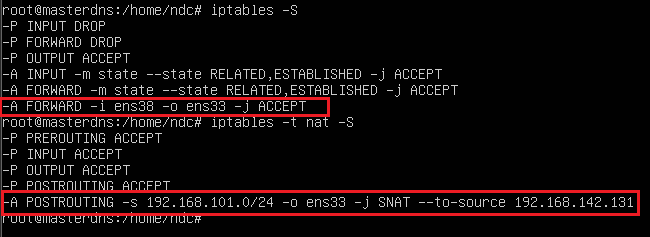

  - Kết quả client 1

  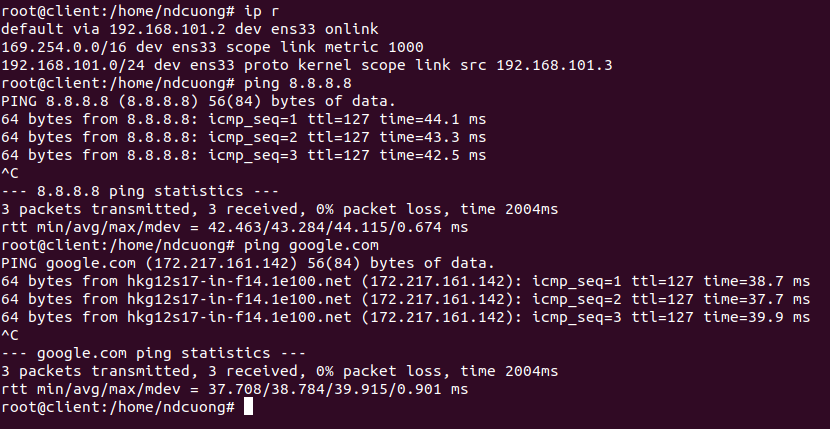

  - Kết quả client 2

  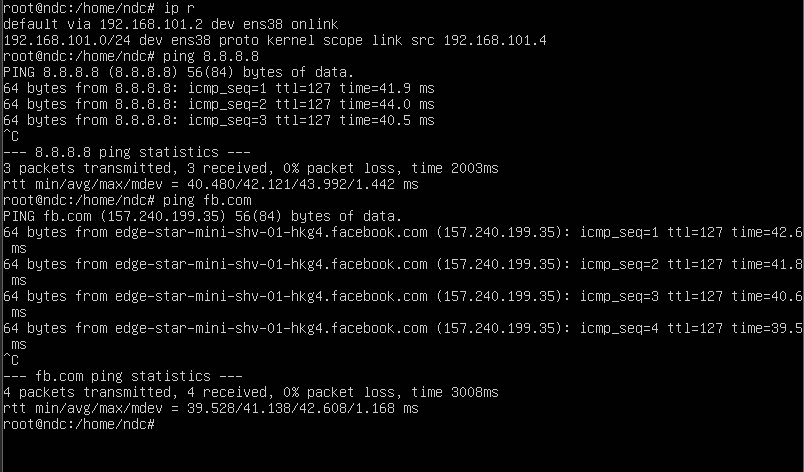

  #### Cho phép client 1 kết nối ssh đến web server

  - Accept forward: `iptables -A FORWARD -i ens38 -o ens40 -s 192.168.101.3 -d 192.168.100.3 -p tcp --dport 22 -j ACCEPT` : cho phép kết nối từ địa chỉ 192.168.101.3(client 1) đến 192.168.100.3(web server) qua port 22
  - POSTROUTING: `iptables -t nat -A POSTROUTING -o ens40 -d 192.168.100.3 -p tcp --dport 22 -j SNAT --to-source 192.168.100.2 `: đối với dữ liệu đến địa chỉ 192.168.100.3, port 22 và qua cổng ens40, đổi source ip của dữ liệu thành địa chỉ của firewall để firewall có thể nhận respone
  - Lưu ý: Các client khác sẽ k thể kết nối ssh đến web client (yêu cầu bị loại bỏ (drop) do cấu hình `iptables -P FORWARD DROP` đã đặt) và trả về lỗi timeout sau 1 khoảng thời gian chờ. Để tiết kiệm thời gian có thể từ chối kết nối (reject) và trả về lỗi refused với rule: `iptables -A FORWARD -i ens38 -o ens40 -s 192.168.101.3 -d 192.168.100.4 -p tcp --dport 22 -j REJECT`

- Kết quả

  - Cấu hình firewall

  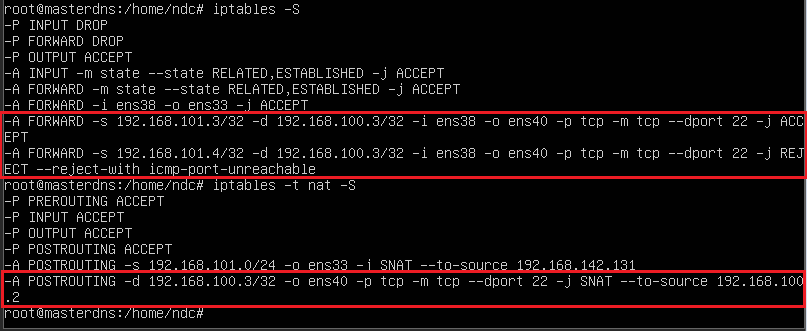

  - Kết quả client 1

  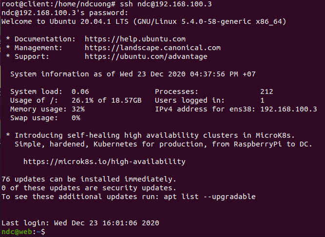

  - Kết quả client 2

  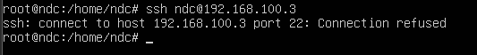

  #### Cho phép các thiết bị kết nối internet bên ngoài hệ thống có thể truy cập đến web server

  - Accept input: `iptables -A INPUT -i ens33 -d 192.168.142.131 -p tcp --dport 80 -j ACCEPT `
  - PREROUTING: `iptable -t nat -A PREROUTING -i ens33 -d 192.168.142.131 -p tcp --dport 80 -j DNAT --to-destination 192.168.100.3`

- Kết quả

  - Cấu hình

  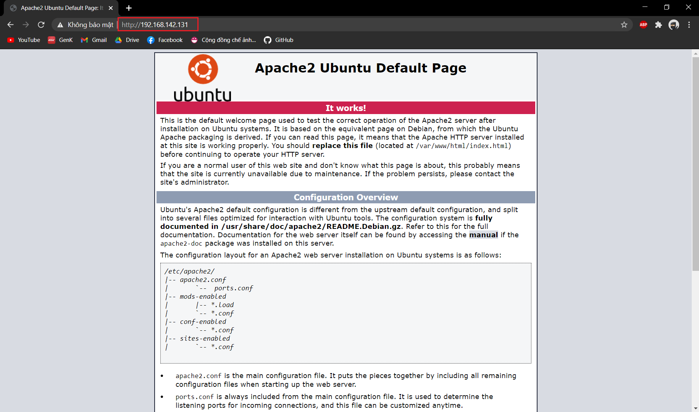

  - Kết quả

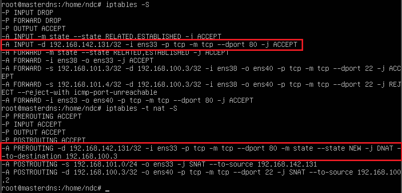